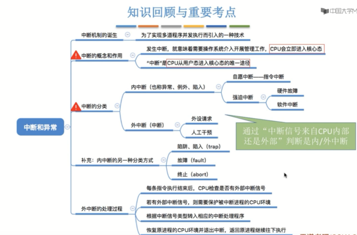
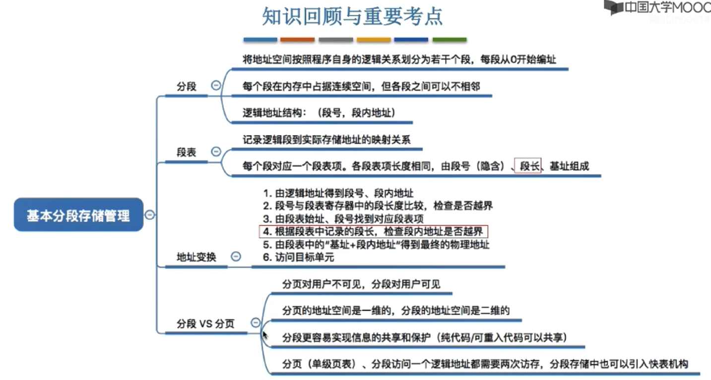
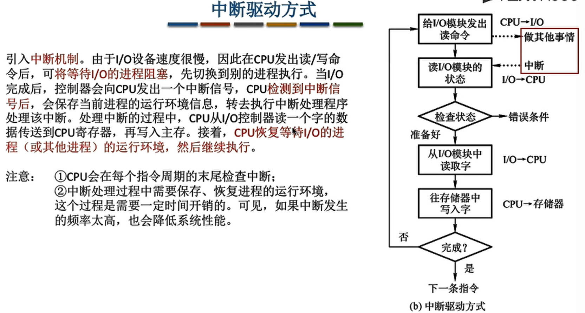
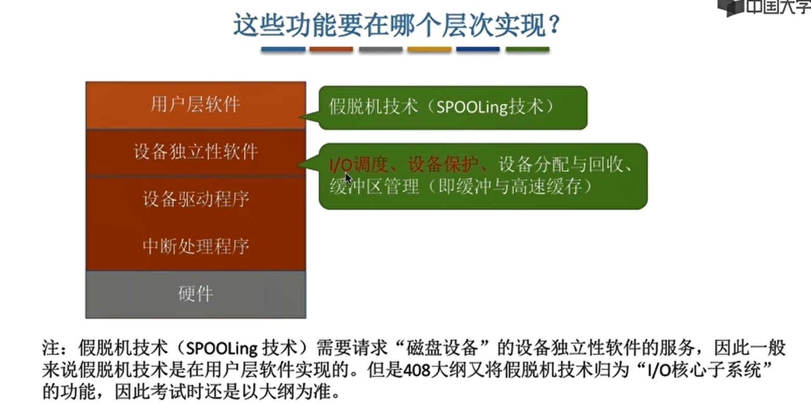
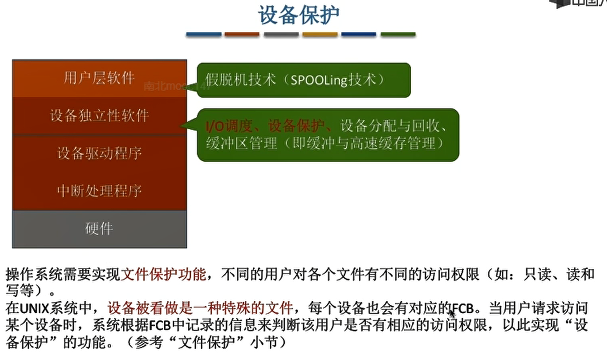

- [操作系统](#操作系统)
  - [第一章 操作系统概述](#第一章-操作系统概述)
    - [1-1-1 操作系统的基本概念{2019-06-30}](#1-1-1-操作系统的基本概念2019-06-30)
      - [概念](#概念)
      - [功能和目标](#功能和目标)
    - [1-1-2 操作系统的特征{2019-06-30}](#1-1-2-操作系统的特征2019-06-30)
      - [并发----计算机系统同时运行多个运行着的程序](#并发----计算机系统同时运行多个运行着的程序)
      - [共享----资源共享](#共享----资源共享)
      - [虚拟----把一个物理上的实体变为若干逻辑上的对应物](#虚拟----把一个物理上的实体变为若干逻辑上的对应物)
      - [异步](#异步)
    - [1-1-3 操作系统的发展和分类{2019-06-30}](#1-1-3-操作系统的发展和分类2019-06-30)
      - [手工操作阶段](#手工操作阶段)
      - [批处理阶段--单道批处理系统](#批处理阶段--单道批处理系统)
      - [批处理阶段--多道批处理系统](#批处理阶段--多道批处理系统)
      - [分时操作系统](#分时操作系统)
      - [实时操作系统](#实时操作系统)
      - [其他几种操作系统](#其他几种操作系统)
    - [1-1-4 操作系统的运行机制和体系结构{2019-06-30}](#1-1-4-操作系统的运行机制和体系结构2019-06-30)
      - [操作系统的运行机制](#操作系统的运行机制)
        - [两种指令](#两种指令)
        - [两种处理器状态](#两种处理器状态)
        - [两种程序](#两种程序)
      - [操作系统内核](#操作系统内核)
      - [操作系统的体系结构](#操作系统的体系结构)
    - [1-1-5 中断和异常{2019-06-30}](#1-1-5-中断和异常2019-06-30)
      - [中断机制的诞生](#中断机制的诞生)
      - [中断的分类](#中断的分类)
      - [外中断的处理过程](#外中断的处理过程)
    - [1-1-6 系统调用{2019-07-06}](#1-1-6-系统调用2019-07-06)
      - [什么是系统调用, 有何作用](#什么是系统调用-有何作用)
      - [系统调用和库函数的区别](#系统调用和库函数的区别)
      - [系统调用背后的过程](#系统调用背后的过程)
  - [第二章 进程管理](#第二章-进程管理)
    - [2-1-1 进程的定义、组成、组织方式、特征{2019-07-09}](#2-1-1-进程的定义组成组织方式特征2019-07-09)
      - [进程的定义](#进程的定义)
      - [进程的组成](#进程的组成)
        - [程序段](#程序段)
        - [数据段](#数据段)
        - [PCB](#pcb)
      - [进程的组织](#进程的组织)
        - [链接方式](#链接方式)
        - [索引方式](#索引方式)
      - [进程的特征](#进程的特征)
        - [动态性](#动态性)
        - [并发性](#并发性)
        - [独立性](#独立性)
        - [异步性](#异步性)
        - [结构性](#结构性)
    - [2-1-2 进程的状态和转换{2019-07-09}](#2-1-2-进程的状态和转换2019-07-09)
      - [进程的状态](#进程的状态)
        - [三种基本状态](#三种基本状态)
          - [运行态(Running)](#运行态running)
          - [就绪态(Ready)](#就绪态ready)
          - [阻塞态(Waiting/Blocked,又称等待态)](#阻塞态waitingblocked又称等待态)
        - [另外两种状态](#另外两种状态)
          - [创建态(New,又称新建态)](#创建态new又称新建态)
          - [终止态(Terminated,又称结束态)](#终止态terminated又称结束态)
      - [进程状态的切换](#进程状态的切换)
    - [2-1-3 进程控制{2019-07-09}](#2-1-3-进程控制2019-07-09)
      - [基本概念](#基本概念)
        - [什么是进程控制](#什么是进程控制)
        - [如何实现进程控制](#如何实现进程控制)
      - [进程控制相关的原语](#进程控制相关的原语)
        - [学习技巧](#学习技巧)
    - [2-1-4 进程通信{2019-07-09}](#2-1-4-进程通信2019-07-09)
      - [什么是进程通信](#什么是进程通信)
      - [共享存储](#共享存储)
        - [基于数据结构的共享](#基于数据结构的共享)
        - [基于存储区的共享](#基于存储区的共享)
      - [管道通信](#管道通信)
      - [消息传递](#消息传递)
    - [2-1-5 线程概念和多线程模型{2019-07-09}](#2-1-5-线程概念和多线程模型2019-07-09)
      - [什么是线程,为什么要引入线程](#什么是线程为什么要引入线程)
      - [引入线程机制后,有什么变化](#引入线程机制后有什么变化)
      - [线程的属性](#线程的属性)
      - [线程的实现方式](#线程的实现方式)
        - [用户级线程(User-Level Thread,ULT)](#用户级线程user-level-threadult)
        - [内核级线程(Kernel-LevelThread,KLT,又称"内核支持的线程")](#内核级线程kernel-levelthreadklt又称内核支持的线程)
        - [组合方式](#组合方式)
      - [多线程模型](#多线程模型)
        - [多对一模型](#多对一模型)
        - [一对一模型](#一对一模型)
        - [多对多模型](#多对多模型)
    - [2-2-1 处理机调度的概念、层次{2019-06-30}](#2-2-1-处理机调度的概念层次2019-06-30)
      - [调度的三个层次](#调度的三个层次)
        - [高级调度(作业调度)--面向作业](#高级调度作业调度--面向作业)
        - [中级调度(内存调度)--面向进程](#中级调度内存调度--面向进程)
        - [低级调度(进程调度)](#低级调度进程调度)
      - [进程的七状态模型](#进程的七状态模型)
    - [2-2-2 进程调度的时机、切换与过程、方式{2019-07-01}](#2-2-2-进程调度的时机切换与过程方式2019-07-01)
      - [进程调度的时机](#进程调度的时机)
        - [需要进行进程调度与切换的情况](#需要进行进程调度与切换的情况)
        - [不能进行进程调度与切换的情况](#不能进行进程调度与切换的情况)
      - [进程调度的方式](#进程调度的方式)
      - [进程的切换与过程](#进程的切换与过程)
        - ["狭义的进程调度"与"进程切换"的区别](#狭义的进程调度与进程切换的区别)
    - [2-2-3 调度算法的评价指标{2019-07-01}](#2-2-3-调度算法的评价指标2019-07-01)
      - [CPU利用率](#cpu利用率)
      - [系统吞吐量](#系统吞吐量)
      - [周转时间](#周转时间)
      - [等待时间](#等待时间)
      - [响应时间](#响应时间)
    - [2-2-4 调度算法(适用于早期批处理系统): 先来先服务、 最短作业优先、 最高响应比优先{2019-07-01}](#2-2-4-调度算法适用于早期批处理系统-先来先服务-最短作业优先-最高响应比优先2019-07-01)
      - [先来先服务(FCFS)](#先来先服务fcfs)
      - [最短作业优先(SJF)](#最短作业优先sjf)
        - [最短剩余时间优先算法(SRTN)](#最短剩余时间优先算法srtn)
      - [高响应比优先(HRRN)](#高响应比优先hrrn)
    - [2-2-5 调度算法(适用于交互式系统): 时间片轮转、 优先级、 多级反馈队列{2019-07-02}](#2-2-5-调度算法适用于交互式系统-时间片轮转-优先级-多级反馈队列2019-07-02)
      - [时间片轮转(RR, Round_Robin)](#时间片轮转rr-round_robin)
      - [优先级调度算法](#优先级调度算法)
      - [多级反馈队列调度算法](#多级反馈队列调度算法)
    - [2-3-1 什么是进程同步、进程互斥{2019-07-03}](#2-3-1-什么是进程同步进程互斥2019-07-03)
      - [进程同步](#进程同步)
      - [进程互斥](#进程互斥)
    - [2-3-2 进程互斥的软件实现方法{2019-07-03}](#2-3-2-进程互斥的软件实现方法2019-07-03)
      - [单标志法](#单标志法)
      - [双标志先检查法](#双标志先检查法)
      - [双标志后检查法](#双标志后检查法)
      - [Peterson算法](#peterson算法)
    - [2-3-3 进程互斥的硬件实现方法{2017-07-03}](#2-3-3-进程互斥的硬件实现方法2017-07-03)
      - [中断屏蔽方法](#中断屏蔽方法)
      - [TestAndSet指令](#testandset指令)
      - [Swap指令](#swap指令)
    - [2-3-4 信号量机制{2019-07-06}](#2-3-4-信号量机制2019-07-06)
      - [整形信号量](#整形信号量)
      - [记录型信号量(高频考点)](#记录型信号量高频考点)
    - [2-3-5 用信号量实现进程互斥、同步、前驱关系{2019-07-06}](#2-3-5-用信号量实现进程互斥同步前驱关系2019-07-06)
      - [实现进程互斥](#实现进程互斥)
      - [实现进程同步](#实现进程同步)
      - [实现进程前驱关系](#实现进程前驱关系)
    - [2-3-6 生产者-消费者问题{2019-07-07}](#2-3-6-生产者-消费者问题2019-07-07)
      - [问题分析](#问题分析)
      - [PV问题分析步骤](#pv问题分析步骤)
      - [重点](#重点)
    - [2-3-7 多生产者-多消费者问题{2019-07-07}](#2-3-7-多生产者-多消费者问题2019-07-07)
      - [问题描述](#问题描述)
      - [重点](#重点-1)
    - [2-3-8 吸烟者问题{2019-07-07}](#2-3-8-吸烟者问题2019-07-07)
      - [问题描述](#问题描述-1)
      - [重点](#重点-2)
    - [2-3-9 读者写者问题{2019-07-07}](#2-3-9-读者写者问题2019-07-07)
      - [问题描述](#问题描述-2)
      - [重点](#重点-3)
    - [2-3-10 哲学家进餐问题{2019-07-07}](#2-3-10-哲学家进餐问题2019-07-07)
      - [问题描述](#问题描述-3)
      - [重点](#重点-4)
    - [2-3-11 管程{2019-07-07}](#2-3-11-管程2019-07-07)
      - [为什么要引入管程](#为什么要引入管程)
      - [管程的定义](#管程的定义)
      - [管程的基本特征](#管程的基本特征)
      - [扩展1: 用管程解决生产者消费者问题](#扩展1-用管程解决生产者消费者问题)
      - [扩展2: Java中类似管程的机制](#扩展2-java中类似管程的机制)
    - [2-4-1 死锁的概念{2019-07-08}](#2-4-1-死锁的概念2019-07-08)
      - [什么是死锁](#什么是死锁)
      - [进程死锁、 饥饿、 死循环的区别](#进程死锁-饥饿-死循环的区别)
      - [死锁产生的必要条件](#死锁产生的必要条件)
      - [什么时候会发生死锁](#什么时候会发生死锁)
      - [死锁的处理策略](#死锁的处理策略)
    - [2-4-2 死锁的处理策略—预防死锁{2019-07-08}](#2-4-2-死锁的处理策略预防死锁2019-07-08)
      - [破坏互斥条件](#破坏互斥条件)
      - [破坏不剥夺条件](#破坏不剥夺条件)
      - [破坏请求和保持条件](#破坏请求和保持条件)
      - [破坏循环等待条件](#破坏循环等待条件)
    - [2-4-3 死锁的处理策略—避免死锁{2019-07-08}](#2-4-3-死锁的处理策略避免死锁2019-07-08)
      - [什么是安全序列](#什么是安全序列)
      - [银行家算法](#银行家算法)
      - [银行家算法实现](#银行家算法实现)
        - [条件](#条件)
        - [实现](#实现)
    - [2-4-4 死锁的处理策略—死锁的检测与解除{2019-07-08}](#2-4-4-死锁的处理策略死锁的检测与解除2019-07-08)
      - [死锁的检测](#死锁的检测)
        - [必要条件](#必要条件)
          - [数据结构:资源分配图](#数据结构资源分配图)
          - [算法](#算法)
        - [死锁定理](#死锁定理)
      - [死锁的解除](#死锁的解除)
  - [第三章 内存管理](#第三章-内存管理)
    - [3-1-1 内存的基础知识{2019-07-09}](#3-1-1-内存的基础知识2019-07-09)
      - [什么是内存,有何作用](#什么是内存有何作用)
        - [内存地址](#内存地址)
        - [存储单元](#存储单元)
      - [进程运行的基本原理](#进程运行的基本原理)
        - [指令的工作原理](#指令的工作原理)
        - [逻辑地址VS物理地址](#逻辑地址vs物理地址)
        - [从写程序到程序运行](#从写程序到程序运行)
        - [装入的三种方式](#装入的三种方式)
          - [绝对装入](#绝对装入)
          - [静态重定位(可重定位装入)](#静态重定位可重定位装入)
          - [动态重定位(动态运行时装入)](#动态重定位动态运行时装入)
        - [链接的三种方式](#链接的三种方式)
          - [静态链接](#静态链接)
          - [装入时动态链接](#装入时动态链接)
          - [运行时动态链接](#运行时动态链接)
    - [3-1-2 内存管理的概念{2019-07-10}](#3-1-2-内存管理的概念2019-07-10)
      - [内存空间的分配与回收](#内存空间的分配与回收)
      - [内存空间的扩充(实现虚拟性)](#内存空间的扩充实现虚拟性)
      - [地址转换功能](#地址转换功能)
      - [内存保护](#内存保护)
    - [3-1-3 覆盖与交换{2019-07-10}](#3-1-3-覆盖与交换2019-07-10)
      - [覆盖技术](#覆盖技术)
      - [交换技术(对换技术)](#交换技术对换技术)
        - [应该在外存的什么位置保存被换出的进程](#应该在外存的什么位置保存被换出的进程)
        - [什么时候应该交换](#什么时候应该交换)
        - [应该换出哪些进程](#应该换出哪些进程)
    - [3-1-4 连续分配管理方式{2019-07-10}](#3-1-4-连续分配管理方式2019-07-10)
      - [单一连续分配](#单一连续分配)
      - [固定分区分配](#固定分区分配)
      - [动态分区分配](#动态分区分配)
    - [3-1-5 动态分区分配算法{2019-07-10}](#3-1-5-动态分区分配算法2019-07-10)
      - [首次适应算法(First Fit)](#首次适应算法first-fit)
      - [最佳适应算法(Best Fit)](#最佳适应算法best-fit)
      - [最坏适应算法(Worst Fit)](#最坏适应算法worst-fit)
      - [邻近适应算法(Next Fit)](#邻近适应算法next-fit)
    - [3-1-6 基本分页存储管理的基本概念{2019-07-11}](#3-1-6-基本分页存储管理的基本概念2019-07-11)
      - [基本分页存储管理的思想](#基本分页存储管理的思想)
      - [实现地址的转换](#实现地址的转换)
    - [3-1-7 基本地址变换机构{2019-07-11}](#3-1-7-基本地址变换机构2019-07-11)
      - [基本地址变换机构工作流程](#基本地址变换机构工作流程)
      - [对页表项大小的进一步探索](#对页表项大小的进一步探索)
    - [3-1-8 具有快表的地址变换机构{2019-07-11}](#3-1-8-具有快表的地址变换机构2019-07-11)
      - [局部性原理](#局部性原理)
        - [时间局部性](#时间局部性)
        - [空间局部性](#空间局部性)
      - [什么是快表](#什么是快表)
      - [引入快表后,地址的变换过程](#引入快表后地址的变换过程)
    - [3-1-9 两级页表{2019-07-11}](#3-1-9-两级页表2019-07-11)
      - [单级页表存在的问题](#单级页表存在的问题)
      - [两级页表的原理、逻辑地址结构](#两级页表的原理逻辑地址结构)
      - [如何实现地址变换](#如何实现地址变换)
      - [两级页表问题需要注意的几个细节](#两级页表问题需要注意的几个细节)
    - [3-1-10 基本分段存储管理方式{2019-07-11}](#3-1-10-基本分段存储管理方式2019-07-11)
      - [什么是分段(类似于分页管理中的分页)](#什么是分段类似于分页管理中的分页)
      - [什么是段表(类似于分页管理中的页表)](#什么是段表类似于分页管理中的页表)
      - [如何实现地址转换](#如何实现地址转换)
      - [分段、分页管理的对比](#分段分页管理的对比)
    - [3-1-11 段页式管理方式{2019-07-13}](#3-1-11-段页式管理方式2019-07-13)
      - [分页、分段管理方式中最大的优缺点](#分页分段管理方式中最大的优缺点)
      - [分段+分页的结合=段页式管理方式](#分段分页的结合段页式管理方式)
        - [段页式管理的逻辑地址结构](#段页式管理的逻辑地址结构)
      - [段表、页表](#段表页表)
      - [如何实现地址转换](#如何实现地址转换-1)
    - [3-2-1 虚拟内存的基本概念{2019-07-15}](#3-2-1-虚拟内存的基本概念2019-07-15)
      - [传统存储管理方式的特征、缺点](#传统存储管理方式的特征缺点)
      - [局部性原理](#局部性原理-1)
        - [计算机中存储器的层次结构](#计算机中存储器的层次结构)
      - [虚拟内存的定义和特征](#虚拟内存的定义和特征)
        - [定义](#定义)
        - [特征](#特征)
        - [易混点](#易混点)
      - [如何实现虚拟内存技术](#如何实现虚拟内存技术)
    - [3-2-2 请求分页管理方式{2019-07-15}](#3-2-2-请求分页管理方式2019-07-15)
      - [页表机制](#页表机制)
      - [缺页中断机构](#缺页中断机构)
      - [地址变换机构](#地址变换机构)
        - [新增步骤](#新增步骤)
        - [注意事项](#注意事项)
    - [3-2-3 页面置换算法{2019-07-17}](#3-2-3-页面置换算法2019-07-17)
      - [最佳置换算法(OPT)](#最佳置换算法opt)
      - [先进先出置换算法(FIFO)](#先进先出置换算法fifo)
      - [最近最久未使用置换算法(LRU,least recently used)](#最近最久未使用置换算法lruleast-recently-used)
      - [时钟置换算法(CLOCK)](#时钟置换算法clock)
      - [改进型的时钟置换算法](#改进型的时钟置换算法)
    - [3-2-4 页面分配策略{2019-07-17}](#3-2-4-页面分配策略2019-07-17)
      - [驻留集](#驻留集)
      - [页面分配,置换策略](#页面分配置换策略)
        - [固定分配局部置换](#固定分配局部置换)
        - [可变分配全局置换](#可变分配全局置换)
        - [可变分配局部置换](#可变分配局部置换)
      - [调入页面的时机](#调入页面的时机)
      - [从何处调页](#从何处调页)
      - [抖动(颠簸)现象](#抖动颠簸现象)
      - [工作集](#工作集)
  - [第四章 文件管理](#第四章-文件管理)
    - [4-1-1 初识文件管理{2019-07-17}](#4-1-1-初识文件管理2019-07-17)
      - [文件的属性](#文件的属性)
      - [文件的逻辑结构-文件内部数据的组织](#文件的逻辑结构-文件内部数据的组织)
      - [文件之间的组织](#文件之间的组织)
      - [操作系统向上提供的功能](#操作系统向上提供的功能)
      - [文件的物理地址-文件如何存放在外存](#文件的物理地址-文件如何存放在外存)
      - [其他文件管理功能](#其他文件管理功能)
    - [4-1-2 文件的逻辑结构{2019-07-17}](#4-1-2-文件的逻辑结构2019-07-17)
      - [无结构文件](#无结构文件)
      - [有结构文件](#有结构文件)
        - [顺序文件](#顺序文件)
        - [索引文件](#索引文件)
        - [索引顺序文件](#索引顺序文件)
          - [多级索引顺序文件](#多级索引顺序文件)
    - [4-1-3 文件目录{2019-07-18}](#4-1-3-文件目录2019-07-18)
      - [文件控制块](#文件控制块)
      - [目录结构](#目录结构)
        - [单级目录结构](#单级目录结构)
        - [两级目录结构](#两级目录结构)
        - [多级目录结构(树形目录结构)](#多级目录结构树形目录结构)
        - [无环图目录结构](#无环图目录结构)
      - [索引结点(FCB的改进)](#索引结点fcb的改进)
    - [4-1-4 ???](#4-1-4-)
    - [4-1-5 文件共享{2019-07-18}](#4-1-5-文件共享2019-07-18)
      - [基于索引结点的共享方式(硬链接)](#基于索引结点的共享方式硬链接)
      - [基于符号链的共享方式(软连接)](#基于符号链的共享方式软连接)
    - [4-1-6 文件保护{2019-07-18}](#4-1-6-文件保护2019-07-18)
      - [口令保护](#口令保护)
      - [加密保护](#加密保护)
      - [访问控制](#访问控制)
    - [4-2-1 文件的物理结构(文件分配方式){2019-07-18}](#4-2-1-文件的物理结构文件分配方式2019-07-18)
      - [连续分配](#连续分配)
      - [链接分配](#链接分配)
        - [隐式链接](#隐式链接)
        - [显式链接](#显式链接)
      - [索引分配](#索引分配)
    - [4-2-2 文件存储空间管理{2019-07-18}](#4-2-2-文件存储空间管理2019-07-18)
      - [存储空间的划分与初始化](#存储空间的划分与初始化)
      - [四种存储管理方法](#四种存储管理方法)
        - [空闲表法](#空闲表法)
        - [空闲链表法](#空闲链表法)
          - [空闲盘块链](#空闲盘块链)
          - [空闲盘区链](#空闲盘区链)
        - [位示图法](#位示图法)
        - [成组链接法](#成组链接法)
    - [4-2-3 文件系统的层次结构{2019-07-19}](#4-2-3-文件系统的层次结构2019-07-19)
    - [4-3-1 磁盘的结构{2019-07-19}](#4-3-1-磁盘的结构2019-07-19)
      - [磁盘,磁道,扇区](#磁盘磁道扇区)
      - [如何在磁盘中读取数据](#如何在磁盘中读取数据)
      - [磁盘的物理地址](#磁盘的物理地址)
      - [磁盘的分类](#磁盘的分类)
    - [4-3-2 磁盘调度算法{2019-07-19}](#4-3-2-磁盘调度算法2019-07-19)
      - [一次磁盘读写操作需要的时间](#一次磁盘读写操作需要的时间)
      - [磁盘调度算法](#磁盘调度算法)
        - [先来先服务(FCFS)](#先来先服务fcfs-1)
        - [最短寻找时间优先(SSTF)](#最短寻找时间优先sstf)
        - [扫描算法(SCAN)](#扫描算法scan)
          - [LOOK调度算法](#look调度算法)
        - [循环扫描算法(C-SCAN)](#循环扫描算法c-scan)
          - [C-LOOK算法](#c-look算法)
    - [4-3-3 减少延迟时间的方法{2019-07-19}](#4-3-3-减少延迟时间的方法2019-07-19)
      - [交替编号](#交替编号)
      - [磁盘地址结构的设计](#磁盘地址结构的设计)
      - [错位命名](#错位命名)
    - [4-3-4 磁盘的管理{2019-07-19}](#4-3-4-磁盘的管理2019-07-19)
      - [磁盘初始化](#磁盘初始化)
      - [引导块/启动分区](#引导块启动分区)
      - [坏块的管理](#坏块的管理)
  - [第五章 设备管理](#第五章-设备管理)
    - [5-1-1 IO设备的基本概念和分类{2019-07-19}](#5-1-1-io设备的基本概念和分类2019-07-19)
      - [什么是IO设备](#什么是io设备)
      - [按使用特性分类](#按使用特性分类)
      - [按传输速率分类](#按传输速率分类)
      - [按信息交换的单位分类](#按信息交换的单位分类)
    - [5-1-2 IO控制器{2019-07-19}](#5-1-2-io控制器2019-07-19)
      - [IO设备的电子部件(IO控制器)](#io设备的电子部件io控制器)
      - [IO控制器的组成](#io控制器的组成)
      - [内存映像IOvs寄存器独立编址](#内存映像iovs寄存器独立编址)
    - [5-1-3 IO控制方式{2019-07-19}](#5-1-3-io控制方式2019-07-19)
      - [程序直接控制方式](#程序直接控制方式)
      - [中断驱动方式](#中断驱动方式)
      - [DMA方式](#dma方式)
      - [通道控制方式](#通道控制方式)
    - [5-2-1 IO核心子系统{2019-07-21}](#5-2-1-io核心子系统2019-07-21)
      - [功能在哪个层次实现](#功能在哪个层次实现)
      - [IO调度](#io调度)
      - [设备保护](#设备保护)
    - [5-2-2 假脱机技术(SPOOLing技术){2019-07-21}](#5-2-2-假脱机技术spooling技术2019-07-21)
      - [什么是脱机技术](#什么是脱机技术)
      - [假脱机技术](#假脱机技术)
- [易错题](#易错题)
  - [第一章](#第一章)
  - [第二章](#第二章)

# 操作系统

> 2019年7月21日完成

## 第一章 操作系统概述

### 1-1-1 操作系统的基本概念{2019-06-30}

#### 概念

> 操作系统是指控制和管理整个计算机系统的硬件和软件资源, 并合理的组织调度计算机的工作和资源的分配, 已提供给用户和其他软件方便的接口和环境, 它是计算机系统中最基本的系统软件

#### 功能和目标

1. 作为系统资源的管理者----安全高效
	1. 文件管理
	2. 存储器管理(内存管理)
	3. 处理机管理
	4. 设备管理
2. 作为用户和计算机硬件之间的接口----方便用户使用
	1. 命令接口--允许用户直接使用
		1. 联机命令接口 = `交互式` 命令接口
		2. 脱机命令接口 = `批处理` 命令接口
	2. 程序接口=系统调用--允许用户通过程序间接使用
		1. 系统调用 = 系统调用命令 = 广义指令
	3. GUI
3. 作为最接近硬件的层次----实现对硬件机器的扩展
	1. 通常把覆盖了软件的机器称为扩充机器或虚拟机

### 1-1-2 操作系统的特征{2019-06-30}

> 并发和共享是两个最基本的特征, 二者互为存在条件

#### 并发----计算机系统同时运行多个运行着的程序

1. 并发, 多个事件在同一时间间隔内发生, 宏观上同时发生, 微观上交替发生
2. 并行, 多个事件在同一时刻同时发生

#### 共享----资源共享

1. 互斥共享
2. 同时共享

#### 虚拟----把一个物理上的实体变为若干逻辑上的对应物

1. 空分复用技术
2. 时分复用技术

#### 异步

> 在多道程序环境下, 允许多个程序并发执行, 但由于资源有限, 进程的执行不是一贯到底的, 而是走走停停, 已不可预知的速度推进, 这就是进程的异步性

### 1-1-3 操作系统的发展和分类{2019-06-30}

#### 手工操作阶段

1. 用户独占全机、 人机速度矛盾导致资源利用率极低

#### 批处理阶段--单道批处理系统

1. 引入脱机输入/输出技术(用磁带完成), 并 `监督程序(操作系统的雏形)` 负责控制作业的输入输出
2. 缓解了一定程度的人机速度矛盾, 资源利用率有所提升
3. 主要缺点: 内存中仅能有一道程序运行, 程序运行结束后才能调入下一道程序, CPU有大量的时间在空闲等待i/O完成, 资源利用率依然很低

#### 批处理阶段--多道批处理系统

1. 操作系统正式诞生
2. 多道程序并发执行, 共享计算机资源, 资源利用率大幅提升, CPU和其他资源保持"忙碌"状态, 系统吞吐量增大
3. 主要缺点: 用户响应时间长, 没有人机交互功能(提交之后只能等待完成, 中间不能控制)

#### 分时操作系统

1. 计算机以 `时间片` 为单位轮流为各个用户/作业服务, 各个用户可通过终端与计算机进行交互
2. 用户请求可以被即时响应, 解决了人机交互问题. 允许多个用户同时使用一台计算机, 并且用户对计算机的操作相互独立, 感受不到别人的存在
3. 主要缺点: 不能优先处理一些紧急任务. 操作系统对各个用户/作业都是完全公平的

#### 实时操作系统

1. 在实时操作系统的控制下, 计算机系统接收到外部信号后及时进行处理, 并且要在严格的时限内处理完时间. 实时操作系统的主要特点是及时性和可靠性
2. 能够优先响应一些紧急任务, 某些紧急任务不需时间片排队
3. 分类
	1. 硬实时系统: 必须在绝对严格的规定时间内完成处理
	2. 软实时系统: 能偶尔违反时间规定

#### 其他几种操作系统

1. 网络操作系统----实现网络中各种资源的共享和各台计算机之间的通信, 比如Windows NT
2. 分布式操作系统----主要特点是分布性和并行性
3. 个人计算机操作系统

### 1-1-4 操作系统的运行机制和体系结构{2019-06-30}

#### 操作系统的运行机制

##### 两种指令

> 指令就是处理器能识别并执行的最基本命令

1. 特权指令
2. 非特权指令

##### 两种处理器状态

1. 用户态(目态)
2. 核心态(管态)
3. 用程序状态字寄存器(PSW)中的某标志位来标识

##### 两种程序

1. 内核程序
2. 应用程序

#### 操作系统内核

> 内核是计算机上配置的底层软件, 是操作系统最基本、 最核心的部分  
> 实现操作系统内核功能的那些程序就是内核程序

1. 时钟管理
2. 中断处理
3. 原语(设备驱动、 CPU切换等)--一种特殊的程序, 是最接近硬件的部分, 运行具有 `原子性`
4. 进程管理、 存储器管理、 设备管理等(有些操作系统不包括这部分)

#### 操作系统的体系结构

1. 大内核
	1. 将操作系统的主要功能模块都作为系统内核, 运行在核心态
	2. 高性能
	3. 内核代码庞大, 结构混乱, 难以维护
2. 微内核
	1. 只把最基本的功能保留在内核
	2. 内核代码少, 结构清晰, 方便维护
	3. 需要频繁在核心态和用户态之间切换, 性能低

### 1-1-5 中断和异常{2019-06-30}

#### 中断机制的诞生

> 为了实现多道程序并发执行而引入的一种技术  
> 发生中断就意味着需要操作系统介入, 开展管理工作  
> 中断是使CPU由用户态切换到核心态的 `唯一` 途径, 使操作系统获得计算机的控制权  
> 核心态切换为用户态需要执行一个特权指令, 设置程序状态字的标志位为用户态即可  

1. 当中断发生时, CPU立即进入核心态
2. 当中断发生后, 当前运行的进程暂停运行, 并由操作系统内核对中断进行处理
3. 对于不同的中断信号, 会进行不同的处理

#### 中断的分类

1. 内中断(也称异常、 例外、 陷入)
	1. 信号来源于CPU内部, 与当前执行的指令有关
	2. 分类
		1. 自愿中断--指令中断
		2. 强迫中断
		1. 硬件故障
		2. 软件中断
2. 外中断(也称中断)
	1. 信号来源于CPU外部, 与当前执行的指令无关
	2. 分类
		1. 外设请求
		2. 人工干预
3. 内中断的另一种分类
	1. 陷阱、 陷入(trap)
	2. 故障(fault)
	3. 终止(abort)

#### 外中断的处理过程

1. 每条指令执行完成后, CPU检查是否有外部中断信号
2. 若有外部中断信号, 则需要保护被中断进程的CPU环境
3. 根据中断信号类型转入相应的中断处理程序
4. 恢复进程的CPU环境并退出中断, 返回原进程继续向下执行

### 1-1-6 系统调用{2019-07-06}

#### 什么是系统调用, 有何作用

1. 系统调用是操作系统提供给应用程序(程序员/编程人员)使用的接口, 可以理解为一种可供应用程序调用的特殊函数, 应用程序可以发出系统调用请求来获得操作系统的服务
2. 操作系统提供"系统调用"功能, 用户进程想要使用某种资源, 只能通过系统调用向操作系统发出请求. 操作系统会对各个请求进行协调管理
3. 应用程序通过系统调用请求操作系统的服务. 系统中的各种共享资源都由操作系统统一掌管, 因此在用户程序中, 凡是与资源有关的操作(如存储分配、 IO操作、 文件管理等), 都必须通过系统调用的方式向操作系统提出服务请求, 由操作系统代为完成, 特权指令只能在核心态完成. 这样可以保证系统的稳定性和安全性, 防止用户进行非法操作
4. 系统调用(按功能分类)
	1. 设备管理: 完成设备的请求、 释放、 启动等功能
	2. 文件管理: 完成文件的读、 写、 创建、 删除等功能
	3. 进程管理: 完成进程的创建、 撤销、 阻塞、 唤醒等功能
	4. 进程通信: 完成进程之间的消息传递、 信号传递等功能
	5. 内存管理: 完成内存的分配、 回收等功能
5. 系统调用会使处理器从用户态进入核心态

#### 系统调用和库函数的区别

1. 普通应用程序可直接进行系统调用, 也可使用库函数. 有的库函数涉及系统调用, 有的不涉及
2. 编程语言向上提供库函数. 有时会将系统调用封装成库函数, 隐藏细节, 使上层系统调用更加方便
3. 操作系统向上提供系统调用

#### 系统调用背后的过程

1. 传递系统调用参数→执行陷入指令(用户态)→执行系统调用相应服务程序(核心态)→返回过户程序
2. 发出系统调用请求是在用户态, 而对系统调用的相应处理在核心态下进行
3. 陷入指令是`唯一`一个只能在用户态执行, 而不可在核心态执行的指令

## 第二章 进程管理

### 2-1-1 进程的定义、组成、组织方式、特征{2019-07-09}

#### 进程的定义

1. 为了方便操作系统管理,完成各程序并发执行,引入了进程、进程实体的概念
2. 系统为每个运行的程序配置一个数据结构,称为进程控制块,用来描述进程的各种信息
3. 程序段、数据段、PCB(进程控制块)三部分组成了`进程实体`(进程映像).一般情况下,把进程实体简称为进程.所谓创建进程,实质上是创建进程实体中的PCB;而撤销进程,实质上是撤销进程实体中的PCB.`PCB是进程存在的唯一标志`
4. 从不同的角度,进程可以有不同的定义,比较传统的定义有:
   1. 进程是程序的一次执行过程
   2. 进程是一个程序及其数据在处理机上顺序执行时所发生的活动
   3. 进程是具有独立功能的程序在数据集合上运行的过程(强调动态性),它是系统进行资源分配和调度的一个独立单位
5. 引入进程实体的概念后,可把进程定义为:进程是进程实体的运行过程,是系统进行资源分配和调度的一个独立单位
6. 严格来说,进程实体和进程并不一样,进程实体是静态的,进程是动态的.不过一般不考虑,认为进程=进程实体

#### 进程的组成

> 数据段和程序段存储程序本身运行所需的数据  
> PCB存储操作系统管理所需的数据

##### 程序段

> 存放要执行的代码

##### 数据段

> 存放程序运行过程中处理的各种数据

##### PCB

1. 进程描述信息
   1. 进程标识符PID
   2. 用户标识符UID
2. 进程控制和管理信息
   1. 进程当前状态
   2. 进程优先级
3. 资源分配清单
   1. 程序段指针
   2. 数据段指针
   3. 键盘
   4. 鼠标
4. 处理机相关信息
   1. 各种寄存器值

#### 进程的组织

> 进程的组成讨论的是一个进程内部由哪些部分构成的问题,而进程的组织讨论的是多个进程之间的组织方式问题

##### 链接方式

1. 按照进程状态将PCB分为多个队列
2. 操作系统持有指向各个队列的指针

##### 索引方式

1. 根据进程状态的不同,建立几张索引表
2. 操作系统持有指向各个索引表的指针

#### 进程的特征

##### 动态性

1. 动态性是进程最基本的特征
2. 进程是程序的一次执行过程,是动态的产生、变化和消亡的

##### 并发性

1. 内存中有多个进程实体,各进程可并发执行

##### 独立性

1. 进程是能独立运行、独立获得资源、独立接受调度的基本单位

##### 异步性

1. 各进程按各自独立的、不可预知的速度向前推进
2. 操作系统要提供"进程同步机制"来解决异步问题

##### 结构性

1. 每个进程都会分配一个PCB.结构上看,进程由程序段、数据段、PCB组成

### 2-1-2 进程的状态和转换{2019-07-09}

#### 进程的状态

##### 三种基本状态

###### 运行态(Running)

> 占有CPU,并在CPU上工作

###### 就绪态(Ready)

> 已经具备运行条件,但由于没有空闲CPU,而暂时不能运行  
> 万事俱备,只欠CPU

###### 阻塞态(Waiting/Blocked,又称等待态)

> 因等待某一事件而暂时不能运行

##### 另外两种状态

###### 创建态(New,又称新建态)

> 进程正在被创建,操作系统为进程分配资源、初始化PCB

###### 终止态(Terminated,又称结束态)

> 进程正在从系统中撤销,操作系统会回收进程拥有的资源、撤销PCB

#### 进程状态的切换

### 2-1-3 进程控制{2019-07-09}

#### 基本概念

##### 什么是进程控制

> 进程控制的主要功能是对系统中的所有进程实施有效的管理,它具有创建新进程、撤销已有进程、实现进程状态切换等功能  
> 简化理解:进程控制实现进程状态切换

##### 如何实现进程控制

1. 用原语实现进程控制.原语的特点是执行期间不允许中断,只能一气呵成,这种操作被称为原子操作
2. 原语采用"关中断指令"和"开中断指令"实现
3. 原语运行在核心态

#### 进程控制相关的原语

##### 学习技巧

1. 进程控制会导致进程状态的切换.无论哪个原语,要做的无非三类事情
   1. 更新PCB中的信息(如修改进程状态标志、将运行环境保存到PCB、从PCB恢复运行环境)
      1. 所有的进程控制原语一定会修改进程状态标志
      2. 剥夺当前运行进程的CPU使用权必然需要保存其运行环境
      3. 某进程开始运行前必然要恢复运行环境
   2. 将PCB插入合适的队列
   3. 分配、回收资源

### 2-1-4 进程通信{2019-07-09}

#### 什么是进程通信

1. 进程通信就是指进程之间的信息交换
2. 进程是分配系统资源的单位(包括内存空间地址),因此各进程拥有的内存地址空间相互独立
3. 为了保证安全,一个进程不能直接访问另一个进程的地址空间
4. 但是进程之间的信息交换又是必须实现的,为了保证进程间的安全通信,操作系统提供了一些方法

#### 共享存储

> 两个进程对共享空间的访问必须是互斥的  
> 操作系统只负责提供共享空间和同步互斥工具

##### 基于数据结构的共享

1. 比如共享空间里只能放一个长度为10的数组
2. 这种方式速度慢、限制多,是一种低级通信方式

##### 基于存储区的共享

1. 在内存中划出一块共享存储区,数据的形式、存放位置都由进程控制,而不是操作系统
2. 相比之下,这种方式速度更快,是一种高级通信方式

#### 管道通信

> 管道是指用于连接读写进程的一个共享文件,又名pipe文件.其实就是在内存中开辟一个大小固定的缓冲区

1. 管道`只能采用半双工通信`,某一时间段内只能实现单向的传输.如果要实现双向同时通信,则需要设置两个管道
2. 各进程要互斥的访问管道
3. 数据以字符流的形式写入管道,当管道写满时,写进程的write系统调用将被阻塞,等待读进程将数据取走.当读进程将数据全部取走之后,管道变空,此时读进程的read系统调用将被阻塞
4. 如果没写满,就不允许读.如果没读空,就不允许写
5. 数据一旦被读出,就从管道中被抛弃,这就意味着读进程最多只能有一个,否则可能会有读错数据的情况

#### 消息传递

> 进程间的数据交换以格式化的消息(Message)为单位.进程通过操作系统提供的"发送消息/接收消息"两个原语进行数据交换

1. 直接通信方式:消息直接挂到接收进程的消息队列中
2. 间接通信方式:消息先被发送到中间实体(信箱)中,因此也叫"信箱通信方式".比如:计网中的电子邮箱系统

### 2-1-5 线程概念和多线程模型{2019-07-09}

#### 什么是线程,为什么要引入线程

1. 有的进程可能需要"同时"做很多事,而传统的进程只能串行的执行一系列程序.为此引入了"线程"来增加并发度
2. 传统的进程是程序执行流的最小单位.引入线程后,线程成为了程序执行流的最小单位
3. 可以把线程理解为"轻量级进程"
4. 线程是一个`基本的CPU执行单元`,也是程序执行流的最小单位
5. 引入线程之后,不仅是进程之间可以并发,进程内的各线程之间也可以并发,从而进一步提高了系统的并发度,使得一个进程内也可以并发处理各种任务
6. 引入线程后,进程只作为`除CPU之外的系统资源的分配单元`,线程则作为`处理机的分配单元`

#### 引入线程机制后,有什么变化

#### 线程的属性

#### 线程的实现方式

##### 用户级线程(User-Level Thread,ULT)

1. 用户级线程由应用程序通过线程库实现
2. 所有的线程管理工作都由应用程序负责
3. 用户级线程中,线程切换可以在用户态下即可完成,无需操作系统干预
4. 在用户看来,是有多个线程.但是在操作系统内核看来,并意识不到线程的存在(用户级线程对用户不透明,对操作系统透明)
5. 可以这样理解,用户级线程就是从用户视角能看到的线程

##### 内核级线程(Kernel-LevelThread,KLT,又称"内核支持的线程")

1. 内核级线程的管理工作由操作系统内核完成.
2. 线程调度、切换等工作都由内核负责,因此内核级线程的切换必然需要在核心态下才能完成
3. 可以这样理解,内核级线程就是从操作系统内核视角能看到的线程

##### 组合方式

1. 在同时支持用户级线程和内核级线程的系统中,可采用二者组合的方式:将n个用户级线程映射到m个内核级线程上
2. 操作系统只能看到内核级线程,因此只有`内核级线程才是处理机分配的单位`

#### 多线程模型

> 在同时支持用户级线程和内核级线程的系统中,由几个用户级线程映射到几个内核级线程的问题引出了"多线程模型"问题

##### 多对一模型

1. 多个用户级线程映射到一个内核级线程.每个用户进程只对应一个内核级线程
2. 优点:用户级线程的切换在用户空间即可完成,不需要切换到核心态,线程管理的系统开销小,效率高
3. 缺点:当一个用户级线程被阻塞后,整个进程都会被阻塞,并发度不高.多个线程不可以在多核处理机上并行运行

##### 一对一模型

1. 一个用户级线程映射到一个内核级线程.每个用户进程有与用户级线程同数量的内核级线程
2. 优点:当一个线程被阻塞后,别的线程还可以继续执行,并发能力强.多线程可在多和处理机上并行执行
3. 缺点:一个用户进程会占用多个内核级线程,线程切换由操作系统内核完成,需要切换到核心态,因此线程管理的成本高,开销大

##### 多对多模型

1. n用户级线程映射到m个内核级线程.每个用户进程对应m个内核级线程
2. 克服了多对一模型并发度不高的缺点;又克服了一对一模型中一个用户进程占用太多内核级线程,开销太大的缺点

### 2-2-1 处理机调度的概念、层次{2019-06-30}

> 调度, 确定某种规则来决定顺序  
> 处理机调度, 进程的数量往往多于处理机个数, 从就绪队列中按照一定的算法选择一个进程并将处理机分配给他运行, 以实现进程的并发执行

#### 调度的三个层次

##### 高级调度(作业调度)--面向作业

1. 按一定的规则从外存上处于后备队列的作业中选择一个(或多个)作业, 给他们分配内存等必要资源, 并建立响应的进程(PCB), 以获得竞争处理机的权利
2. 是辅存(外存)与内存之间的调度, 只调入和调出一次, 频率低, 调入时建立PCB, 调出时撤销PCB, 主要是指调入的问题, 因为只有调入的时机需要操作系统来确定
3. 无→创建态→就绪态

##### 中级调度(内存调度)--面向进程

1. 引入了虚拟存储技术之后, 可将暂时不能运行的进程调至外存等待, 后续重新调入内存
2. 目的是提高内存利用率和系统吞吐量
3. 暂时调至外存等待的进程状态为挂起状态, 值得注意的是PCB不会调到外存, 而是常驻内存. PCB会记录进程状态, 被挂起的进程PCB会被放到挂起队列中
4. 中级调度就是要决定哪个处于挂起状态的进程重新调入内存, 一个进程可多次调入调出, 中级调度的频率高于高级调度
5. 挂起态→就绪态

##### 低级调度(进程调度)

1. 主要任务是按照某种方法和策略从就绪队列中选取一个进程, 将处理机分配给他
2. 是最基本的一种调度, 频率很高, 一般几十毫秒一次
3. 就绪态→运行态

#### 进程的七状态模型

> 挂起态进程映像在外存, 阻塞态进程映像还在内存中

1. 创建态
2. 就绪态
	1. 就绪挂起
3. 运行态
4. 阻塞态
	1. 阻塞挂起
5. 终止态

### 2-2-2 进程调度的时机、切换与过程、方式{2019-07-01}

#### 进程调度的时机

##### 需要进行进程调度与切换的情况

1. 当前运行的进程主动放弃处理机
	1. 进程正常终止
	2. 运行过程中发生异常而终止
	3. 进程主动请求阻塞(如等待IO)
2. 当前运行的进程被动放弃处理机
	1. 时间片用完
	2. 有更紧急的事需要处理(如IO中断)
	3. 有更高优先级的进程进入就绪队列

##### 不能进行进程调度与切换的情况

> 临界资源, 一个时间段内只允许一个进程使用的资源. 各进程需要互斥的访问临界资源  
> 临界区, 访问临界资源的那段代码

1. 在处理中断的过程中
2. 在操作系统内核程序临界区中
	1. 内核程序临界区一般是用来访问某种内核数据结构的
3. 在原子操作过程中

#### 进程调度的方式

1. 非剥夺调度方式(非抢占方式)
	1. 只允许进程主动放弃处理机
	2. 实现简单, 系统开销小但是无法及时处理紧急任务, 适合于早期批处理系统
2. 剥夺调度方式(抢占方式)
	1. 更重要或更紧急, 则立即暂停当前正在执行的进程
	2. 可以优先处理更紧急的进程, 也可实现让各进程按时间片轮流执行的功能(通过时钟中断). 适合分时操作系统、 实时操作系统

#### 进程的切换与过程

##### "狭义的进程调度"与"进程切换"的区别

1. 狭义的进程调度指的是从就绪队列中选中一个要运行的进程. (这个进程可以使刚刚被暂停的进程, 也可以是另一个进程, 后一种情况就需要进程切换)
2. 进程切换是指一个进程让出处理机, 由另一个进程占用处理机的过程
3. 广义的进程调度包含了选择一个进程和进程切换两个步骤

> 进程切换是有代价的, 过于频繁的进行进程调度和切换, 必然使整个系统的效率降低

### 2-2-3 调度算法的评价指标{2019-07-01}

#### CPU利用率

1. 指CPU"忙碌"的时间占总时间的比例

#### 系统吞吐量

1. 单位时间内完成作业的数量

#### 周转时间

1. 指从作业被提交给系统开始, 到作业完成为止的这段时间间隔
	1. 包含四个部分: 作业调度的时间+进程调度的时间+CPU执行时间+IO等待时间
2. 平均周转时间=各作业周转时间/作业数
3. 带权周转时间=作业周转时间/作业实际运行的时间
4. 平均带权周转时间

#### 等待时间

1. 指进程/作业处于等待处理机状态时间之和
	1. 对于进程来说, 等待时间就是指进程建立后等待被服务的时间之和, 在等待IO完成的时间也是在被服务的, 所以不计入等待时间
	2. 对于作业来说, 不仅要考虑建立进程后的等待时间, 还要加上作业在外存后备队列中等待的时间
2. 一个作业总共被CPU服务多久, 被IO设备服务多久一般是确定不变的, 因此调度算法其实只会影响作业/进程的等待时间
3. 平均等待时间

#### 响应时间

1. 指从用户提交请求到首次产生响应所用的时间

### 2-2-4 调度算法(适用于早期批处理系统): 先来先服务、 最短作业优先、 最高响应比优先{2019-07-01}

1. 算法思想
2. 算法规则
3. 用于作业调度还是进程调度?
4. 抢占式? 非抢占式?
5. 优点和缺点
6. 是否会导致 `饥饿` (某进程/作业长期得不到服务)

#### 先来先服务(FCFS)

1. 主要从"公平"的角度考虑
2. 按照作业/进程到达的先后顺序进行服务
3. 用于作业调度时, 考虑的是哪个作业先到达后备队列; 用于进程调度时, 考虑的是哪个进程先到达就绪队列
4. 非抢占式的算法
5. 优缺点
	1. 优点: 公平、 算法实现简单
	2. 缺点: 对长作业有利, 对短作业不利
6. 不会导致饥饿

#### 最短作业优先(SJF)

1. 每次调度时选择当前已到达且运行时间最短的作业/进程. 追求最少的平均等待时间, 最少的平均周转时间, 最少的平均带权周转时间
2. 最短的作业/进程优先得到服务(指要求服务时间最短)
3. 即可用于作业调度, 也可用于进程调度. 用于进程调度时, 称为"短进程优先(SPF)"算法
4. 默认是非抢占式的. 但是也有抢占式的版本--最短剩余时间优先"SRTN"算法
5. 优缺点
	1. 优点: "最短的"平均等待时间, 平均周转时间
	2. 缺点: 不公平. 对短作业有利, 对长作业不利. 可能产生饥饿现象. 另外, 作业/进程的运行时间是由用户提供的, 并不一定真实, 不一定能做到真正的短作业优先
6. 会. 如果短作业源源不断到来, 可能使长作业长时间得不到服务, 产生饥饿现象. 如果一直得不到服务, 则称为饿死

##### 最短剩余时间优先算法(SRTN)

1. 每当有进程加入就绪队列改变时就需要调度, 如果新到达的进程剩余时间比当前运行的进程剩余时间更短, 则由新进程抢占处理机, 当前运行进程重新回到就绪队列. 另外, 另一个进程完成时也需要调度

#### 高响应比优先(HRRN)

1. 综合考虑作业/进程的等待时间和要求服务时间
2. 在每次调度时先计算各个作业/进程的响应比, 选择响应比高的为其服务. 响应比=(等待时间+要求服务时间)/要求服务时间
3. 即可用于作业调度, 也可用于进程调度
4. 非抢占式的算法. 只有主动放弃时, 才需要调度
5. 综合考虑了等待时间和运行时间, 等待时间相同时, 要求服务时间短的优先; 要求服务时间相同时, 等待时间长的优先. 对于长作业来说, 等待时间越来越久, 响应比越来越大, 避免了长作业饥饿的问题
6. 不会导致饥饿

### 2-2-5 调度算法(适用于交互式系统): 时间片轮转、 优先级、 多级反馈队列{2019-07-02}

#### 时间片轮转(RR, Round_Robin)

1. 公平的、 轮流的为各个进程服务, 让每个进程在一定时间间隔内都得到响应
2. 按照各进程到达就绪队列的顺序, 轮流让各个进程执行一个时间片. 若进程未在一个时间片内执行完, 则剥夺处理机, 将进程重新放到就绪队列队尾重新排队
3. 用于进程调度
4. 若进程未能在时间片内运行完, 将被强行剥夺处理及使用权, 因此时间片轮转调度算法属于抢占式的算法. 由时钟装置发出时钟中断来通知CPU时间片已到
5. 优缺点
	1. 优点: 公平, 响应快, 适用于分时操作系统
	2. 缺点: 由于高频率的进程切换, 有一定的开销; 不区分任务的紧急程度
6. 不会导致饥饿
7. 时间片太大会退化为先来先服务算法, 并且会增大进程响应时间; 时间片太小会导致进程切换过于频繁

#### 优先级调度算法

1. 随着计算机的发展, 特别是实时操作系统的出现, 越来越多的应用场景需要根据任务的紧急程度来决定处理顺序
2. 每个进程/作业有各自的优先级, 调度时选择优先级最高的作业/进程
3. 即可用于作业调度, 也可用于进程调度, 还可用于IO调度中
4. 抢占式, 非抢占式都有
5. 优缺点
	1. 优点: 用优先级区分紧急程度、 重要程度, 适用于实时操作系统. 可灵活的调整对各种进程/作业的偏好程度
	2. 缺点: 若源源不断的有高优先级进程到来, 则可能导致饥饿
6. 会
7. 就绪队列未必只有一个, 可以按照不同优先级来调度
	1. 分为静态优先级和动态优先级

#### 多级反馈队列调度算法

1. 对其他调度算法的折中权衡
2. 算法规则
	1. 设置多级就绪队列, 各级队列优先级从高到低, 时间片从小到大
	2. 新进程到达时先进入第1级队列, 按FCFS原则排队等待被分配时间片. 若用完时间片进程还未结束, 则进程进入下一级队列队尾. 如果此时已经在最下级的队列, 则重新放回最下级队列队尾
	3. 只有第k级队列为空时, 才会为k+1级队头的进程分配时间片
	4. 被抢占处理机的进程重新放回原队列队尾
3. 用于进程调度
4. 抢占式的算法
5. 优点
	1. 对各类型进程相对公平(FCFS的优点)
	2. 每个新到达的进程都可以很快得到响应(RR的优点)
	3. 短进程只用较少的时间就可完成(SPF的优点)
	4. 不必事先估计进程的运行时间(避免用户作假)
	5. 可灵活的调整对各种进程的偏好程度, 比如CPU密集型、 IO密集型(将IO密集型重新放回原队列)
6. 会

### 2-3-1 什么是进程同步、进程互斥{2019-07-03}

#### 进程同步

1. 同步亦称直接制约关系, 它是指为完成某种任务而建立的两个或多个进程, 这些进程因为需要在某些位置协调他们的工作次序而产生的制约关系. 进程间的直接制约关系就是源于他们之间的相互合作

#### 进程互斥

1. 对临界资源的访问, 必须互斥的进行. 互斥, 亦称间接制约关系. 进程互斥指当一个进程访问某临界资源时, 另一个想要访问该临界资源的进程必须等待. 访问完成后, 才能去访问该资源
2. 互斥访问的逻辑, 进入区和互斥区是负责实现互斥的代码段
	1. 进入区(设置正在访问临界资源的标志), 上锁
	2. 临界区, 访问临界资源的那段代码
	3. 退出区(解除正在访问临界资源的标志), 解锁
	4. 剩余区, 做其他处理
3. 互斥访问的原则
	1. 空闲让进
	2. 忙则等待
	3. 有限等待
	4. 让权等待, 进不了临界区的进程, 要释放处理机, 防止忙等

### 2-3-2 进程互斥的软件实现方法{2019-07-03}

1. 理解各个算法的思想、 原理
2. 重点理解各算法在进入区、 退出去都做了什么
3. 分析各算法的缺陷

#### 单标志法

1. 算法思想: 两个进程在访问完临界区后会把使用临界区的权限转交给另一个进程. 也就是说每个进程进入临界区的权限智能被另一个进程赋予
2. 进入区 `while(turn != 0)` , 退出区 `turn=1`
3. 缺陷: 违背了"空闲等待"

#### 双标志先检查法

1. 算法思想: 设置一个布尔型数组 `flag[]` , 数组中各个元素用来标记各进程想进入临界区的意愿, 每个进程在进入临界区之前先检查当前有没有别的的进程想进入临界区, 如果没有, 则把自身对应的标志 `flag[i]` 设为true, 之后开始访问临界区
2. 进入区 `while(flag[1]);flag[0]=true` , 退出区 `flag[0]=false`
3. 缺陷: 违背了"忙则等待"

#### 双标志后检查法

1. 算法思想: 双标志先检查法的改版. 前一个算法的问题是先检查后上锁, 但是两个操作又无法一气呵成, 因此导致了两个进程同时进入临界区的问题. 因此, 人们想到先上锁后检查的方法来避免上述问题
2. 进入区 `flag[0]=true;while(flag[1]);` , 退出区 `flag[0]=false`
3. 解决了"忙则等待"的问题, 但是又违背了"空闲让进"和"有限等待"原则, 会导致饥饿现象

#### Peterson算法

1. 算法思想: 在双标志后检查法中, 谁也不让谁. 皮尔森让进程尝试主动让对方先使用临界区
2. 进入区 `flag[0]=true; turn=1; while(flag[1]);` , 退出区 `flag[0]=false`
3. 未遵循"让权等待"

### 2-3-3 进程互斥的硬件实现方法{2017-07-03}

#### 中断屏蔽方法

1. 原理: 利用"开关中断指令"实现(与原语的实现思想相同, 即在某进程开始访问临界区到结束访问为止都不允许被中断, 也就不会发生进程切换, 因此也不可能发生两个同时访问临界区的情况)
2. 优点: 简单、 高效
3. 缺点: 不适用于多处理机; 只适用于操作系统内核进程, 不适用于用户进程(因为开关中断指令只能运行在内核态)

#### TestAndSet指令

1. 简称TS指令, 也称TestAndSetLock指令, 或TSL指令
2. TSL指令是用硬件实现的, 执行的过程中不允许被中断, 只能一气呵成
3. 相比于软件实现方法, TSL指令把"上锁"和"检查"用硬件的方式变成了一气呵成的原子操作
4. 优点: 实现简单, 无需像软件实现方法那样严格检查是否会有逻辑漏洞; 适用于多处理机环境
5. 缺点: 不满足"让权等待"

#### Swap指令

1. 也称Exchange指令或XCHG指令
2. Swap指令是用硬件实现的, 执行的过程中不允许被中断, 只能一气呵成
3. 逻辑上看与TSL指令并无太大区别, 都是先记录此时临界区是否已经被上锁(记录在old中)再将上锁标记设置为true, 最后检查old. 如果old为false, 则说明没有别的进程上锁, 则可进入临界区
4. 优点: 实现简单, 无需像软件实现方法那样严格检查是否会有逻辑漏洞; 适用于多处理机环境
5. 缺点: 不满足"让权等待"

### 2-3-4 信号量机制{2019-07-06}

> 1965年, dijkstra提出了一种卓有成效的的实现进程互斥、 同步的方法----信号量机制  
> 用户进程可以通过使用操作系统提供的一对原语来对信号量进行操作, 从而很方便的实现了进程互斥、 进程同步  
> 信号量其实就是一个变量(可以是一个整数, 也可以是更复杂的记录型变量), 可以用一个信号量来表示系统中某种资源的数量  
> 原语是一种特殊的程序段, 其执行只能一气呵成, 不可被中断. 原语是由关中断/开中断指令来实现的  
> 一对原语: wait(S)和signal(S)  
> wait、 signal原语常简称为P、 V操作(来自荷兰语proberen、 verhogen). 因此经常将两个操作写为P(S)、 V(S), 默认S为记录型信号量  

#### 整形信号量

1. 用一个整形数的变量作为信号量, 用来表示系统中某种资源的数量
2. 与普通整形变量的区别: 对信号量的操作只有三种, 即初始化、 P操作、 V操作
3. 存在的问题: 不满足"让权等待", 会发生忙等

#### 记录型信号量(高频考点)

1. 用记录型数据结构表示信号量
2. S.value的初值表示系统中某种资源的数目, S.L指向等待该资源的队列
	1. 对信号量S的一次P操作意味着进程请求一个单位的该类资源, 因此需要执行S.value--, 表示资源数减1, 当S.value<0时表示该类资源已分配完毕, 因此进程应调用block原语进行自我阻塞(当前的进程从运行态->阻塞态), 主动放弃处理机, 并插入该类资源的等待序列S. L中. 因此, 该机制遵循了"让权等待"原则
	2. 对信号量S的一次V操作意味着进程释放一个单位的该类资源, 因此需要执行S.value++, 表示资源数加1, 若加1后仍是S.value<=0, 表示依然有进程在等待该类资源, 因此应调用wakeup原语唤醒等待队列中的第一个进程(阻塞态->就绪态)	
3. P操作中, 一定是先--, 之后可能需要执行block原语
4. V操作中, 一定是先++, 之后可能需要执行wakeup原语

### 2-3-5 用信号量实现进程互斥、同步、前驱关系{2019-07-06}

#### 实现进程互斥

1. 分析并发进程的关键活动, 划定临界区
2. 设置互斥信号量mutex, 初值为1. 简写为 `semaphore mutex=1`
3. 在临界区之前执行P(mutex)
4. 在临界区之后执行V(mutex)
5. 对不同临界资源需要设置不同的互斥信号量
6. P、 V操作必须成对出现

#### 实现进程同步

1. 分析什么地方需要实现"同步关系", 即必须保证"一前一后"执行的两个操作
2. 设置同步信号量S, 初始为0
3. 在"前操作"之后执行V(S)
4. 在"后操作"之前执行P(S)

#### 实现进程前驱关系

1. 每一对前驱关系都是一个进程同步关系
2. 为每一对前驱关系各设置一个同步变量
3. 在"前操作"之后对相应的同步变量执行V操作
4. 在"后操作"之前对相应的同步变量执行P操作

### 2-3-6 生产者-消费者问题{2019-07-07}

#### 问题分析

1. 系统中有一组生产者进程和消费者进程, 生产者进程每次生产一个产品放入缓冲区, 消费者进程每次从缓冲区取出一个产品并使用
2. 生产者、 消费者共享一个初始为空、 大小为n的缓冲区
3. 只有缓冲区没满时, 生产者才能把产品放入缓冲器, 否则必须等待
4. 只有缓冲区不空时, 消费者才能从中取出产品, 否则必须等待
5. 缓冲区是临界资源, 各进程必须互斥的访问

#### PV问题分析步骤

1. 关系分析. 找出题目中描述的各个进程, 分析它们之间的互斥、 同步关系
2. 整理思路. 根据各进程的操作流程确定P、 V操作的大致顺序
3. 设置信号量. 设置需要的信号量, 并根据题目条件确定信号量初始值(互斥信号量一般为1, 同步信号量为对应资源初始值大小)

#### 重点

1. 实现互斥是在同一进程中, 实现同步是在不同进程中
2. 实现互斥的P操作一定要在实现同步的P操作之后
3. V操作不会导致进程阻塞, 因此两个V操作可以互换
4. 访问临界区的代码应尽量少
5. 生产者消费者问题是一个互斥、 同步的综合问题
6. 本题中设置一个互斥量和两个同步量

### 2-3-7 多生产者-多消费者问题{2019-07-07}

#### 问题描述

1. 桌子上有一个盘子, 每次只能向其中放入一个水果
2. 爸爸向其中放苹果, 妈妈向其中放橘子, 儿子只吃橘子, 女儿只吃苹果
3. 只有盘子为空时, 爸爸妈妈才能放, 只有盘子有自己需要的水果时, 儿子或女儿才能取

#### 重点

1. 多类型生产者-多类型消费者
2. 当盘子容量为1时, 不需要互斥信号量. 当大于1时, 需要互斥信号量. 还需要3个同步信号量
3. 在分析同步问题的时候不能从单个进程行为的角度分析. 要从"事件"角度来分析, 是事件的一前一后关系

### 2-3-8 吸烟者问题{2019-07-07}

#### 问题描述

1. 假设一个系统有三个抽烟者进程和一个供应者进程
2. 每个抽烟者不停地卷烟并抽掉它, 但是需要三种材料: 烟草、 纸和胶水
3. 三个抽烟者中, 第一个拥有烟草, 第二个拥有纸, 第三个拥有胶水
4. 供应者进程无限的提供三种材料, 供应者每次将两种材料放桌子上, 拥有剩下那种材料的抽烟者进程卷一根烟并抽掉它, 并给供应者进程一个信号告诉完成了, 供应者就会放另外两种材料在桌上
5. 让三个抽烟者轮流的抽烟

#### 重点

1. 解决"可以生产多个产品的单生产者"问题
2. 只有1个资源可以不使用互斥信号量. 另需要4个同步信号量
3. 若一个生产者要生产多种产品(或者说引发多种前去事件), 那么各个V操作应该放在各自对应的"事件"发生之后的位置

### 2-3-9 读者写者问题{2019-07-07}

#### 问题描述

1. 有读者和写者两组并发进程, 共享一个文件
2. 当两个及以上的读进程同时访问共享数据时不会产生副作用
3. 但若某个写进程和其他进程(读或写)同时访问时则可能导致数据不一致的问题
4. 要求
	1. 允许多个读者同时对文件进行读操作
	2. 只允许一个写进程往文件中写信息
	3. 任一写者在完成写操作之前不允许其他读者或写者工作
	4. 写者执行写操作前, 应让已有的读者和写者全部退出

#### 重点

1. 写者进程和任何进程都互斥, 因此设置一个互斥信号量rw
2. 读者写者问题的核心问题: 允许多个写者同时读. 设置一个计数量count, 只在第一个读者时加锁, 在最后一个读者解锁
3. 为保证对count的检查和赋值一气呵成, 设置一个互斥信号量mutex
4. 为解决写进程饿死问题, 设置1个互斥信号量w, 用于实现相对公平的"写优先", 因此又被称为"读写公平法"
5. 读者-写者问题为解决复杂的互斥问题提供了一种思路

### 2-3-10 哲学家进餐问题{2019-07-07}

#### 问题描述

1. 一张圆桌上坐着5名哲学家, 每两个哲学家之间的桌子上摆一根筷子, 桌子的中间是一碗米饭
2. 哲学家们倾注毕生的精力用于思考和进餐, 哲学家在思考时, 并不影响他人
3. 只有当哲学家饥饿时, 才试图拿起左、 右两根筷子(一根一根的拿)
4. 如果筷子已在他人手上, 则需等待
5. 饥饿的哲学家只有同时拿起两根筷子才可以进餐, 当进餐完毕后, 放下筷子继续思考

#### 重点

1. 哲学家问题的精髓: 哲学家进程需要同时持有两个临界资源才能运行, 在资源分配不当时, 可能发生死锁
2. 定义互斥信号量数组 `chopstick[5]={1,1,1,1,1};`
3. 避免死锁
	1. 加限制, 最多允许4个哲学家同时进餐
	2. 要求奇数号哲学家先拿左边的筷子, 后拿右边的筷子, 偶数号哲学家相反
	3. 仅当哲学家左右两只筷子都可用时才允许拿起筷子

### 2-3-11 管程{2019-07-07}

#### 为什么要引入管程

1. 信号量机制编写程序困难, 易出错
2. 1973年, Brinch Hansen首次在程序设计语言(Pascal)中引入了"管程"成分----一种高级同步机制

#### 管程的定义

1. 管程是一种特殊的程序模块, 由以下部分组成
	1. 局部于管程的共享数据结构说明
	2. 对该数据结构进行操作的一组过程(函数)
	3. 对局部于管程的共享数据设置初始值的语句
	4. 管程有一个名字

#### 管程的基本特征

1. 局部于管程的数据只能被局部于管程的过程所访问
2. 一个进程只有通过调用管程内的过程才能进入管程访问共享数据
3. 每次仅允许一个进程在管程内执行某个内部过程

#### 扩展1: 用管程解决生产者消费者问题

1. 由编译器负责实现各进程互斥的进入管程中的过程
2. 在管程中设置条件变量和等待/唤醒条件, 以实现同步问题
3. 引入管程的目的无非是更方便的实现进程互斥同步

#### 扩展2: Java中类似管程的机制

1. java中, 使用关键字 `synchronized` 来描述一个函数, 那么这个函数同一时间段内只能被一个线程调用

### 2-4-1 死锁的概念{2019-07-08}

#### 什么是死锁

1. 各进程互相等待对方手里的资源, 导致各进程都阻塞, 无法向前推进的现象

#### 进程死锁、 饥饿、 死循环的区别

|        | 共同点                     | 区别                                                                                                                                            |
| :----- | :------------------------- | :---------------------------------------------------------------------------------------------------------------------------------------------- |
| 死锁   | 都是进程无法向前推进的现象 | 死锁一定是"循环等待对方手里的资源"导致的,因此如果有死锁现象,`那至少有两个或两个以上的进程同时发生死锁` .另外,发生死锁的进程一定处于`阻塞态` |
| 饥饿   |                            | 可能`只有一个进程发生饥饿` .发生饥饿的进程既可能是阻塞态,也可能是就绪态                                                                       |
| 死循环 |                            | 可能`只有一个进程发生死循环` .死循环的进程可以上处理机运行(可以是运行态),只不过无法像预期的那样推进                                         |

> 死锁和饥饿问题是由于操作系统分配资源的策略不合理导致的,而死循环是由代码逻辑导致的  
> 死锁和饥饿是管理者(操作系统)的问题,死循环是被管理者的问题

#### 死锁产生的必要条件

> 以下四个条件缺一不可

1. 互斥条件:只有对必须互斥使用的资源的争抢才会导致死锁
2. 不剥夺条件:进程所获得的资源在未使用完之前,`不能由其他进程强行夺走`,只能主动释放
3. 请求和保持条件:进程`已经保持了至少一个资源`,但又提出了新的资源`请求`,而该资源又被其他进程占有,此时请求进程被阻塞,但又对自己已有的资源`保持`不放
4. 循环等待条件:存在一种进程`资源的循环等待链`,链中的每一个进程已获得的资源同时被下一个进程所请求.但是发生循环等待时未必死锁

#### 什么时候会发生死锁

1. 对系统资源的竞争.各进程对不可剥夺的资源的竞争可能引起死锁,对可剥夺的资源的竞争不会引起死锁
2. 进程推进顺序非法.请求和释放资源的顺序不当,也同样会导致死锁
3. 信号量的使用不当.如生产者消费者问题中,如果实现互斥的P操作在实现同步的P操作之前,就有可能发生死锁
4. 总之,对不可剥夺资源的不合理分配,可能导致死锁

#### 死锁的处理策略

1. 预防死锁.破坏死锁产生的四个必要条件中的一个或几个
2. 避免死锁.用某种方法防止系统进入不安全状态,从而避免死锁(银行家算法)
3. 死锁的检测和解除.允许死锁的发生,不过操作系统会负责检测出死锁的发生,然后采取某种措施解除死锁

### 2-4-2 死锁的处理策略—预防死锁{2019-07-08}

#### 破坏互斥条件

1. 把互斥使用的资源改造为允许共享使用,则系统不会进入死锁状态.比如`SPOOLing`技术
2. 操作系统可以使用SPOOLing技术把独占设备在逻辑上改造成共享设备
3. 缺点:并不是所有的资源都可以改造成可共享使用的资源.并且为了保护系统安全,很多地方必须保护这中互斥性

#### 破坏不剥夺条件

1. 方案一:当某个进程请求新的资源得不到满足时,他必须立即释放保持的所有资源.待以后需要时再重新申请.也就是说,即时某些资源尚未使用完,也需要主动释放,从而破坏了不可剥夺条件
2. 方案二:当某个进程需要的资源被其他进程所占有的时候,可以由操作系统协助,将想要的资源强行剥夺,这种方式一般需要考虑各进程的优先级
3. 缺点:
   1. 实现起来复杂
   2. 释放已获得的资源可能会造成前一阶段工作的失效.因此这种方法一般只适合于易保存和恢复状态的资源,如CPU
   3. 反复的申请和释放资源会增加系统开销,降低系统吞吐量
   4. 若采用方案一,可能导致饥饿现象

#### 破坏请求和保持条件

1. 可以采用静态分配方法.即进程在运行前一次申请完它所需要的全部资源,在资源未满足前,不让他投入运行.一旦投入运行后,这些资源就一直归他所有,该进程就不会在请求别的任何资源
2. 缺点:有些资源可能只需要用很短的时间,因此如果进程的整个运行期间都一直保持着所有资源,就会造成严重的资源浪费,资源利用率极低.另外,也可能导致某些进程饥饿

#### 破坏循环等待条件

1. 可采用顺序资源分配阀.首先给系统中的资源编号,规定每个进程必须按编号递增的顺序请求资源,同类资源(编号相同的资源)一次申请完
2. 原理分析:一个进程只有已占有小编号的资源时,才有资格申请更大编号的资源.按此规则,已持有大编号资源的进程不可能逆向的回来申请小编号的资源,从而不会产生循环等待的现象
3. 缺点:
   1. 不方便增加新的设备,因为可能需要重新分配所有的编号
   2. 进程实际使用资源的顺序可能和编号递增顺序不一致,会导致资源浪费
   3. 必须按规定次序申请资源,用户编程麻烦

### 2-4-3 死锁的处理策略—避免死锁{2019-07-08}

#### 什么是安全序列

1. 所谓安全序列,就是指如果系统按照这种序列分配资源,则每个进程都能顺利完成.只要能找出一个安全序列,系统就是安全状态.安全序列可以有多个
2. 如果分配资源之后,系统中找不出任何一个安全序列,系统就进入了不安全状态.这就意味着之后可能所有进程都无法顺利的执行下去.当然,如果有进程提前归还了一些资源,那系统也可能重新回到安全状态,不过在我们分配资源之前总是要考虑到最坏的情况
3. 如果系统处于安全状态,就一定不会发生死锁.如果系统进入不安全状态,就可能发生死锁(处于不安全状态未必就是发生了死锁,但是发生死锁一定处于不安全状态)
4. 因此可以`在资源分配之前预先判断这次分配是否会导致系统进入不安全状态`,以此决定是否答应资源分配请求.这也是"银行家算法"的核心思想

#### 银行家算法

1. 最初是荷兰学者Dijkstra为银行系统设计的,后来被用于操作系统中,用来避免死锁
2. 核心思想:在进程提出自愿申请时,先预判此次分配是否会使系统进入不安全状态.如果会,就暂时不答应这次请求,让该进程先阻塞等待
3. 安全性算法:循环检查将进程都加入安全序列中,最终得到一个安全序列

#### 银行家算法实现

##### 条件

1. 假设系统中有n个进程,m种资源
2. 每个进程在运行前先声明对各种资源的最大需求数,则可用一个n*m的矩阵表示所有进程对各种资源的最大需求数.设为`最大需求矩阵Max`,`Max[i,j]=k`表示进程Pi最多需要k个Rj资源
3. 同理,使用一个n*m的`分配矩阵Allocation`表示对所有进程的资源分配情况.
4. Max - Allocation = `Need矩阵`,表示各进程最多还需要多少各类资源
5. 另外,用一个`长度为m的一维数组Available`表示当前系统中还有多少可用资源
6. 当进程Pi向系统申请资源时,可用一个`长度为m的一维数组Request_i`表示本次申请的各种资源量

##### 实现

> 用银行家算法预判本次分配是否会导致系统进入不安全状态

1. 如果`Request_i[j] <= Need[i,j](0<=j<=m)`便转向2;否则所需资源越界,出错
2. 如果`Request_i[j] <= Available[j](0<=j<=m)`便转向3;否则表示尚无足够资源,Pi必须等待
3. 系统试探着把资源分配给Pi,并修改相应的数据(并非真正的分配,修改数据只是为了做预判)
4. 操作系统执行安全性算法,检查此次资源分配后,系统是否处于安全状态.若安全,才真正分配;否则,恢复相应数据,让进程阻塞等待

### 2-4-4 死锁的处理策略—死锁的检测与解除{2019-07-08}

#### 死锁的检测

##### 必要条件

1. 用某种数据结构来保存资源的请求和分配信息
2. 提供一种算法,利用上述信息来检测系统是否已进入死锁状态

###### 数据结构:资源分配图

1. 两种结点
   1. 进程结点:对应一个进程,一般用圆表示
   2. 资源结点:对应一类资源,一类资源可能有多个,一般用矩形表示资源结点,矩形中的小圆代表该类资源的数量
2. 两种边
   1. 进程结点→资源结点:表示进程想申请几个资源(每条边代表一个)
   2. 资源结点→进程结点:表示已经为进程分配了几个资源(每条边代表一个)

###### 算法

1. 在资源分配图中,找出既不阻塞又不是孤点的进程Pi(即找出一条有向边与他相连,且该有向边对应对应资源的申请数量小于系统中空闲资源数量,若所有的边均满足该条件,则进程能继续执直到完成).消去它所有的请求边和分配边,使之成为孤立的结点
2. 进程Pi所释放的资源,可以唤醒某些等待这些资源而阻塞的进程,原来的进程可以变为非阻塞进程.根据1中的方法进行一系列简化后,若能消去途中所有的边,则称该图是可完全简化的

##### 死锁定理

> 如果某时刻系统的资源分配图是不可完全简化的,那么此时系统死锁  
> 最终未被完全消除边的进程就是处于死锁的进程

#### 死锁的解除

1. 资源剥夺法:挂起(暂时放到外存上)某些死锁进程,并抢占它的资源,将这些资源分配给其他的死锁进程.但是应防止被挂起的进程长时间得不到资源而饥饿
2. 撤销进程法(终止进程法):强制撤销部分、甚至全部死锁进程,并剥夺这些进程的资源.这种方式的优点是操作简单,但付出的代价可能会很大,有些进程可能已经运行了很长时间
3. 进程回退法:让一个或多个死锁进程回退到足以避免死锁的地步.这就要求系统要记录进程的历史信息,设置还原点

## 第三章 内存管理

### 3-1-1 内存的基础知识{2019-07-09}

> 几个常用的数量单位

| 2的次方数 | 单位  | 大小       |
| :-------: | :---: | :--------- |
|    10     |  1K   | 千         |
|    20     |  1M   | 兆,百万   |
|    30     |  1G   | 十亿,千兆 |

> 如果内存大小为4GB,即2的32次方个字节,需要地址长度为32个二进制数才能表示

#### 什么是内存,有何作用

> 内存是用于存放数据的硬件.程序执行前需要先放到内存中才能被CPU处理

##### 内存地址

1. 从0开始,每个地址对应一个存储单元

##### 存储单元

1. 按字节编址:每个存储单元大小为1字节,即8b
2. 按字编址:每个存储单元为1个字,每个字的大小为字长16/32/64

#### 进程运行的基本原理

##### 指令的工作原理

1. 我们写的代码要翻译成CPU能识别的质量.这些指令会告诉CPU应该去内存的哪个地址存/取数据,这个数据应该做什么样的处理
2. 变量的实际存放地址--物理地址
3. 但是在生成机器指令的时候并不知道该进程的数据会被放到什么位置,因此编译生成的指令中一般使用逻辑地址

##### 逻辑地址VS物理地址

1. 编译时只需知道变量的相对地址,CPU想要找到他的实际存放地址,只需要用进程的起始地址+相对地址即可
2. 相对地址又称逻辑地址
3. 绝对地址又称物理地址

##### 从写程序到程序运行

> 编辑代码→编译→链接→装入内存

1. 编译:由编译程序将用户源代码编译成若干个目标模块(编译就是把高级语言翻译为机器语言)
2. 链接:由链接程序将编译后形成的一组目标模块,以及所需库函数链接在一起,形成一个完整的装入模块(装入模块中的指令地址指的是相对地址)
3. 装入(装载):由装入程序将装入模块装入内存运行

##### 装入的三种方式

> 用三种不同的方式完成逻辑地址到物理地址的转换

###### 绝对装入

1. 在编译时,编译程序直接产生绝对地址的目标代码
2. 程序中使用的绝对地址,可在编译或汇编时给出,也可由程序员直接赋予.通常情况下都是编译或汇编时再转换为绝对地址
3. 绝对装入只适用于单道程序环境

###### 静态重定位(可重定位装入)

1. 编译、链接后的装入模块的地址都是从0开始的,指令中使用的地址、数据存放的地址都是相对于起始地址而言的逻辑地址.装入时对地址进行"重定位",将逻辑地址转换为物理地址(地址变换是在装入时一次性完成的)
2. 在一个作业装入内存时,必须分配其要求的全部内存空间,如果没有足够的内存,就不能装入该作业.作业一旦装入内存,在运行期间就不能移动,也不能在申请内存空间

###### 动态重定位(动态运行时装入)

1. 编译、链接后的装入模块的地址都是从0开始的.装入程序把装入模块装入内存后,并不会立即把逻辑地址装换为物理地址,而是把地址转换推迟到程序真正要执行时才进行.因此装入内存后所有的地址依然是逻辑地址.这种方式需要一个重定位寄存器(存放装入模块存放的起始位置)的支持
2. 允许程序在内存中移动.并且可以把程序分配到不连续的存储区,在程序运行前只需装入部分代码即可运行,在运行期间根据需要动态申请分配内存

##### 链接的三种方式

###### 静态链接

> 在程序运行之前,先将各目标代码块及它们所需的库函数连接成一个完整的可执行文件(装入模块),之后不再拆开

###### 装入时动态链接

> 将各目标模块装入内存时,边装入边链接的链接方式

###### 运行时动态链接

> 在程序执行中需要该模块时,才对它进行链接.其优点是便于修改和更新,便于实现对目标模块的共享

### 3-1-2 内存管理的概念{2019-07-10}

#### 内存空间的分配与回收

#### 内存空间的扩充(实现虚拟性)

#### 地址转换功能

> 操作系统负责逻辑地址到物理地址的转换  
> 三种装入方式

#### 内存保护

> 保证各进程在自己的内存空间内运行,不会越界访问

1. 设置上下限寄存器:在CPU中设置一对上、下限寄存器,存放进程的上、下限地址.进程指令访问某地址时,CPU检查是否越界
2. 利用重定位寄存器、界地址寄存器进行越界检查:重定位寄存器(基址寄存器)存放的是进程的起始物理地址,界地址寄存器存放的是进程的最大逻辑地址

### 3-1-3 覆盖与交换{2019-07-10}

> 覆盖技术、交换技术以及虚拟存储技术用来实现对内存空间的扩充

#### 覆盖技术

1. 思想:将程序分为多个段(多个模块).常用的段常驻内存,不常用的段在需要时调入内存.用来解决"程序大小超过物理内存总和"的问题
2. 内存中分为一个"固定区"和若干个"覆盖区"
3. 需要常驻的放在固定区,调入后就不再调出(直到运行结束)
4. 不常用的放在覆盖区,需要调入时调入内存,用不到时调出内存
5. 缺点:必须由程序员声明覆盖结构,操作系统完成自动覆盖,对用户不透明,增加编程负担.现在已经成为历史

#### 交换技术(对换技术)

1. 思想:内存空间紧张时,系统将内存中某些进程暂时换出外存,把外存中某些已具备运行条件的进程换入内存(进程在内存与磁盘间动态调度)
2. 中级调度(内存调度)就是要决定将哪个处于挂起状态的进程重新调入内存
3. 暂时换出外存等待的进程状态为挂起状态(suspend),挂起态又可以分为就绪挂起、阻塞挂起两种状态
4. PCB会常驻内存,不会被换出外存

##### 应该在外存的什么位置保存被换出的进程

> 具有对换功能的操作系统中,通常把磁盘分为文件区和对换区两部分.文件区主要用于存放文件,主要追求存储空间的利用率,因此对文件区空间的管理采用`离散分配方式`;对换区只占磁盘空间的小部分,被换出的进程数据就存放在对换区,因此通常采用`连续分配方式`.对换区的IO速度比文件区快

##### 什么时候应该交换

> 交换通常在许多进程运行且内存吃紧时进行,而系统负荷降低就暂停

##### 应该换出哪些进程

> 可优先换出阻塞进程;可换出优先级低的进程;为了防止优先级低的进程在被调入后很快被换出,有的系统还会考虑进程在内存的驻留时间

### 3-1-4 连续分配管理方式{2019-07-10}

> 内存空间的分配和回收:连续分配管理方式(为用户进程分配的必须是一个连续的内存空间)

1. 内部碎片:分配给某进程的内存区域中,有些部分没有用上
2. 外部碎片:内存中的某些空闲分区由于太小而难以利用

#### 单一连续分配

1. 在单一连续分配方式中,内存被分为系统区和用户区.系统区通常位于内存的低地址部分,用于存放操作系统相关数据;用户区用于存放用户进程相关数据
2. 内存中只能有一道用户程序,用户程序独占整个用户区空间
3. 优点:实现简单;无外部碎片;可以采用覆盖技术扩充内存;不一定需要采取内存保护
4. 缺点:只能用于单用户、单任务的操作系统中;有内部碎片;存储器利用率极低

#### 固定分区分配

1. 将整个用户空间划分为若干个固定大小的分区,在每个分区中只装入一道作业
2. 分区大小相等:缺乏灵活性,但是很适合用一台计算机控制多个相同对象的场合
3. 分区大小不等:增加了灵活性,可以满足不同大小的进程需求.根据常在系统运行的作业大小情况进行划分
4. 操作系统需要建立一个数据结构----分区说明表,来实现各个分区的分配和回收.每个表项包括对应分区的大小、起始状态、状态
5. 当某用户程序要装入内存时,由操作系统内核程序根据用户大小检索该表,从中找到一个能满足大小的、未分配的分区,将之分配给该程序,然后修改状态为已分配
6. 优点:实现简单,无外部碎片
7. 缺点:当用户程序太大时,可能所有的分区都不能满足需求,此时不得不采用覆盖技术来解决,但这又会降低性能;会产长内部碎片,内存利用率低

#### 动态分区分配

1. 动态分区分配又称为可变分区分配
2. 这种分配方式不会预先划分内存分区,而是在进程装入内存时,根据进程的大小动态的建立分区,并使分区的大小正好适合进程的需要.因此系统分区的大小和数目是可变的
3. 要用什么样的数据结构记录内存的使用情况
   1. 空闲分配表:每个空闲分区对应一个表项.表项中包含分区号、分区大小、分区起始信息等信息
   2. 空闲分区链:每个分区的起始部分和末尾部分分别设置前向指针和后向指针.起始部分处还可记录分区大小等信息
4. 当很多个空闲分区都能满足需求时,应该选择哪个分区进行分配
   1. 动态分区分配算法
5. 如何进行分区的分配和回收操作
   1. 有相邻分区即合并之
6. 动态分区分配没有内部碎片,但有外部碎片
7. 如果内存中空闲空间的总和本来可以满足某进程的要求,但由于进程需要的是一整块连续的内存空间,因此这些碎片不能满足进程的需求.可以通过紧凑(Compaction)技术来解决外部碎片

### 3-1-5 动态分区分配算法{2019-07-10}

> 在动态分区分配时,当很多个空闲分区都能满足需求时,应该选择哪个分区进行分配

#### 首次适应算法(First Fit)

1. 算法思想:每次都从低地址开始查找,找到第一个能满足大小的空闲分区
2. 如何实现:空闲分区以地址递增的次序排列.每次分配内存时顺序查找空闲分区链(或空闲分区表),找到大小能满足要求的第一个空闲分区

#### 最佳适应算法(Best Fit)

1. 算法思想:由于动态分区分配是一种连续分配方式,为各进程分配的空间必须是连续的一整片区域.因此为了保证当"大进程"到来时有连续的大空间,可以尽可能多的留下大片的空闲区,即优先使用更小的空闲区
2. 如何实现:空闲分区按容量递增次序链接.每次分配内存时顺序查找空闲分区链(或空闲分区表),找到大小能满足要求的第一个空闲分区
3. 缺点:每次都选最小的分区进行分配,会留下越来也多的、很小的、难以利用的内存块.因此这种方法会产生很多的外部碎片

#### 最坏适应算法(Worst Fit)

> 又称最大适应算法(Largest Fit)

1. 算法思想:为了解决最佳适应算法的问题--即留下太多小碎片,可以在每次分配时优先使用最大的连续空闲区,这样分配后剩余的空闲区就不会太小,更方便使用
2. 如何实现:空闲分区按容量递减次序链接.每次分配内存时顺序查找空闲分区链(或空闲分区表),找到大小能满足要求的第一个空闲分区
3. 缺点:每次哦度选最大的分区进行分配,虽然可以让分配后留下的空闲区更大,更可用,但是这种方式会导致较大的连续空闲区被迅速用完.如果之后有大进程到达,就没有内存分区可用了

#### 邻近适应算法(Next Fit)

1. 算法思想:首次适应算法每次都从链头开始查找.这可能会导致低地址部分出现很多小的空闲分区,而每次分配查找时,都要经过这些分区,因此也增加了查找的开销.如果每次都从上次查找结束的位置开始检索,就能解决上述问题
2. 如何实现:空闲分区以地址递增的顺序排列(可排成一个循环链表).每次分配内存时从上次查找结束的位置开始查找空闲分区链(或空闲分区表),找到大小能满足要求的第一个空闲分区
3. 缺点:邻近适应算法的规则可能会导致无论低地址、高地址部分的空闲分区都有相同的概率被使用,也就导致了高地址部分的大分区更可能被使用,划分为小分区,最后导致无大分区可用

### 3-1-6 基本分页存储管理的基本概念{2019-07-11}

> 基于将一个进程分散的装入到许多不相邻的分区中,充分利用内存的思想,产生了"非连续分配方式",或称为离散分配方式  
> 为用户进程分配的可以是一些分散的内存空间

#### 基本分页存储管理的思想

> 把内存分为一个个相等的小分区,再按照分区大小把进程拆分为一个个小部分.如果把分区大小设置的更小一些,内部碎片会更小,内存利用率会更高

1. 将内存空间分为一个个大小相等的分区(比如每个分区4KB),每个分区就是一个`页框或页帧或内存块或物理块`.每个页框有一个编号,即`页框号或页帧号或内存块号或物理块号`,编号从0开始.页框不能太大,否则可能产生大的内存碎片
2. 将用户进程的地址空间也分为与页框大小相等的一个个区域,称为`页或页面`.每个页面也有一个编号`页号`,也是从0开始
3. 操作系统`以页框为单位为各个进程`分配内存空间.进程的每个页面分别放在一个页框中.进程的页面与内存的页框有一一对应的关系
4. 各个页面不必连续存放,也不必按先后顺序来,可以放到不相邻的各个页框中

#### 实现地址的转换

1. 算出逻辑地址对应的页号.`页号=逻辑地址/页面长度(取整)`
2. 获得该页号对应页面在内存中的起始位置.操作系统为每个进程建立一张页表
   1. 一个进程对应一张页表
   2. 进程的每一页对应一个页表项
   3. 每个页表项由页号和块号组成
   4. 页表记录进程页面和实际存放的内存块之间的对应关系
   5. 每个页表项的长度是相同的,页号是隐含的.内存4GB,页面大小4KB,则每个页表项至少应该为3B=24b>20b
3. 算出逻辑地址在页面内的偏移量.`页内偏移量=逻辑地址%页面长度(取余)`
4. 物理地址=页面地址+页内偏移量
5. 计算机内部为了方便计算,页面大小一般为2的整数幂.如果每个页面大小为2的k次幂字节,用二进制表示逻辑地址,则末尾k位即为页内偏移量,其余m位就是页号,即一个进程最多允许有2的m次幂个页面

### 3-1-7 基本地址变换机构{2019-07-11}

> 借助进程的页表,实现逻辑地址到物理地址转换的一组硬件机构  
> 通常会在系统中设置一个`页表寄存器(PTR)`,存放页表在内存中的`起始地址F`和`页表长度M`  
> 进程未执行时,页表的地址和页表长度放在进程控制块中,当进程被调度时,操作系统会把它们放到页表寄存器中

#### 基本地址变换机构工作流程

> 设页面大小为L(2的整数幂),逻辑地址A到物理地址E的变换过程如下

1. 计算页号P和页内偏移量W
2. 比较页号P和页表长度M,若P>=M,则产生越界中断,否则继续执行
3. 页表中页号P对应的`页表项地址=页表起始地址F+页号*页表项长度`,取出该页表项内容b,即为内存块号
4. 计算`E=b*L+W`,用得到的物理地址E去访问

> 若页面大小L为1k字节,页号2对应的内存块号b=8,将逻辑地址A=2500转换为物理地址E  
> 等价描述为某系统按字节寻址,逻辑地址结构中,业内偏移量占10位,页号2对应的内存块号b=8,将逻辑地址转换为物理地址

1. 计算页号、页内偏移量
   1. 页号P=A/L=2,页内偏移量W=A%L=452
   2. 页号2没有越界,对应的内存块号位8
   3. 物理地址E=b*L+W=8644

> 在分页存储管理(页式管理)系统中,只要确定了每个页面的大小,逻辑地址结构就确定了.因此,`页式地址中地址是唯一的`.即,给出一个逻辑地址,系统就可以自动算出页号、页内偏移量两个部分,并不需要显示告诉系统这个逻辑地址中,页内偏移量占多少位

#### 对页表项大小的进一步探索

1. 各页表项按顺序连续的存放在内存中
2. 理论上,页表项长度只需容纳内存块号的位置.但是,为了方便页表的查询,常常会让一个页表项占更多的字节,使得`每个页框恰好可以装下整数个页表项`

### 3-1-8 具有快表的地址变换机构{2019-07-11}

> 是基本地址变换机构的改进版本

#### 局部性原理

> 在基本地址变换机构中,每次要访问一个逻辑地址,都需要查询内存中的页表.由于局部性原理,可能连续多次查到的都是同一个页表项

##### 时间局部性

1. 如果执行了程序中的某条指令,那么不久后这条指令很有可能再次执行;如果某个数据被访问过,不久之后该数据很可能再次被访问

##### 空间局部性

1. 一旦程序访问了某个存储单元,在不久之后,其附近的存储单元也很有可能被访问

#### 什么是快表

> `快表,又称联想寄存器(TLB)`,是一种访问速度比内存快很多的的高速缓冲存储器,用来存放当前访问的若干页表项,以加速地址变换的过程.与之对应,内存中的页表常称为`慢表`

#### 引入快表后,地址的变换过程

1. CPU给出逻辑地址,由某个硬件算的页号、页内偏移量,将页号与快表中的所有页号进行比较
2. 如果找到匹配的页号,说明要访问的页表项在快表中有副本,则直接从中取出该页对应的内存块号,在将内存块号与页内偏移量拼接形成物理地址.最后,访问该物理地址对应的内存单元.因此,若`快表命中`,则访问某个逻辑地址仅需一次访存即可
3. 如果没有找到匹配的页号,则需要访问内存中的页表,找到对应页表项,得到页面存放的内存块号,再将内存块号与页内偏移量拼接成物理地址,最后,访问该物理地址对应的内存单元.因此,若快表未命中,则访问某个逻辑地址需要两次访存(在找到页表项后,应同时将其存入快表)
4. 由于局部性原理,一般来说快表的命中率可以达到90%以上.引入快表后,访问一个逻辑地址的速度接近翻倍

### 3-1-9 两级页表{2019-07-11}

#### 单级页表存在的问题

1. 页表必须连续存放,因此当页表很大时,需要占用很多个连续的页框
   1. 解决方法:将长长的页表进行分组,使每个内存块刚好可以放入一个分组,将各组离散的放到各个内存块中,为分配的页表再建立一张页表,称为`页目录表或外层页表或顶层页表`
2. 没有必要让整个页表常驻内存,因为进程在一段时间内可能只需要访问几个特定的页面
   1. 解决方法:可以在需要访问页面时才把页面调入内存(`虚拟存储技术`).可以在页表项中增加一个标志位,用于表示该页面是否已经调入内存.如果访问的页面不在内存中,则产生`缺页中断`(内中断),然后将目标页面从外存调入内存

#### 两级页表的原理、逻辑地址结构

1. 两级页面结构的逻辑地址结构(一级页号,二级页号,页内偏移量)

#### 如何实现地址变换

> 将逻辑地址(0000000000,0000000001,11111111111)转为物理地址(用十进制表示)

1. 按照地址结构将逻辑地址分为三部分
2. 从PCB中读出页目录表始址,在根据一级页号查页目录表,找到下一级页表在内存中的存放位置
3. 按照二级页号查表,找到最终访问的内存块号
4. 结合页内偏移量得到物理地址

#### 两级页表问题需要注意的几个细节

1. 若采用多级页表机制,则各级页表的大小不能超过一个页面
2. 多级页表的访存次数分析(比n级页表多1)

### 3-1-10 基本分段存储管理方式{2019-07-11}

> 与"分页"最大的区别是--离散分配时所分配地址空间的基本单位不同

#### 什么是分段(类似于分页管理中的分页)

1. 进程的地址空间
   1. 按照程序`自身的逻辑关系`划分为若干个段,每个段都有一个段名(在低级语言中,程序员使用段名来编程),每段从0开始编址
2. 内存分配规则
   1. 以段为单位进行分配,每个段在内存中占据连续空间,但各段之间可以不相邻
3. 由于按逻辑功能模块划分,用户编程更方便,程序的可读性更高
4. 编译程序会将段名转换为段号
5. 分段系统的逻辑地址结构由段号(段名)和段内地址(段内偏移量)所组成
   1. 段号的位数决定了`每个进程最多可以分几个段`
   2. 段内地址位数决定了`每个段的最大长度是多少`

#### 什么是段表(类似于分页管理中的页表)

> 程序分多个段,各段离散的装入内存,为了保证程序能正常运行,就必须能从物理内存中找到各个逻辑段的存放位置.因此,需为每个进程建立一张段映射表,简称`段表`

1. 每个段对应一个段表项,其中记录了该段在内存中的起始地址(又称基址)和段的长度
2. 各个段表项的长度相同.由于段表项长度相同,因此段号可以是隐含的,不占存储空间.若段表存放的起始地址为M,段表项长度固定为6B,则K号段对应的段表项存放的地址为M+K*6

#### 如何实现地址转换

> 段表寄存器,保存段表地址F和段表长度M

1. 根据逻辑地址得到段号S、段内地址W
2. 判断段号是否越界.若S>=M,则产生越界中断,否则继续执行
3. 查询段表,找到对应的段表项,段表项的存放地址为F+S*段表项长度
4. `检查段内地址是否超过段长`.若W>=C,则产生越界中断,否则继续执行
5. 计算得到物理地址=段基址b+段内地址W

#### 分段、分页管理的对比

1. 页是信息的`物理单位`.分页的主要目的是为了实现离散分配,提高内存利用率.分页仅仅是系统管理上的需要,完全是系统行为,`对用户不可见`
2. 段是信息的`逻辑单位`.分段的主要目的是更好的满足用户需求.一个段通常包含着一组属于一个逻辑模块的信息.`分段对用户是可见的`,用户编程时需要显式的给出段名
3. 页的大小固定且由系统决定.段的长度不固定,决定于用户编写的程序
4. 分页的用户进程地址空间是一维的,程序员只需给出一个记忆符即可表示一个地址
5. 分页的用户进程地址空间是二维的,程序员在标识一个地址时,既要给出段名,也要给出段内地址
6. 分段比分页更容易实现信息的共享和保护.不能被修改的代码称为纯代码或可重入代码(不属于临界资源),这样的代码是可以共享的.可修改的代码是不能共享的
7. 访问一个逻辑地址需要几次访存
   1. 分页(单级页表):第一次访存--查内存中的页表,第二次访存--访问目标内存单元,总共两次
   2. 分段:第一次访存--查内存中的段表,第二次访存--访问目标内存单元,总共两次
   3. 与分页系统类似,分段系统也可以引入快表机构

### 3-1-11 段页式管理方式{2019-07-13}

#### 分页、分段管理方式中最大的优缺点

#### 分段+分页的结合=段页式管理方式

> 将进程按逻辑模块分段,再将各段分页,再将内存空间分为大小相同的内存块/页框/页帧/物理块,将各页面分别装入个内存块中

##### 段页式管理的逻辑地址结构

1. 段页式系统的逻辑地址结构由段号、页号、页内地址组成
2. 段号的位数决定了每个进程最多可以分几个段
3. 页号位数决定了每个段最多有多少页
4. 页内偏移量决定了页面大小、内存块大小
5. 分段对用户是可见的,程序员编程时需要显式给出段号、段内地址.而将各段分页对用户是不可见的.系统会根据段内地址自动划分页号和页内偏移量,因此,段页式管理的地址结构是二维的

#### 段表、页表

1. 每个段对应一个段表项,每个段表项由段号、页表长、页表存放块号(页表起始地址)组成.每个段表项长度相等,段号是隐含的
2. 每个页面对应一个页表项,每个页表项由页号、页面存放的内存块号组成.每个页表项长度相等,页号是隐含的

#### 如何实现地址转换

1. 根据逻辑地址得到段号、页号、页内偏移量
2. 判断段号是否越界,若S>=M,则产生越界中断,否则继续执行
3. 查询段表,找到对应的段表项,段表项的存放地址为F+S*段表项长度
4. 检查页号是否越界,若页号>=页表长度,则发生越界中断,否则继续执行
5. 根据页表存放块号、页号查询页表,找到对应页表项
6. 根据内存块号、页内偏移量得到最终的物理地址
7. 共需要三次访存:第一次查段表,第二次查页表,第三次访问目标单元

### 3-2-1 虚拟内存的基本概念{2019-07-15}

#### 传统存储管理方式的特征、缺点

1. 一次性:作业必须一次性全部装入内存才能开始运行,会导致两个问题
   1. 作业很大时,不能全部装入内存,导致大作业无法运行
   2. 当大量作业要求运行时,由于内存无法容纳所有作业,因此只有少量作业能运行,导致多道程序并发度下降
2. 驻留性:一旦作业被装入内存,就会一直驻留在内存中,直到作业运行结束.事实上,在一个时间段内,只需要访问作业的一小部分数据即可正常运行,这就导致了内存中会驻留大量的、暂时用不到的数据,浪费了宝贵的内存资源

#### 局部性原理

1. 时间局部性
2. 空间局部性
3. 高速缓冲技术:将近期会频繁访问到的数据放到更高速的存储器中,暂时用不到的数据放到更低速存储器中

##### 计算机中存储器的层次结构

> 寄存器→高速缓存→内存→外存

#### 虚拟内存的定义和特征

##### 定义

1. 基于局部性原理,在程序装入时,可以将程序中很快会用到的部分装入内存,暂时用不到的部分留在外存,就可以让程序开始执行
2. 在程序执行时,当所访问的信息不在内存时,由操作系统负责将所需信息从外存调入内存,然后继续执行程序
3. 若内存空间不够,由操作系统负责将内存中暂时用不到的信息换出到外存
4. 在操作系统的管理下,在用户看来似乎有一个比实际内存大得多的内存,这就是虚拟内存

##### 特征

1. 多次性:无需在作业运行时一次性全部装入内存,而是允许被分成多次调入内存
2. 对换性:在作业运行时无需一直常驻内存,而是允许在作业运行过程中,将作业换入、换出
3. 虚拟性:从逻辑上扩充了内存的容量,使用户看到的内存容量,远小于实际的容量

##### 易混点

1. 虚拟内存的最大容量是由计算机的地址结构(CPU寻址范围)确定的
2. 虚拟内存的实际容量=min(内存和外存容量之和,CPU寻址范围)

#### 如何实现虚拟内存技术

> 虚拟内存的实现需要建立在离散分配的内存管理方式基础上

1. 请求分页存储管理
2. 请求分段存储管理
3. 请求段页式存储管理

> 主要区别

1. 在程序执行过程中,当所访问的信息不在内存时,由操作系统负责将所需信息从外存调入内存,然后继续执行程序.操作系统要提供请求调页(或请求调段)功能
2. 若内存空间不够,由操作系统负责将内存中暂时用不到的信息换出内存.操作系统要提供页面置换(或段置换)的功能

### 3-2-2 请求分页管理方式{2019-07-15}

#### 页表机制

> 请求页表增加4个字段

1. 状态位:是否已调入内存
2. 访问字段:记录被访问的次数或上次访问的时间,供置换算法选择换出页面时参考
3. 修改位:页面调入后是否被修改
4. 外存地址

#### 缺页中断机构

1. 在请求分页系统中,每当要访问的页面不在内存时,便产生一个缺页中断,然后由操作系统的缺页中断处理程序处理中断
2. 此时缺页的进程阻塞,放入阻塞队列,调页完成后再将其唤醒,放回就绪队列
3. 如果内存中由空闲块,则为进程分配一个空闲块,将所缺页面装入该块,并修改页表中相应的页表项
4. 如果内存中没有空闲块,则由页面置换算法选择一个页面淘汰,若该页面在内存期间被修改过,则要将其写会外存.未修改过的页面不用写回外存

> 缺页中断属于内中断中的故障,可能会被故障处理程序修复  
> 一条指令在执行期间,可能产生多次缺页中断

#### 地址变换机构

> 查快表(未命中)→查慢表(发现未调入内存)→调页(调入的页面对应的表项会直接加入快表)→查快表(命中)→访问目标内存单元

##### 新增步骤

  1. 请求调页(查到页表项时进行判断)
  2. 页面置换(需要调入页面,但没有空闲内存块时进行)
  3. 需要修改请求页表中新增的表项

##### 注意事项

1. 只有写指令才需要修改修改位.并且,一般来说只需要修改快表中的数据,只有将快表项删除时才需要写回内存中的慢表.这样可以减少访存次数
2. 和普通的中断处理一样,缺页中断处理依然需要保留CPU现场
3. 需要用某种页面置换算法来决定一个换出页面
4. 换入、换出页面都需要启动慢速的IO操作,如果太频繁,会有很大的开销
5. 页面调入内存后,需要修改慢表,同时也需要将表项复制到快表中

### 3-2-3 页面置换算法{2019-07-17}

> 页面的换入换出需要磁盘IO,会有较大的开销,因此好的页面置换算法应该追求更少的缺页率

#### 最佳置换算法(OPT)

> 缺页时未必发生页面置换.若还有可用的空闲内存块,就不用进行页面置换

1. 每次选择淘汰的页面将是以后永不使用,或者在最长时间内不再被访问的页面,这样可以保证最低的缺页率
2. 最佳置换算法可以保证最低的缺页率,但实际上,只有在进程执行的过程中才能知道接下来会访问到的是哪个页面.操作系统无法提前预判页面访问序列.因此,`最佳置换算法是无法实现的`

#### 先进先出置换算法(FIFO)

> Belady异常--当为进程分配的物理块数增大时,缺页次数不减反增的异常现象

1. 每次选择淘汰的是最早进入内存的页面
2. 实现方法:把调入内存的页面根据调入的先后顺序排成一个队列,需要换出页面时选择队头页面即可.队列的最大长度取决于系统为进程分配了多少个内存块
3. 只有FIFO算法`会产生Belady异常`.FIFO虽然实现简单,但是该算法与进程实际运行的规律不适应,因为先进入的页面也有可能最经常被访问,因此`算法性能差`

#### 最近最久未使用置换算法(LRU,least recently used)

1. 每次淘汰的页面是最近最久未使用的页面
2. 赋予每个页面对应的页表项中,用访问字段记录该页面自上次被访问以来所经历的时间t,当需要淘汰一个页面时,选择现有页面中t最大的,即最近最久未使用的页面
3. 算法的实现`需要专门的硬件支持`,虽然算法性能好,但是`实现困难,开销大`
4. 在手动做题时,若需要淘汰页面,可以逆向检查此时在内存中的几个页面号.在逆向扫描过程中最后一个出现的页号就是要淘汰的页面

#### 时钟置换算法(CLOCK)

1. 一种性能和开销较均衡的算法,又称CLOCK算法或`最近未用算法`(NRU,not recently used)
2. 简单的CLOCK算法实现方法:为每个页面设置一个访问位,再将内存中的页面都通过链接指针`链接成一个循环队列`,当某页被访问时,其访问位置为1.当需要淘汰一个页面时,只需检查他的访问位.如果是0,就选择该页换出;如果是1,则将它置为0,暂不换出,继续检查下一个页面,若第一轮扫描中所有页面都是1,则将这些页面的访问位依次设置为0后,在进行第二轮扫描(第二轮扫描中一定会有访问位为0的页面,因此简单的CLOCK算法选择一个淘汰页面`最多会经过两轮扫描`)

#### 改进型的时钟置换算法

1. 简单的时钟置换算法仅考虑到一个页面最近有没有被访问过.事实上,如果被淘汰的页面没有被修改过,就不需要执行IO操作写回外存.`只有被淘汰的页面被修改时,才需要写回外存`
2. `在其他条件相同时,应优先淘汰没有修改过的页面`,避免IO操作,这就是`改进型的时钟置换算法的思想`
3. 修改位=0,表示页面没有被修改过;修改位=1,表示页面被修改过.用(访问位,修改位)的形式表示各页面状态
4. 算法规则
   1. 从当前位置开始扫描到第一个(0,0)的帧用于替换.本轮扫描不修改任何标志位
   2. 若第一轮扫描失败,则重新扫描,查找第一个(0,1)的帧用于替换.本轮将所有扫描过的帧访问位设为0
   3. 若第二轮扫描失败,则重新扫描,查找第一个(0,0)的帧用于替换.本轮扫描不修改了半个标志位
   4. 若第三轮扫描失败,则重新扫描,查找第一个(0,1)的帧用于替换
5. 由于第二轮已将所有帧的访问位设为0,因此经过第三轮,第四轮扫描一定会有一个帧被选中,因此改进型CLOCK置换算法选择一个淘汰页面`最多会进行四轮扫描`

### 3-2-4 页面分配策略{2019-07-17}

#### 驻留集

1. 请求分页存储管理中给进程分配的物理块的集合
2. 在采用了虚拟存储技术的系统中,驻留集大小一般小于进程的总大小
3. 若驻留集太小,会导致缺页频繁,系统会花大量的时间来处理缺页,实际用于进程推进的时间很少
4. 若驻留集太大,又会导致多道程序并发度下降,资源利用率降低

#### 页面分配,置换策略

1. 固定分配:操作系统为每个进程分配一组固定数目的物理块,在进程运行期间不再改变.即驻留集大小不变
2. 可变分配:先为每个进程分配一定数目的物理块,在进程运行期间,可根据情况做适当的增加或减少.即驻留集大小可变
3. 局部置换:发生缺页时址能选进程自己的物理块进行置换
4. 全局置换:可以将操作系统保留的空闲物理块分配给缺页进程,也可以将别的进程持有的物理块置换到外存,再分配给缺页进程

> 可变分配`全局`置换:只要缺页就给分配新物理块  
> 可变分配`局部`置换:要根据发生`缺页的频率`来动态的增减进程的物理块

##### 固定分配局部置换

1. 系统为每个进程分配一定数量的物理块,在整个运行期间都不改变.若进程在运行中发生缺页,则只能从该进程在内存中的页面中选出一页换出,然后再调入需要的页面
2. 缺点:很难在刚开始就确定应为每个进程分配多少个物理块才算合理

##### 可变分配全局置换

1. 刚开始会为进程分配一定数量的物理块.操作系统会保持一个空闲物理块队列.当某进程发生缺页时,从空闲物理块中取出一块分配给该进程;若已无空闲物理块,则可选择一个`未锁定的页面`换出外存,再将该物理块分配给缺页的进程
2. 只要某进程发生缺页,都将获得新的物理块,仅当空闲物理块用完时,系统才选择一个未锁定的页面调出.被选择调出的页可能是系统中任何一个进程的页,因此`这个被选中的进程拥有的物理块会减少,缺页率会增加`

##### 可变分配局部置换

1. 刚开始会为进程分配一定数量的物理块.当某进程发生缺页时,只允许从该进程自己的物理块中选出一个换出外存
2. 如果进程频繁缺页,系统会多分配物理块,直到缺页率适当;反之,如果进程缺页率低,则可适当减少物理块

#### 调入页面的时机

1. 预调页策略:根据局部性原理,一次调入若干个相邻的页面可能比一次调入一个页面更高效.但是如果提前调入的页面大多数未被访问,则又是低效的.因此可以预测不久之后可能访问到的页面,将他们预先调入内存,但目前预测成功率只有50%.故这种策略`主要用于进程的首次调入(运行前调入)`
2. 请求调页策略:进程在`运行期间发生缺页时才将所缺页面调入内存(运行时调入)`.由这种策略调入的页面一定会被访问到,但由于每次只能调入一页,而每次调页都需要磁盘IO操作,因此IO开销较大

#### 从何处调页

1. 系统拥有足够的对换区空间:页面的调入,调出都是在内存与对换区之间进行,这样可以保证速度.在进程运行前,需将新进程相关的数据从文件区复制到对换区
2. 系统缺少足够的对换区空间:凡是不会被修改的数据都直接从文件区调入,由于这些页面不会被修改,因此换出时不必写回磁盘,下次需要时在从文件区调入即可.对于可能被修改的部分,换出时需写回磁盘对换区,下次需要时再从对换区调入
3. UNIX方式:运行之前进程有关的数据全部放在文件区,故未使用的页面,都可从文件区调入.若被使用过的页面需要换出,则写回对换区,下次需要时从对换区调入

#### 抖动(颠簸)现象

> 刚刚换出的页面马上又被换入内存,刚刚换入的页面马上又要换出内存,这种频繁的页面调度行为称为`抖动或颠簸`.产生抖动的`主要原因是进程频繁访问的页面数目高于可用的物理块数(分配给进程的物理块不够)`

#### 工作集

> 为研究应该为进程分配多少个内存块,Denning提出了进程"工作集"的概念

1. 工作集:指在某段时间间隔内,进程实际访问页面的集合.操作系统会根据"窗口尺寸"来算出工作集
2. 工作集大小可能小于窗口尺寸,实际应用中,操作系统可以统计进程的工作集大小,根据工作集大小给进程分配若干内存块
3. 一般来说,`驻留集大小不能小于工作集大小,否则进程运行过程中将频繁缺页`
4. 可以根据进程近期访问的页面集合(工作集)来设计一种页面置换算法

## 第四章 文件管理

### 4-1-1 初识文件管理{2019-07-17}

#### 文件的属性

1. 文件名:由创建文件的用户决定文件名,主要是为了方便用户找到文件,`同一目录下不允许有重名文件`
2. 标识符:一个系统内的个文件标识符唯一,对用户而言毫无可读性,因此标识符只是操作系统用于区分文件的一种内部名称
3. 类型
4. 位置:文件存放的路径(用户使用)/在外存中的地址(操作系统使用,用户不可见)
5. 大小
6. 创建时间,修改时间
7. 文件所有者信息
8. 保护信息

#### 文件的逻辑结构-文件内部数据的组织

#### 文件之间的组织

#### 操作系统向上提供的功能

#### 文件的物理地址-文件如何存放在外存

#### 其他文件管理功能

1. 文件共享:使多个用户可以共享使用一个文件
2. 文件保护:如何保证不同的用户对文件有不同的操作权限

### 4-1-2 文件的逻辑结构{2019-07-17}

#### 无结构文件

1. 文件内部的数据就是一系列二进制流或字符流组成.又称`流式文件`

#### 有结构文件

1. 由一组相似的记录组成,又称`记录式文件`.每条记录由若干个数据项组成,一般来说,每条记录有一个数据项可作为`关键字`.
2. 根据各条记录的长度是否相等,又可分为定长记录和可变长记录两种

> 根据有结构文件中的各条记录在逻辑上如何组织,可以分为三类

##### 顺序文件

1. 文件中的记录一个接一个的顺序排列(逻辑上),记录可以是定长或可变的
2. 每个记录在物理上可以顺序存储(逻辑上相邻则物理上也相邻)或链式存储(逻辑上相邻物理上未必相邻)
3. 根据顺序是否与关键字有关,分为
   1. 串结构:记录之间的顺序与关键字无关(通常按照存入时间决定记录的顺序)
   2. 顺序结构:记录之间的顺序按关键字顺序排列
4. 一般来说,常说的顺序文件指的是"物理上顺序存储的顺序文件"

##### 索引文件

1. `索引表本身是定长记录的顺序文件`.因此可以快速找到第i个记录对应的索引项
2. 可将关键字作为索引号内容,若按关键字顺序排列,则还可以支持按照关键字折半查找
3. 每当要增删记录时,需要对索引表进行修改.由于索引文件有很快的检索速度,因此`主要用于对信息处理的及时性要求比较高的场合`
4. 可以用不同的数据项建立多个索引表,就可以根据不同数据项快速检索文件(如SQL索引)

##### 索引顺序文件

1. 索引顺序文件时索引文件和顺序文件思想的结合
2. 索引顺序文件中,同样会为文件建立一张索引表,但不同的是:并不是每个记录对应一个索引表项,而是一组记录对应一个索引表项
3. 索引项和分组内的项都不需要按照关键字排序

###### 多级索引顺序文件

1. 为了进一步提高检索效率,可以为顺序文件建立`多级索引表`

### 4-1-3 文件目录{2019-07-18}

#### 文件控制块

1. 目录本身就是一种有结构文件,由一条条记录组成.每条记录对应一个放在该目录下的文件
2. 目录文件中的一条记录就是`文件控制块(FCB)`
3. FCB的有序集合称为文件目录,一个FCB就是一个文件目录项
4. FCB中包含了文件的基本信息(文件名,物理地址,逻辑结构,物理地址,物理结构等),存取控制信息(是否可读/可写,禁止访问的用户名单等),使用信息(文件的创建时间,修改时间等)
5. `最重要,最基本的是文件名和文件存放的物理地址`
6. FCB实现了文件名和文件之间的映射.使用户可以实现"按名存取"
7. 需要对目录进行的操作
   1. 搜索:系统根据文件名搜索目录
   2. 创建文件:在所属目录中增加一个目录项
   3. 删除文件:在所属目录中删除相应的目录项
   4. 显示目录:用户可以请求显示目录的内容
   5. 修改目录:某些文件属性保存在目录中,因此这些属性变化时需要修改相应的目录项(如文件重命名)

#### 目录结构

##### 单级目录结构

1. 早期操作系统不支持多级目录,整个系统中只建立一张目录表,每个文件占一个目录项
2. 单级目录结构实现了"按名存取",但是不允许文件重名
3. 创建文件时,先检查有没有同名文件
4. 单级目录结构不适用于多用户操作系统

##### 两级目录结构

1. 早期的多用户操作系统,采用两级目录结构
2. 分为
   1. 主文件目录(MFD,Master File Directory),记录用户名和用户目录文件位置
   2. 用户文件目录(UFD,USer File Directory),记录用户文件FCB
3. 允许不同用户的文件重名,也可以实现访问限制

##### 多级目录结构(树形目录结构)

1. 用户要访问某个文件时要用`文件路径名`标识文件,文件路径名是个字符串
2. 各级目录之间用`/`隔开,从根目录出发的路径称为`绝对路径`
3. 系统根据绝对路径一层一层的找到下一级目录,并从外存中读入目录的目录表,需要多次磁盘IO操作
4. 每次从根目录开始查找,显示是低效的.因此设置一个`当前目录`,当用户访问文件时,使用从当前目录出发的`相对路径`,可以减少磁盘IO
5. 树形目录结构可以很方便的对文件进行分类,层次结构清晰,也能够更有效的进行文件的管理和保护.但是`树形结构不便于实现文件的共享`.为此提出了无环图目录结构

##### 无环图目录结构

1. 在树形目录结构的基础上,增加一些指向同一结点的有向边,使整个目录成为一个有向无环图,可以方便的实现多用户间文件共享
2. `可以用不同的文件名指向同一个文件`,甚至指向同一个目录
3. 需要为`每个共享结点设置一个共享计数器`,用于记录此时多少个地方在共享该结点.用户提出删除请求时,只是删除该用户的PCB,并使`共享计数器减1`,并不会直接删除共享结点
4. `只有共享计数器减为0时,才删除结点`
5. 共享文件不同于复制文件,共享文件中一个用户修改,所有用户均可见

#### 索引结点(FCB的改进)

1. 在查找各级目录的过程中,只需要用到`文件名这一个信息`,只有文件名匹配时,才需要其他信息
2. 将除了文件名之外的所有信息都放到索引结点中,目录项仅仅包括文件名和索引结点指针,将提高文件检索速度
3. 当找到文件名对应的目录项时,才需要将索引结点调入内存,根据索引结点中的信息可以找到文件
4. 存放在外存中的索引结点称为`磁盘索引结点`,当索引结点放入内存后称为`内存索引结点`
5. 相比之下`内存索引节点需要增加一些信息`,如文件是否被修改,此时有几个进程在访问该文件等

### 4-1-4 ???

### 4-1-5 文件共享{2019-07-18}

#### 基于索引结点的共享方式(硬链接)

1. 索引结点中设置一个`链接计数变量count`,用于表示链接到本索引结点上的用户目录项数
2. 若count>1,说明此时有多个用户在共享此文件
3. 若某个用户决定删除文件,则只是把用户目录中与该文件对应的目录项删除,且索引结点的count减1
4. 若count>0,则不能把文件数据删除,否则会导致指针悬空
5. 当count=0时系统负责删除文件

#### 基于符号链的共享方式(软连接)

1. `Link类型的文件,记录了文件的存放路径`.类似于windows的快捷方式
2. 当用户访问某文件时,系统会判断其属于Link文件,于是会根据其中记录的路径`层层查找目录`,最终找到真实文件
3. 当真实文件被删除时,Link文件不会被删除,但是也无法访问文件

### 4-1-6 文件保护{2019-07-18}

#### 口令保护

1. 为文件设置一个口令,用户请求访问该文件时必须提供口令
2. 口令一般存放在文件对应的FCB或索引结点中.用户访问文件前需要先输入口令,操作系统会将用户提供的口令与PCB中的做对比,正确才可以访问文件
3. 优点:保存口令的空间开销不多,验证口令的时间开销也很小
4. 缺点:口令保存在系统内部,不够安全

#### 加密保护

1. 使用某个密码对文件进行加密,在访问文件时需要提供正确的密码才能对文件进行正确的解密
2. 一个最简单的加密算法--异或加密
3. 优点:保密性强,不需要在系统中存储密码
4. 缺点:加解密要花费一定时间

#### 访问控制

1. 在每个文件的FCB中增加一个访问控制列表(Access-Control List,ACL),该表中记录了各个用户可以对该文件执行哪些操作
2. 访问类型
   1. 读
   2. 写
   3. 执行
   4. 添加
   5. 删除
   6. 列表清单
3. 精简的访问列表:以组为单位,标记该组用户可以对文件执行哪些操作
4. 当某用户想要访问文件时,系统会检查该用户所属的分组是否有相应的访问权限

### 4-2-1 文件的物理结构(文件分配方式){2019-07-18}

1. 文件块/磁盘块:类似于内存分页,磁盘中的存储单元也会被分为一个个"块/硬盘块/物理块"
2. 很多操作系统中,磁盘块的大小与内存块/页面的大小相同
3. 内存与磁盘之间的数据交换都是以块为单位进行的,操作系统为文件分配存储空间都是以块为单位的
4. 在外存管理中,为了方便对文件数据的管理,`文件的逻辑地址也被分为了一个一个的文件块`,文件的逻辑地址可以表示为`(逻辑块号,块内地址)`
5. 用户通过逻辑地址来操作自己的文件,操作系统负责实现从逻辑地址到物理地址的转换

#### 连续分配

1. 连续分配方式要求`每个文件在磁盘上占有一组连续的块`
2. (逻辑块号,块内地址)→(物理块号,块内地址),只需要转换块号即可
3. 文件目录中记录存放的起始块号和长度
4. 用户给出要访问的逻辑块号,操作系统找到该文件对应的目录项(FCB),`物理块号=起始块号+逻辑块号`,需要检查是否合法
5. 连续分配方式`支持顺序访问和随机访问`
6. 读取某个磁盘块时,需要移动磁头.访问的两个磁盘块相隔越远,移动磁头所需时间就越长.因此`连续分配的文件在顺序读/写时速度最快`
7. 但是`物理上采用连续分配的文件不方便拓展,存储空间利用率低,会产生磁盘碎片`

#### 链接分配

> 链接分配采取离散分配的方式,可以为文件分配离散的磁盘块.分为隐式链接和显式链接两种

##### 隐式链接

1. 目录中记录了文件存放的起始块号和结束块号,除了文件的最后一个磁盘块之外,每个磁盘块都会保存指向下一个盘块的指针,这些指针对用户透明
2. 用户给出要访问的逻辑块号i,操作系统找到该文件对应的目录项,从目录项中找到起始块号,读入内存之后得到下一块的物理块号,经过i+1次磁盘IO得到i号逻辑块
3. 采用链式分配(隐士链接)方式的文件,`只支持顺序访问,不支持随机访问,查找效率低;另外存指针也需要耗费少量的存储资源`
4. `但是很方便文件扩展,所有的空闲磁盘块都可以被利用,不会有碎片问题,外存利用率高`

##### 显式链接

> 把用于链接文件各物理块的指针显式的存放在一张表中,即`文件分配表(FAT,File Allocation Table)`

1. 文件目录中只需记录文件的起始块号
2. `一个磁盘仅设置一张FAT.开机时将FAT读入内存,并常驻`.FAT记录(物理块号,下一块).FAT的各个表项在物理上连续存储,且各表项长度相同,因此物理块号可省略
3. 用户给出要访问的逻辑块号,操作系统找到该文件对应的目录项,从目录项中找到起始块号,若i>0,则查询FAT,往后一次找到i号逻辑块对应的物理块号.`逻辑块号转换成物理块号的过程不需要读磁盘操作`
4. 采用`链式分配(显式链接)的文件,支持顺序访问也支持随机访问`(访问i块时不需要依次访问之前的逻辑块),块号转移时`不需要访问磁盘,因此速度快很多.也不会产生外部碎片,可以很方便的对文件进行扩展`
5. `但是文件分配表需要占用一定的存储空间`

#### 索引分配

1. 在显式链接的链式分配中,FAT是一个磁盘对应一张表;而索引分配方式中,索引表是一个文件对应一张表
2. 从目录项中可知索引项存放位置,将索引表从外存读入内存,并查找索引表即可知i号逻辑块在外存中的位置
3. 索引分配方式可以支持随机访问,文件扩展也很容易实现,但是索引表需要占用一定的存储空间

### 4-2-2 文件存储空间管理{2019-07-18}

#### 存储空间的划分与初始化

1. 存储空间的`划分`:将物理磁盘划分为一个个`文件卷(逻辑卷/逻辑盘)`.如windows系统为磁盘分区(C盘/D盘)
2. 存储空间的`初始化`:将各个文件卷划分为`目录区,文件区`
   1. 目录区主要存放文件目录信息(FCB),用于磁盘存储空间管理的信息
   2. 文件区用于存放文件数据
3. 有的系统支持超大型文件,可支持由多个物理磁盘`组成一个文件卷`

#### 四种存储管理方法

##### 空闲表法

> 适用于连续分配方式

1. 如何分配磁盘块:与内存管理中的动态分区分配很类似,为一个文件分配连续的存储空间.同样可采用首次适应/最佳适应/最坏适应等算法来决定要为文件分配哪个区间
2. 如何回收磁盘块: 与内存管理中的动态分区分配类似:当回收区前后存在空闲区时需要合并表项

##### 空闲链表法

###### 空闲盘块链

1. 以盘块为单位组成一条空闲链,空闲盘块中存储着下一个空闲盘块的指针
2. 操作系统保存着链头和链尾指针
3. 如何分配:若某文件申请k个盘块,则从链头开始依次摘下k个盘块分配,并修改空闲链的链头指针
4. 如何回收:回收的盘块依次挂到链尾,并修改空闲链的链尾指针
5. 适用于离散分配的物理结构.为文件分配多个盘块时可能要重复多次操作

###### 空闲盘区链

1. 以盘区(连续的空闲盘块组成一个空闲盘区)为单位组成一条空闲链,空闲盘区的第一个盘块内记录了盘区的长度和下一个盘区的地址
2. 操作系统保存着链头和链尾指针
3. 如何分配:若某文件申请k个盘块,则可以采用首次适应/最佳适应等算法,从链头开始检索,按照算法规则找到一个大小符合要求的空闲盘区,分配给文件.若没有合适的连续空闲块,也可以将不同盘区的盘块同时分配给一个文件,注意分配后可能要修改相应的链指针,盘区大小等数据
4. 如何回收:若回收区和某个空闲盘区相邻,则需要合并;若不相邻,则将回收区作为单独的一个空闲盘区挂到链尾
5. 离散分配,连续分配都适用.为一个文件分配多个盘块时效率更高

##### 位示图法

1. 位示图:每个二进制位对应一个盘块.0和1分别代表空闲和已分配.
2. 位示图一般用连续的字来表示,字中的每一位对应一个盘块,因此可以用`(字号,位号)对应一个盘块`,也可描述为(行号,列号)
3. `进行盘块号与(字号,位号)的相互转换`,注意是否从0开始计数
4. 如何分配:若文件需要k个块
   1. 舒徐扫描位示图,找到k个相邻或不相邻的0
   2. 根据字号和位号算出相应的盘块号,将相应盘块号分配给文件
   3. 将相应位设置为1
5. 如何回收
   1. 根据回收的盘块号计算出对应的字号和位号
   2. 将相应二进制位设为0

##### 成组链接法

> 空闲表法和空闲链表法并不适用于大型文件系统,因为空闲表或空闲链表可能过大  
> UNIX系统采用了成组链接法对磁盘空闲块进行管理

1. `文件卷的目录区中专门一个磁盘块作为超级块`,当系统启动时需要`将超级块读入内存`.并且保证内存和外存中的超级块数据一致
2. 超级块由下一组空闲盘块数和空闲块号组成
3. 如何分配
   1. 检查第一个分组的块数是否足够
      1. 若足够,则分配并修改相应数据
      2. 若不够,则分配当前空闲块并将下一组信息复制到超级块中,循环操作,直至分配完成
4. 如何回收
   1. 检查第一个分组的空闲位置是否足够
      1. 若足够,则直接将空闲块加入超级块中
      2. 若不够,需要将超级块中的数据复制到新回收的块中,并修改超级块中的内容,让新回收的块成为第一个分组

### 4-2-3 文件系统的层次结构{2019-07-19}

### 4-3-1 磁盘的结构{2019-07-19}

#### 磁盘,磁道,扇区

#### 如何在磁盘中读取数据

#### 磁盘的物理地址

#### 磁盘的分类

### 4-3-2 磁盘调度算法{2019-07-19}

#### 一次磁盘读写操作需要的时间

#### 磁盘调度算法

##### 先来先服务(FCFS)

1. 根据进程请求访问磁盘的`先后顺序`进行调度
2. 优点:公平;如果访问请求的磁道比较集中的话,算法性能还算过得去
3. 缺点:如果有大量进程竞争使用磁盘,请求访问的磁道很分散,则FCFS性能上很差,寻道时间长

##### 最短寻找时间优先(SSTF)

1. 优先处理与当前磁头`最近`的磁道.可以保证每次的寻道时间最短,但是并不能保证总的寻道时间最短.(采用贪心算法的思想,只是选择眼前最优,但是总体未必最优)
2. 优点:性能较好,平均寻道时间短
3. 缺点:可能产生饥饿现象(磁头在一个小区域内来回的移动)

##### 扫描算法(SCAN)

1. 为了防止SSTF算法中磁头可能在一个小区域内来回移动,产生饥饿的现象,可以规定,`只有磁头移动到最外侧磁道的时候才能往内移动,移动到最内侧磁道的时候才能往外以动`,这是扫描算法的思想.
2. 由于磁头移动的方式很像电梯,因此也叫`电梯算法`
3. 优点:性能较好,平均寻道时间较短,不会产生饥饿现象
4. 缺点
   1. 只有到达最边上的磁道时才能改变磁头移动方向
   2. 对于各个位置磁道的响应频率不平均

###### LOOK调度算法

1. 解决扫描算法中只有到达最边上的磁道才能改变磁头移动方向的问题
2. 算法思想:如果在磁头移动方向上已经没有别的请求,就可以立即改变磁头移动方向(边移动边观察,因此叫LOOK)
3. 优点:比起扫描算法,不需要每次移动到最内侧或最外侧才改变磁头方向,使寻道时间进一步缩短

##### 循环扫描算法(C-SCAN)

1. 为了解决扫描算法中对各个位置磁道响应频率不平均的问题
2. `规定只有磁头朝某个特定方向移动时才处理磁道访问请求,而返回时直接快速移动至起始端而不处理任何请求`
3. 优点:相比扫描算法,对于各个位置磁道的响应频率很平均
4. 缺点:只有到达最边上的磁道时才能改变磁头移动方向,并且返回时不需要直接返回起始端边缘;平均寻道时间比扫描算法更长

###### C-LOOK算法

1. 为了解决循环扫描算法中移动到边缘问题
2. 如果磁头移动的方向上已经没有磁道访问请求了,就立即让磁头返回,并且磁头只需要返回到有磁道请求的位置即可
3. 优点:相比循环扫描算法,不需要每次移动到最边缘,使寻道时间进一步缩短

### 4-3-3 减少延迟时间的方法{2019-07-19}

#### 交替编号

1. 磁头读取一个扇区的内容后需要一小段时间处理,但是盘片在不停的旋转.如果`逻辑上相邻的扇区在物理上也相邻,则读入几个连续的逻辑扇区可能需要很长的延迟时间`(等转到下一圈时才能读取)
2. 若采用交替编号的策略,即`让逻辑上相邻的扇区在物理上有一定的间隔`,可以使读取连续的逻辑扇区所需要的延迟时间更小

#### 磁盘地址结构的设计

1. 为什么磁盘的物理地址是(柱面号,盘面号,扇区号)而不是(盘面号,柱面号,扇区号)
2. 读取地址连续的磁盘块时,采用(柱面号,盘面号,扇区号)的地址结构可以`减少磁头移动消耗的时间`(当柱面号/磁道号相同时,只是盘面号不同,因此不需要移动磁头臂.只需要激活相邻盘面的磁头即可)

#### 错位命名

1. 若相邻的盘面对应位置扇区编号相同,则读完上一个盘面切换到下一个盘面时由于磁头需要短暂的时间处理而导致无法直接读取,需要等待下一圈
2. 采用错位命名,`相邻盘面对应位置扇区编号不同(上层盘面扇区编号领先下层盘面扇区编号),则切换盘面之后可以立即读取,减少延迟时间`

### 4-3-4 磁盘的管理{2019-07-19}

#### 磁盘初始化

1. 进行`低级格式化(物理格式化),将磁盘的各个磁道划分为扇区`.一个扇区通常可分为`头,数据区域(如512B),尾三部分组成`.管理扇区所需要的各种数据结构一般存放在头和尾两个部分,包括扇区校验码(如奇偶校验,CRC循环冗余校验等,校验码用于校验扇区中的数据是否发生错误)
2. `将磁盘分区,每个分区由若干柱面组成`(即C盘,D盘等)
3. 进行`逻辑格式化,创建文件系统`.包括创建文件系统的根目录,初始化存储空间管理所用的数据结构(如位示图,空闲分区表)

#### 引导块/启动分区

1. 计算机开机需要执行初始化程序(自举程序)
2. ROM中存放自举装入程序
3. 完整的自举程序放在磁盘的启动块(即引导块/启动分区中)
4. 拥有启动分区的磁盘称为`启动磁盘或系统磁盘`

#### 坏块的管理

1. 无法正常使用的扇区称为坏块
2. 对于简单的磁盘,在FAT中标明坏块,坏块对文件系统不透明
3. 对于复杂的磁盘,磁盘控制器(硬盘设备内部的一个硬件部件)会维护一个坏块链表,坏块对操作系统透明

## 第五章 设备管理

### 5-1-1 IO设备的基本概念和分类{2019-07-19}

#### 什么是IO设备

1. IO就是输入输出
2. IO设备就是可以将数据输入到计算机或者可以接收计算机输出数据的外部设备,属于计算机中的硬件部件
3. UNIX系统将外部设备抽象成一种特殊的文件,用户可以使用与文件操作相同的方式对外部设备进行操作

#### 按使用特性分类

1. 人机交互类外部设备:鼠标键盘打印机等,数据传输速度慢
2. 存储设备:移动硬盘光盘等,传输速度快
3. 网络通信设备:调制解调器等,传输速度介于上述两者之间

#### 按传输速率分类

1. 低速设备:鼠标键盘等,传输速度每秒几个到几百字节
2. 中速设备:激光打印机等,传输速度每秒数千到上万个字节
3. 高速设备:磁盘等,传输速度为每秒数千字节至千兆字节

#### 按信息交换的单位分类

1. 块设备:如磁盘等,数据传输的基本单位是块,传输速率较高,可寻址
2. 字符设备:如鼠标键盘等,数据传输的基本单位是字符,数据传输较慢,不可寻址,在输入输出时`常采用中断驱动方式`

### 5-1-2 IO控制器{2019-07-19}

> IO设备的机械部件主要用来执行具体IO操作,如鼠标键盘的按钮,显示器的LED屏,移动硬盘的磁臂
> IO设备的`电子部件(IO控制器,设备控制器)通常是一块插入主板扩展槽的印刷电路板`

#### IO设备的电子部件(IO控制器)

1. CPU无法直接控制IO设备的机械部件,因此IO设备还要有一个电子部件`作为CPU和IO设备机械部件之间的中介`,用于实现先CPU对设备的控制
2. 这个设备就是IO控制器,又称设备控制器.CPU可控制IO控制器,又由IO控制器来控制设备的机械部件
3. IO控制器的功能
   1. 接收和识别CPU发出的命令
   2. 向CPU报告设备的状态
   3. 数据交换
   4. 地址识别

#### IO控制器的组成

1. CPU与控制器的接口
2. IO逻辑
3. 控制器与设备的接口
4. 注意:
   1. 一个IO控制器可能会对应多个设备
   2. 数据寄存器,控制寄存器,状态寄存器可能有多个,且这些寄存器都要有相应的地址,才能方便CPU操作.有的计算机会让这些寄存器占用内存地址的一部分,称为`内存映像IO`;另一些寄存器则采用IO专用地址,即`寄存器独立编址`

#### 内存映像IOvs寄存器独立编址

1. 内存映射IO:控制器中的寄存器与内存地址统一编址
2. 寄存器独立编址:控制器中的寄存器使用单独的地址

### 5-1-3 IO控制方式{2019-07-19}

* 需要注意的问题
  1. 完成一次读写操作的流程
  2. CPU干预的频率
  3. 数据传送的单位
  4. 数据的流向
  5. 主要缺点和主要优点

#### 程序直接控制方式

1. 关键词:`轮询`
2. CPU干预`很频繁`
3. 每次读写一个`字`
4. 经过CPU寄存器

#### 中断驱动方式

1. 关键词:`中断`

#### DMA方式

> Direct Memory Access

1. `每次读取一个或多个块,读和写都必须是连续的内存块`

#### 通道控制方式

1. 通道,一种`硬件`,可以识别简单指令,与CPU`共享内存`

### 5-2-1 IO核心子系统{2019-07-21}

#### 功能在哪个层次实现

#### IO调度

#### 设备保护

### 5-2-2 假脱机技术(SPOOLing技术){2019-07-21}

#### 什么是脱机技术

1. 脱机:脱离主机的控制进行的输入/输出操作

#### 假脱机技术

# 易错题

## 第一章

1. `中断处理`是操作系统必须提供的功能
2. 用户态到核心态的转换是由`硬件`完成的,通过`中断机制`实现
3. 中断处理和子程序调用都需要压栈保护现场,中断处理一定会保存而子程序调用不需要保存的是`程序状态字寄存器(标记了当前处理器状态-用户态或内核态)`
4. 处理外部中断时,应该由操作系统保存的是`通用寄存器的内容`.**程序计数器PC和程序状态字PSW由硬件负责保存**

## 第二章

1. `封闭性`:一个进程一旦开始执行,其执行结果就只取决于它本身,不会受外界因素影响
2. `处理机空闲`是引起操作系统选择新进程的直接原因
3. 在一个多道系统中,若就绪队列不空,就绪的进程数目越多,处理器的效率`不变`.**处理器的效率=处理机的利用率=处理机"忙碌"的时间所占比例**
