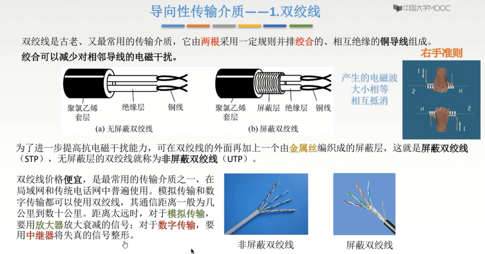
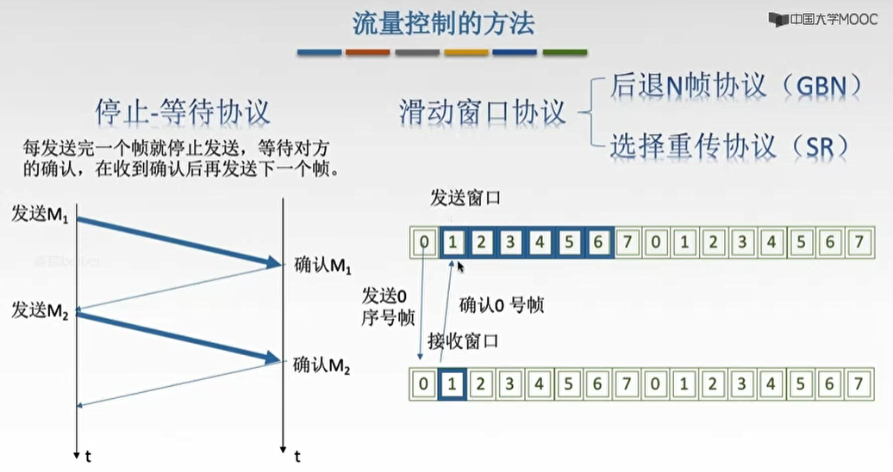
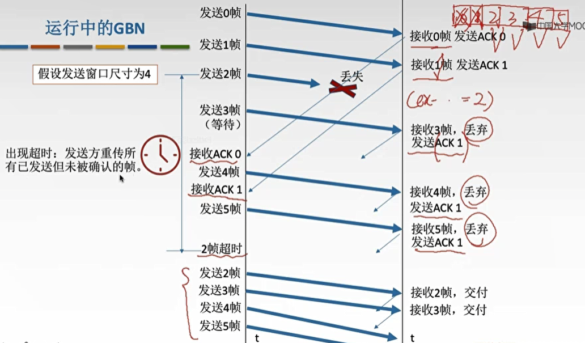
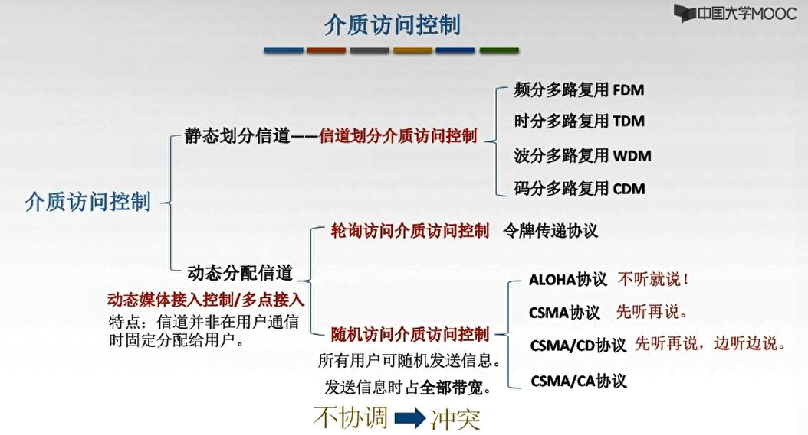
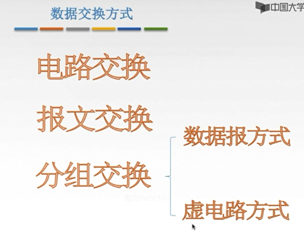
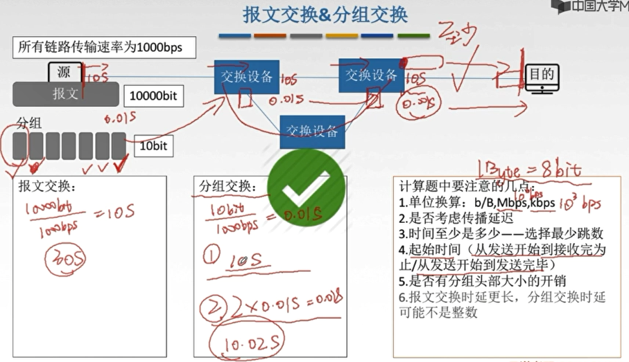
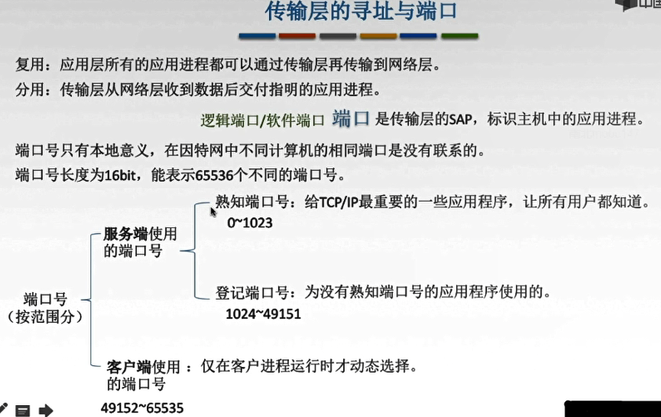
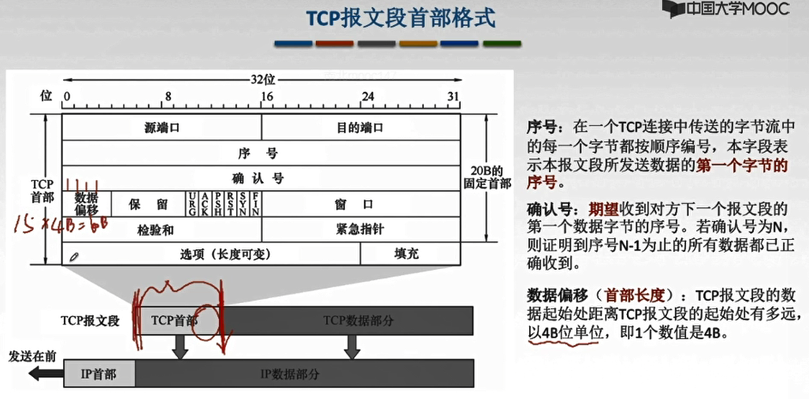

- [计算机网络](#计算机网络)
  - [第一章 计算机网络体系结构](#第一章-计算机网络体系结构)
    - [1-1-1 概念,组成,功能和分类{2019-07-25}](#1-1-1-概念组成功能和分类2019-07-25)
      - [计算机网络概念](#计算机网络概念)
      - [计算机网络功能](#计算机网络功能)
      - [计算机网络的组成](#计算机网络的组成)
      - [计算机网络的分类](#计算机网络的分类)
    - [1-1-2 标准化工作及相关组织{2019-07-25}](#1-1-2-标准化工作及相关组织2019-07-25)
      - [标准化工作](#标准化工作)
        - [标准的分类](#标准的分类)
        - [制定标准](#制定标准)
      - [标准化工作的相关组织](#标准化工作的相关组织)
    - [1-1-3 性能指标之速率,带宽,吞吐量{2019-07-25}](#1-1-3-性能指标之速率带宽吞吐量2019-07-25)
      - [速率](#速率)
      - [带宽](#带宽)
      - [吞吐量](#吞吐量)
    - [1-1-4 性能指标之时延,时延带宽积,往返时间RTT,利用率{2019-07-25}](#1-1-4-性能指标之时延时延带宽积往返时间rtt利用率2019-07-25)
      - [时延](#时延)
      - [时延带宽积](#时延带宽积)
      - [往返时间RTT](#往返时间rtt)
      - [利用率](#利用率)
    - [1-2-1 分层结构,协议,接口,服务{2019-07-25}](#1-2-1-分层结构协议接口服务2019-07-25)
      - [为什么要分层](#为什么要分层)
      - [怎么分层](#怎么分层)
      - [认识分层结构](#认识分层结构)
      - [概念总结](#概念总结)
    - [1-2-2 OSI参考模型I{2019-07-26}](#1-2-2-osi参考模型i2019-07-26)
      - [怎么来的](#怎么来的)
      - [ISO/OSI参考模型](#isoosi参考模型)
      - [OSI参考模型通信过程演示](#osi参考模型通信过程演示)
    - [1-2-3 OSI参考模型II{2019-07-26}](#1-2-3-osi参考模型ii2019-07-26)
      - [应用层](#应用层)
      - [表示层](#表示层)
      - [会话层](#会话层)
      - [传输层](#传输层)
      - [网络层](#网络层)
      - [数据链路层](#数据链路层)
      - [物理层](#物理层)
    - [1-2-4 TCP/IP参考模型和5层模型{2019-07-26}](#1-2-4-tcpip参考模型和5层模型2019-07-26)
      - [OSI参考模型与TCP/IP参考模型](#osi参考模型与tcpip参考模型)
      - [相同点](#相同点)
      - [不同点](#不同点)
      - [5层参考模型](#5层参考模型)
      - [5层参考模型的数据封装与解封装](#5层参考模型的数据封装与解封装)
  - [第二章 物理层](#第二章-物理层)
    - [2-1-1 物理层基本概念{2019-07-26}](#2-1-1-物理层基本概念2019-07-26)
    - [2-1-2 数据通信基础知识I{2019-07-26}](#2-1-2-数据通信基础知识i2019-07-26)
      - [典型的数据通信模型](#典型的数据通信模型)
      - [相关术语](#相关术语)
      - [三种通信方式](#三种通信方式)
      - [两种数据传输方式](#两种数据传输方式)
    - [2-1-3 数据通信基础知识II-码元波特速率带宽{2019-07-26}](#2-1-3-数据通信基础知识ii-码元波特速率带宽2019-07-26)
      - [码元](#码元)
      - [速率,波特,带宽](#速率波特带宽)
      - [练习题](#练习题)
    - [2-1-4 编码与调制I{2019-07-26}](#2-1-4-编码与调制i2019-07-26)
      - [基带信号与宽带信号](#基带信号与宽带信号)
      - [编码与调制](#编码与调制)
    - [2-1-5 编码与调制II{2019-07-27}](#2-1-5-编码与调制ii2019-07-27)
      - [数字数据编码为数字信号](#数字数据编码为数字信号)
      - [数字数据编码为模拟信号](#数字数据编码为模拟信号)
      - [模拟数据编码为数字信号](#模拟数据编码为数字信号)
      - [模拟数据编码为模拟信号](#模拟数据编码为模拟信号)
    - [2-1-6 奈氏准则和香农定理{2019-07-27}](#2-1-6-奈氏准则和香农定理2019-07-27)
      - [失真](#失真)
      - [失真的一种现象-码间串扰](#失真的一种现象-码间串扰)
      - [奈氏准则(奈奎斯特定理)](#奈氏准则奈奎斯特定理)
      - [香农定理](#香农定理)
      - [奈氏与香农](#奈氏与香农)
    - [2-2-1 物理层传输介质{2019-07-27}](#2-2-1-物理层传输介质2019-07-27)
      - [传输介质及分类](#传输介质及分类)
      - [导向性传输介质](#导向性传输介质)
        - [双绞线](#双绞线)
        - [同轴电缆](#同轴电缆)
        - [光纤](#光纤)
      - [非导向性传输介质](#非导向性传输介质)
    - [2-3-1 物理层设备{2019-07-27}](#2-3-1-物理层设备2019-07-27)
      - [中继器](#中继器)
      - [集线器(多口中继器)](#集线器多口中继器)
  - [第三章 数据链路层](#第三章-数据链路层)
    - [3-1-1 数据链路层的功能{2019-07-27}](#3-1-1-数据链路层的功能2019-07-27)
      - [数据链路层基本概念](#数据链路层基本概念)
      - [数据链路层功能概述](#数据链路层功能概述)
    - [3-2-1 封装成帧和透明传输{2019-07-28}](#3-2-1-封装成帧和透明传输2019-07-28)
      - [封装成帧](#封装成帧)
      - [透明传输](#透明传输)
      - [字符计数法](#字符计数法)
      - [字符填充法](#字符填充法)
      - [零比特填充法](#零比特填充法)
      - [违规编码法](#违规编码法)
    - [3-3-1 差错控制(检错编码){2019-07-30}](#3-3-1-差错控制检错编码2019-07-30)
      - [差错从何而来](#差错从何而来)
      - [数据链路层的差错控制](#数据链路层的差错控制)
      - [奇偶校验码](#奇偶校验码)
      - [CRC循环冗余码](#crc循环冗余码)
    - [3-3-2 差错控制(纠错编码){2019-07-30}](#3-3-2-差错控制纠错编码2019-07-30)
      - [海明码](#海明码)
      - [海明码流程](#海明码流程)
    - [3-4-1 流量控制与可靠传输机制{2019-07-31}](#3-4-1-流量控制与可靠传输机制2019-07-31)
      - [数据链路层的流量控制](#数据链路层的流量控制)
      - [流量控制的方法](#流量控制的方法)
      - [可靠传输滑动窗口流量控制](#可靠传输滑动窗口流量控制)
    - [3-4-2 停止-等待协议{2019-07-31}](#3-4-2-停止-等待协议2019-07-31)
      - [停等协议属于哪一层](#停等协议属于哪一层)
      - [停止等待协议](#停止等待协议)
      - [无差错情况](#无差错情况)
      - [有差错情况](#有差错情况)
      - [停等协议性能分析](#停等协议性能分析)
      - [信道利用率](#信道利用率)
    - [3-4-3 后退N帧协议(GBN){2019-07-31}](#3-4-3-后退n帧协议gbn2019-07-31)
      - [停等协议的弊端](#停等协议的弊端)
      - [后退N帧协议中的滑动窗口](#后退n帧协议中的滑动窗口)
      - [GBN发送方必须响应的三件事](#gbn发送方必须响应的三件事)
      - [GBN接收方要做的事](#gbn接收方要做的事)
      - [运行中的GBN](#运行中的gbn)
      - [滑动窗口长度](#滑动窗口长度)
      - [GBN协议重点](#gbn协议重点)
      - [GBN性能分析](#gbn性能分析)
    - [3-4-4 选择重传协议(SR){2019-07-31}](#3-4-4-选择重传协议sr2019-07-31)
      - [GBN协议的弊端](#gbn协议的弊端)
      - [选择重传协议中的滑动窗口](#选择重传协议中的滑动窗口)
      - [SR发送方必须响应的三件事](#sr发送方必须响应的三件事)
      - [SR接收方要做的事](#sr接收方要做的事)
      - [运行中的SR](#运行中的sr)
      - [滑动窗口长度](#滑动窗口长度-1)
      - [SR协议重点](#sr协议重点)
    - [3-5-1 信道划分介质访问控制{2019-07-31}](#3-5-1-信道划分介质访问控制2019-07-31)
      - [传输数据使用的两种链路](#传输数据使用的两种链路)
      - [介质访问控制分类](#介质访问控制分类)
      - [信道划分介质访问控制](#信道划分介质访问控制)
      - [频分多路复用FDM](#频分多路复用fdm)
      - [时分多路复用TDM](#时分多路复用tdm)
      - [改进的时分复用-统计时分复用STDM](#改进的时分复用-统计时分复用stdm)
      - [波分多路复用WDM](#波分多路复用wdm)
      - [码分多路复用CDM](#码分多路复用cdm)
    - [3-5-2 ALOHA协议{2019-07-31}](#3-5-2-aloha协议2019-07-31)
      - [介质访问控制动态分配信道](#介质访问控制动态分配信道)
      - [纯ALOHA协议](#纯aloha协议)
      - [时隙ALOHA协议](#时隙aloha协议)
      - [ALOHA协议重点](#aloha协议重点)
    - [3-5-3 CSMA协议{2019-08-01}](#3-5-3-csma协议2019-08-01)
      - [CSMA协议介绍](#csma协议介绍)
      - [1-坚持CSMA](#1-坚持csma)
      - [非坚持CSMA](#非坚持csma)
      - [P-坚持CSMA](#p-坚持csma)
      - [三种CSMA比较](#三种csma比较)
    - [3-5-4 CSMA/CD协议{2019-08-01}](#3-5-4-csmacd协议2019-08-01)
      - [CSMA/CD协议介绍](#csmacd协议介绍)
      - [传播时延对载波监听的影响](#传播时延对载波监听的影响)
      - [碰撞后的重传时机](#碰撞后的重传时机)
      - [最小帧长](#最小帧长)
    - [3-5-5 CSMA/CA协议{2019-08-01}](#3-5-5-csmaca协议2019-08-01)
      - [CSMA/CA协议介绍](#csmaca协议介绍)
      - [CSMA/CA协议工作原理](#csmaca协议工作原理)
      - [CSMA/CD与CSMA/CA比较](#csmacd与csmaca比较)
    - [3-5-6 轮询访问介质访问控制{2019-08-01}](#3-5-6-轮询访问介质访问控制2019-08-01)
      - [介质访问控制总结](#介质访问控制总结)
      - [轮询协议](#轮询协议)
      - [令牌传输协议](#令牌传输协议)
    - [3-6-1 局域网基本概念和体系结构{2019-08-01}](#3-6-1-局域网基本概念和体系结构2019-08-01)
      - [局域网基本概念](#局域网基本概念)
      - [局域网拓扑结构](#局域网拓扑结构)
      - [局域网传输介质](#局域网传输介质)
      - [局域网介质访问控制方法](#局域网介质访问控制方法)
      - [局域网分类](#局域网分类)
      - [IEEE802标准](#ieee802标准)
      - [MAC子层和LLC子层](#mac子层和llc子层)
    - [3-6-2 以太网{2019-08-01}](#3-6-2-以太网2019-08-01)
      - [以太网概述](#以太网概述)
      - [以太网提供无连接不可靠的服务](#以太网提供无连接不可靠的服务)
      - [以太网传输介质与拓扑结构的发展](#以太网传输介质与拓扑结构的发展)
      - [10BASE-T以太网](#10base-t以太网)
      - [适配器与MAC地址](#适配器与mac地址)
      - [以太网MAC帧](#以太网mac帧)
      - [高速以太网](#高速以太网)
    - [3-6-3 IEEE802.11无线局域网{2019-08-02}](#3-6-3-ieee80211无线局域网2019-08-02)
      - [802.11的MAC帧头格式](#80211的mac帧头格式)
      - [无线局域网的分类](#无线局域网的分类)
      - [有固定基础设施无线局域网](#有固定基础设施无线局域网)
      - [无固定基础设施无线局域网的自组织网络](#无固定基础设施无线局域网的自组织网络)
    - [3-7-1 广域网-PPP协议和HDLC协议{2019-08-02}](#3-7-1-广域网-ppp协议和hdlc协议2019-08-02)
      - [广域网概念](#广域网概念)
      - [PPP协议](#ppp协议)
      - [PPP协议应满足的要求](#ppp协议应满足的要求)
      - [PPP协议无需满足的要求](#ppp协议无需满足的要求)
      - [PPP协议的三个组成部分](#ppp协议的三个组成部分)
      - [PPP协议状态图](#ppp协议状态图)
      - [PPP协议的帧格式](#ppp协议的帧格式)
      - [HDLC协议](#hdlc协议)
      - [HDLC的站](#hdlc的站)
      - [HDLC的帧格式](#hdlc的帧格式)
      - [PPP协议和HDLC协议](#ppp协议和hdlc协议)
    - [3-8-1 数据链路层设备{2019-08-02}](#3-8-1-数据链路层设备2019-08-02)
      - [物理层扩展以太网](#物理层扩展以太网)
      - [链路层扩展以太网-网桥](#链路层扩展以太网-网桥)
      - [网桥分类-透明网桥](#网桥分类-透明网桥)
      - [网桥分类-源路由网桥](#网桥分类-源路由网桥)
      - [多接口网桥-以太网交换机](#多接口网桥-以太网交换机)
      - [以太网交换机的两种交换方式](#以太网交换机的两种交换方式)
      - [冲突域和广播域](#冲突域和广播域)
  - [第四章 网络层](#第四章-网络层)
    - [4-1-1 网络层功能概述{2019-08-26}](#4-1-1-网络层功能概述2019-08-26)
    - [4-2-1 数据交换方式{2019-08-26}](#4-2-1-数据交换方式2019-08-26)
      - [电路交换](#电路交换)
      - [报文交换](#报文交换)
      - [分组交换](#分组交换)
        - [数据报方式](#数据报方式)
        - [虚电路方式](#虚电路方式)
        - [数据报&虚电路](#数据报虚电路)
      - [报文交换VS分组交换](#报文交换vs分组交换)
      - [三种数据交换方式比较](#三种数据交换方式比较)
      - [传输单元名词辨析](#传输单元名词辨析)
    - [4-3-1 IP数据报格式{2019-08-26}](#4-3-1-ip数据报格式2019-08-26)
    - [4-3-2 IP数据报分片{2019-08-26}](#4-3-2-ip数据报分片2019-08-26)
    - [4-4-1 IPV4地址{2019-08-26}](#4-4-1-ipv4地址2019-08-26)
      - [IP编址的历史阶段](#ip编址的历史阶段)
      - [分类的IP地址](#分类的ip地址)
      - [特殊IP地址](#特殊ip地址)
      - [私有IP地址](#私有ip地址)
    - [4-4-2 网络地址转换(NAT){2019-08-27}](#4-4-2-网络地址转换nat2019-08-27)
    - [4-4-3 子网划分和子网掩码{2019-08-27}](#4-4-3-子网划分和子网掩码2019-08-27)
      - [分类IP地址的弱点](#分类ip地址的弱点)
      - [子网划分](#子网划分)
      - [子网掩码](#子网掩码)
      - [使用子网时分组的转发](#使用子网时分组的转发)
    - [4-4-4 无分类编址CIDR(构成超网){2019-08-27}](#4-4-4-无分类编址cidr构成超网2019-08-27)
      - [构成超网](#构成超网)
      - [最长前缀匹配](#最长前缀匹配)
    - [4-4-5 ARP协议{2019-08-27}](#4-4-5-arp协议2019-08-27)
      - [发送数据的过程](#发送数据的过程)
      - [ARP协议](#arp协议)
    - [4-4-6 DHCP协议{2019-08-29}](#4-4-6-dhcp协议2019-08-29)
      - [主机如何获得IP](#主机如何获得ip)
      - [DHCP协议](#dhcp协议)
    - [4-4-7 网际控制报文协议ICMP{2019-08-29}](#4-4-7-网际控制报文协议icmp2019-08-29)
      - [ICMP差错报告报文(5种)](#icmp差错报告报文5种)
        - [ICMP差错控制报文数据字段](#icmp差错控制报文数据字段)
        - [不应发送ICMP差错报文的情况](#不应发送icmp差错报文的情况)
      - [ICMP询问报文](#icmp询问报文)
      - [ICMP的应用](#icmp的应用)
    - [4-5-1 IPV6{2019-08-29}](#4-5-1-ipv62019-08-29)
      - [为什么要有IPV6](#为什么要有ipv6)
      - [IPV6数据报格式](#ipv6数据报格式)
      - [IPV6和IPV4](#ipv6和ipv4)
      - [IPV6地址表示形式](#ipv6地址表示形式)
      - [IPV6基本地址类型](#ipv6基本地址类型)
      - [IPV6向IPV4过渡的策略](#ipv6向ipv4过渡的策略)
    - [4-2+6-1 路由算法与路由协议概述{2019-08-29}](#4-26-1-路由算法与路由协议概述2019-08-29)
      - [路由算法](#路由算法)
      - [路由算法的分类](#路由算法的分类)
      - [分层次的路由选择协议](#分层次的路由选择协议)
    - [4-2+6-2 RIP协议与距离向量算法{2019-08-29}](#4-26-2-rip协议与距离向量算法2019-08-29)
      - [RIP协议](#rip协议)
      - [RIP协议交换](#rip协议交换)
      - [距离向量算法](#距离向量算法)
      - [RIP协议的报文格式](#rip协议的报文格式)
      - [RIP协议特点](#rip协议特点)
    - [4-2+6-3 OSPF协议与链路状态算法{2019-08-30}](#4-26-3-ospf协议与链路状态算法2019-08-30)
      - [OSPF协议](#ospf协议)
      - [链路状态路由算法](#链路状态路由算法)
      - [OSPF的区域](#ospf的区域)
      - [OSPF分组](#ospf分组)
      - [OSPF特点](#ospf特点)
    - [4-2+6-4 BGP协议{2019-08-30}](#4-26-4-bgp协议2019-08-30)
      - [BGP协议](#bgp协议)
      - [BGP协议交换信息的过程](#bgp协议交换信息的过程)
      - [BGP协议报文格式](#bgp协议报文格式)
      - [BGP协议特点](#bgp协议特点)
      - [BGP-4的四种报文](#bgp-4的四种报文)
      - [三种路由协议比较](#三种路由协议比较)
    - [4-7-1 IP组播{2019-08-30}](#4-7-1-ip组播2019-08-30)
      - [IP数据报的三种传输方式](#ip数据报的三种传输方式)
      - [IP组播地址](#ip组播地址)
      - [硬件组播](#硬件组播)
      - [网际组管理协议IGMP](#网际组管理协议igmp)
      - [IGMP工作的两个阶段](#igmp工作的两个阶段)
      - [组播路由选择协议](#组播路由选择协议)
    - [4-8-1 移动IP{2019-08-30}](#4-8-1-移动ip2019-08-30)
      - [移动IP相关术语](#移动ip相关术语)
      - [移动IP通信过程](#移动ip通信过程)
    - [4-9-1 网络层设备](#4-9-1-网络层设备)
      - [路由器](#路由器)
      - [输入端口对线路上收到的分组的处理](#输入端口对线路上收到的分组的处理)
      - [输出端口将交换机构传送来的分组发送到线路](#输出端口将交换机构传送来的分组发送到线路)
      - [三层设备的区别](#三层设备的区别)
      - [路由表和路由转发](#路由表和路由转发)
  - [第五章 传输层](#第五章-传输层)
    - [5-1-1 传输层概述{2019-08-31}](#5-1-1-传输层概述2019-08-31)
      - [传输层](#传输层-1)
      - [传输层的两个协议](#传输层的两个协议)
      - [传输层的寻址和端口](#传输层的寻址和端口)
    - [5-2-1 UDP协议{2019-08-31}](#5-2-1-udp协议2019-08-31)
      - [UDP协议](#udp协议)
      - [UDP首部格式](#udp首部格式)
      - [UDP校验](#udp校验)
    - [5-3-1 TCP协议特点和TCP报文段格式{2019-08-31}](#5-3-1-tcp协议特点和tcp报文段格式2019-08-31)
      - [TCP协议的特点](#tcp协议的特点)
      - [TCP报文段首部格式](#tcp报文段首部格式)
    - [5-3-2 TCP连接管理{2019-08-31}](#5-3-2-tcp连接管理2019-08-31)
      - [TCP的连接建立](#tcp的连接建立)
      - [SYN洪泛攻击](#syn洪泛攻击)
      - [TCP的连接释放](#tcp的连接释放)
    - [5-3-3 TCP可靠传输{2019-08-31}](#5-3-3-tcp可靠传输2019-08-31)
      - [序号](#序号)
      - [确认](#确认)
      - [重传](#重传)
    - [5-3-4 TCP流量控制{2019-08-31}](#5-3-4-tcp流量控制2019-08-31)
    - [5-3-5 TCP拥塞控制{2019-08-31}](#5-3-5-tcp拥塞控制2019-08-31)
      - [TCP拥塞控制算法](#tcp拥塞控制算法)
      - [慢开始和拥塞避免](#慢开始和拥塞避免)
      - [快重传和快恢复](#快重传和快恢复)
  - [第六章 应用层](#第六章-应用层)
    - [6-1-1 网络应用模型{2019-09-01}](#6-1-1-网络应用模型2019-09-01)
      - [应用层概述](#应用层概述)
      - [客户-服务器模型](#客户-服务器模型)
      - [P2P模型](#p2p模型)
    - [6-2-1 域名解析系统DNS{2019-09-01}](#6-2-1-域名解析系统dns2019-09-01)
      - [DNS系统](#dns系统)
      - [域名](#域名)
      - [域名服务器](#域名服务器)
      - [域名解析过程](#域名解析过程)
    - [6-3-1 文件传输协议FTP{2019-09-01}](#6-3-1-文件传输协议ftp2019-09-01)
      - [文件传输协议](#文件传输协议)
      - [FTP服务器和客户端](#ftp服务器和客户端)
      - [FTP工作原理](#ftp工作原理)
    - [6-4-1 电子邮件{2019-09-01}](#6-4-1-电子邮件2019-09-01)
    - [6-5-1 万维网和http{2019-09-01}](#6-5-1-万维网和http2019-09-01)

# 计算机网络

## 第一章 计算机网络体系结构

### 1-1-1 概念,组成,功能和分类{2019-07-25}

#### 计算机网络概念

> 计算机网络:是一个将分散的,具有独立功能的`计算机系统`,通过`网络设备`与`线路`连接起来,由功能完善的`软件`实现`资源共享和信息传递`的系统

1. 计算机网络是`互连`的,`自治`的计算机集合
   1. 互连:互联互通/通信线路
   2. 自治:无主从关系

#### 计算机网络功能

1. 数据通信(连通性)
2. 资源共享(硬件/软件/数据)
3. 分布式处理,多台计算机各自承担同一工作任务的不同部分(如Hadoop平台)
4. 提高可靠性
5. 负载均衡

#### 计算机网络的组成

1. 组成方式
   1. 硬件
   2. 软件
   3. 协议
2. 工作方式
   1. 边缘部分-用户直接使用
      1. C/S方式
      2. P2P方式
   2. 核心部分-为边缘部分服务
      1. 路由器等
3. 功能组成
   1. 通信子网-实现数据通信
   2. 资源子网-实现资源共享/数据处理

#### 计算机网络的分类

1. 按分布范围分
   1. 广域网WAN
   2. 城域网MAN
   3. 局域网WAN
   4. 个人局域网PAN
2. 按使用者分
   1. 公用网
   2. 专用网
3. 按交换技术分
   1. 电路交换
   2. 报文交换
   3. 分组交换
4. 按拓扑结构分
   1. 总线型
   2. 星型
   3. 环型
   4. 网状型
5. 按传输技术分
   1. 广播式网络-共享公共通信信道
   2. 点对点网络-使用分组存储转发和路由选择机制

### 1-1-2 标准化工作及相关组织{2019-07-25}

#### 标准化工作

##### 标准的分类

1. 法定标准:由权威机构制定的正式的合法的标准(ISO)
2. 事实标准:某些公司产品占据了主流,时间长了其中的协议和技术就成了标准(TCP/IP)

##### 制定标准

1. RFC(Request For Comments)--因特网标准的形式
2. RFC上升为因特网正式标准的四个阶段
   1. 因特网草案(Internet Draft)
   2. 建议标准(Proposed Standard)
   3. 交由IETF,IAB审核(目前已取消该步骤)
   4. 因特网标准(Internet Standard)

#### 标准化工作的相关组织

1. 国际标准化组织ISO
   1. OSI参考模型,HDLC协议
2. 国际电信联盟ITU
   1. 制定通信规则
3. 国际电气电子工程师协会IEEE
   1. 学术机构
   2. IEEE802系列标准
   3. 5G
4. Internet工程任务组IETF
   1. 负责因特网相关标准的制定

### 1-1-3 性能指标之速率,带宽,吞吐量{2019-07-25}

#### 速率

1. `速率即数据率或数据传输率或比特率`
2. 连接在计算机网络上的主机在数字信道上传送数据位数的速率
3. 单位是b/s,kb/s,Mb/s,Gb/s,Tb/s

> 速率以`k`表示1000,以位为单位;存储容量以`K`表示1024,以字节为单位

#### 带宽

1. `带宽`原本指某个信号具有的频带宽度,即最高频率和最低频率之差,单位为赫兹
2. 计算机网络中,带宽用以表示网络的通信线路传送数据的能力,通常是指单位时间内从网络中的某一点到另一点所能通过的`最高数据率`,单位是比特每秒.实际用的是最高发送速率,并非传输速率

#### 吞吐量

1. 吞吐量表示单位时间内通过某个网络(或信道,接口)的数据量
2. 单位b/s,kb/s,Mb/s
3. 吞吐量受网络的带宽或网络的额定速率的限制

### 1-1-4 性能指标之时延,时延带宽积,往返时间RTT,利用率{2019-07-25}

#### 时延

1. 指数据(报文/分组/比特流)从网络(或链路)的一端传送到另一端所需的时间.也叫`延迟或迟延`.单位是s
2. 包括
   1. 发送时延(传输时延)
   2. 传播时延
   3. 排队时延
   4. 处理时延

#### 时延带宽积

1. 时延带宽积=传播时延×带宽
2. 又称为以比特为单位的链路长度,即某链路现在有多少比特

#### 往返时间RTT

1. 从发送方发送数据开始,到发送方收到接收方的确认(接收方收到数据后立即发送确认)总共经历的时延
2. RTT越大,在收到确认之前,可以发送的数据越多
3. RTT包括
   1. 往返传播时间=传播时延*2
   2. 末端处理时间

#### 利用率

1. 信道利用率=有数据通过时间/(有和无)数据通过时间
2. 网络利用率=信道利用率加权平均值
3. 利用率越高,时延急剧增大

### 1-2-1 分层结构,协议,接口,服务{2019-07-25}

#### 为什么要分层

1. 网络通信过程中需要考虑很多问题,因此分层处理,每层只负责处理本层的任务

#### 怎么分层

1. 分层的基本原则
   1. 各层之间相互`独立`,每层只实现一种相互独立的功能
   2. 每层之间界面`自然清晰`,易于理解,相互交流尽可能少
   3. 结构上可分隔开.每层都采用`最合适的技术`来实现
   4. 保持`下层对上层的独立性`,上层单向使用下层提供的服务
   5. 整个分层结构应该能促进标准化工作

#### 认识分层结构

1. 实体:第n层的活动元素称为`n层实体`.同一层的实体叫`对等实体`
2. 协议:为进行网络中的对等实体数据交换而建立的规则,标准或约定称为网络协议(`水平`)
   1. 语法:规定传输数据的格式
   2. 语义:规定所要完成的功能
   3. 同步:规定各种操作的顺序
3. 接口(访问服务点SAP):上层使用下层服务的入口
4. 服务:下层为相邻上层提供的功能调用(`垂直`)
5. PCI+SDU=PDU

#### 概念总结

### 1-2-2 OSI参考模型I{2019-07-26}

#### 怎么来的

1. 目的:支持`异构网络系统`的互联互通
2. 国际标准化组织(ISO)于1984年提出`开放系统互连(OSI)参考模型`

#### ISO/OSI参考模型

1. 应用层
2. 表示层
3. 会话层
4. 传输层
5. 网络层
6. 数据链路层
7. 物理层

#### OSI参考模型通信过程演示

1. 上四层`端到端`,下三层`点到点`
2. 除物理层外其他各层都`加头部`
3. 数据链路层`不仅加头还加尾`

### 1-2-3 OSI参考模型II{2019-07-26}

#### 应用层

1. 所有能和用户交互产生网络流量的程序
2. 典型应用层服务
   1. 文件传输(FTP)
   2. 电子邮件(SMTP)
   3. 万维网(HTTP)

#### 表示层

1. 用于处理在两个通信系统中交换信息的表示方式(语法和语义)
2. 功能
   1. 数据格式变换
   2. 数据加密解密
   3. 数据压缩和恢复
3. 协议
   1. jpeg
   2. ascii 

#### 会话层

1. 向表示层实体/用户进程提供`建立连接`并在连接上`有序的传输数据`
2. 这是会话,也是`建立同步(SYN)`
3. 功能
   1. 建立,管理,终止会话
   2. 使用校验点可使会话在通信失效时从`检验点/同步点`继续恢复通信,实现数据同步(适用于传输大文件)
4. 协议
   1. ADSP
   2. ASP

#### 传输层

1. 负责主机中`两个进程`的通信,即`端到端`的通信.传输单位是报文段或用户数据报
2. 功能
   1. `可`靠传输/不可靠传输
   2. `差`错控制
   3. `流`量控制(速度匹配问题)
   4. 复`用`分用
      1. 复用:多个应用层进程可同时使用下面传输层的服务
      2. 分用:传输层把收到的信息分别交付给上面应用层中相应的进程
3. 协议
   1. TCP
   2. UDP

#### 网络层

1. 主要任务是把`分组`从源端传到目的端,为分组交换网上的不同主机提供通信服务.网络层传输单位是`数据报`
2. 数据报与分组的关系类似父与子的关系
3. 功能
   1. 路由选择
   2. 流量控制
   3. 差错控制
   4. 拥塞控制
      1. 若所有结点都来不及接收分组,而要丢弃大量分组的话,网络就处于`拥塞状态`
4. 协议
   1. IP
   2. IPX
   3. ICMP
   4. IGMP
   5. ARP
   6. RARP
   7. OSPF

#### 数据链路层

1. 主要任务是把网络层传下来的数据报`组装成帧`.数据链路层的传输单位是`帧`
2. 功能
   1. 成帧(定义帧的开始和结束)
   2. 差错控制(帧错+位错)
   3. 流量控制
   4. 访问(接入)控制:控制对信道的访问
3. 协议
   1. SDLC
   2. HDLC
   3. PPP
   4. STP

#### 物理层

1. 主要任务是在`物理媒体`上实现比特流的`透明传输`.物理层传输单位是`比特`
2. 透明传输:指不管所传数据是什么样的比特组合,都应当能够在链路上传送
3. 功能
   1. 定义接口特性
   2. 定义传输模式(单工,半双工,双工)
   3. 定义传输速率
   4. 比特同步
   5. 比特编码
4. 协议
   1. Rj45
   2. 802.3

### 1-2-4 TCP/IP参考模型和5层模型{2019-07-26}

#### OSI参考模型与TCP/IP参考模型

#### 相同点

1. 都分层
2. 基于独立的协议栈的概念
3. 可以实现异构网络互连

#### 不同点

#### 5层参考模型

#### 5层参考模型的数据封装与解封装

## 第二章 物理层

### 2-1-1 物理层基本概念{2019-07-26}

1. 机械特性
2. 电气特性
3. 功能特性
4. 规程特性

### 2-1-2 数据通信基础知识I{2019-07-26}

#### 典型的数据通信模型

#### 相关术语

#### 三种通信方式

#### 两种数据传输方式

### 2-1-3 数据通信基础知识II-码元波特速率带宽{2019-07-26}

#### 码元

#### 速率,波特,带宽

#### 练习题

### 2-1-4 编码与调制I{2019-07-26}

#### 基带信号与宽带信号

#### 编码与调制

### 2-1-5 编码与调制II{2019-07-27}

#### 数字数据编码为数字信号

1. `非归零编码(NRZ)`
   1. 高1低0
   2. `编码容易实现`,但没有检错功能,且无法判断一个码元的开始和结束,以至于收发双方`难以保持同步`
2. 归零编码(RZ)
   1. 信号电平在一个码元之内都要恢复到零的编码方式
3. 反向不归零编码(NRZI)
   1. 信号电平反转表示0,信号电平不变表示1
4. `曼彻斯特编码`
   1. 将一个码元分成两个相等的间隔,前一个间隔为低后一个为高表示码元1;码元0则相反.也可以采用相反的规定.
   2. 该编码的特点是在每一个码元的中间出现电平跳变,位中间的跳变既作时钟信号(用于同步),又作数据信号,但它所占的频带宽度是原始的基带宽度的两倍.每个码元都被调成两个电平,所以`数据传输速率只有调制速率的一半`
5. `差分曼彻斯特编码`
   1. 同1异0
   2. 常用于局域网传输
   3. 若码元为1,则前半个码元的电平与上一个码元的后半部分的电平相同,若为0,则相反
   4. 在每个码元的中间都有一次电平的跳转,可以实现自同步,`且抗干扰能力强于曼彻斯特编码`
6. 4B/5B编码
   1. 比特流中插入额外的比特以打破一连串的0或1,就是用5个比特来编码4个比特的数据,之后再传给接收方,因此称为4B/5B.
   2. 编码效率为80%

#### 数字数据编码为模拟信号

#### 模拟数据编码为数字信号

#### 模拟数据编码为模拟信号

### 2-1-6 奈氏准则和香农定理{2019-07-27}

#### 失真

#### 失真的一种现象-码间串扰

#### 奈氏准则(奈奎斯特定理)

#### 香农定理

#### 奈氏与香农

### 2-2-1 物理层传输介质{2019-07-27}

#### 传输介质及分类

#### 导向性传输介质

##### 双绞线

##### 同轴电缆

##### 光纤

#### 非导向性传输介质

### 2-3-1 物理层设备{2019-07-27}

#### 中继器

#### 集线器(多口中继器)

## 第三章 数据链路层

### 3-1-1 数据链路层的功能{2019-07-27}

#### 数据链路层基本概念

#### 数据链路层功能概述

### 3-2-1 封装成帧和透明传输{2019-07-28}

#### 封装成帧

#### 透明传输

#### 字符计数法

#### 字符填充法

#### 零比特填充法

#### 违规编码法

### 3-3-1 差错控制(检错编码){2019-07-30}

#### 差错从何而来

#### 数据链路层的差错控制

#### 奇偶校验码

#### CRC循环冗余码

### 3-3-2 差错控制(纠错编码){2019-07-30}

#### 海明码

#### 海明码流程

1. 确定校验码位数r
2. 确定校验码和数据的位置
3. 求出校验码的值
4. 检错并纠错

### 3-4-1 流量控制与可靠传输机制{2019-07-31}

#### 数据链路层的流量控制

#### 流量控制的方法

#### 可靠传输滑动窗口流量控制

### 3-4-2 停止-等待协议{2019-07-31}

#### 停等协议属于哪一层

1. 以前属于链路层,因为链路质量不好,出错概率大
2. 后来属于传输层,提高了链路层的效率

#### 停止等待协议

#### 无差错情况

#### 有差错情况

#### 停等协议性能分析

#### 信道利用率

### 3-4-3 后退N帧协议(GBN){2019-07-31}

#### 停等协议的弊端

#### 后退N帧协议中的滑动窗口

#### GBN发送方必须响应的三件事

#### GBN接收方要做的事

#### 运行中的GBN

#### 滑动窗口长度

#### GBN协议重点

#### GBN性能分析

1. 因连续发送数据帧而提高了信道利用率
2. 在重传时必须把原来已经正确传送的数据帧重传,使传送效率降低

### 3-4-4 选择重传协议(SR){2019-07-31}

#### GBN协议的弊端

#### 选择重传协议中的滑动窗口

#### SR发送方必须响应的三件事

#### SR接收方要做的事

#### 运行中的SR

#### 滑动窗口长度

#### SR协议重点

### 3-5-1 信道划分介质访问控制{2019-07-31}

#### 传输数据使用的两种链路

#### 介质访问控制分类

#### 信道划分介质访问控制

#### 频分多路复用FDM

#### 时分多路复用TDM

#### 改进的时分复用-统计时分复用STDM

#### 波分多路复用WDM

#### 码分多路复用CDM

### 3-5-2 ALOHA协议{2019-07-31}

#### 介质访问控制动态分配信道

#### 纯ALOHA协议

#### 时隙ALOHA协议

#### ALOHA协议重点

### 3-5-3 CSMA协议{2019-08-01}

#### CSMA协议介绍

#### 1-坚持CSMA

#### 非坚持CSMA

#### P-坚持CSMA

#### 三种CSMA比较

### 3-5-4 CSMA/CD协议{2019-08-01}

#### CSMA/CD协议介绍

#### 传播时延对载波监听的影响

#### 碰撞后的重传时机

#### 最小帧长

### 3-5-5 CSMA/CA协议{2019-08-01}

#### CSMA/CA协议介绍

#### CSMA/CA协议工作原理

#### CSMA/CD与CSMA/CA比较

### 3-5-6 轮询访问介质访问控制{2019-08-01}

#### 介质访问控制总结

#### 轮询协议

#### 令牌传输协议

### 3-6-1 局域网基本概念和体系结构{2019-08-01}

#### 局域网基本概念

#### 局域网拓扑结构

#### 局域网传输介质

#### 局域网介质访问控制方法

#### 局域网分类

#### IEEE802标准

#### MAC子层和LLC子层

### 3-6-2 以太网{2019-08-01}

#### 以太网概述

#### 以太网提供无连接不可靠的服务

#### 以太网传输介质与拓扑结构的发展

#### 10BASE-T以太网

#### 适配器与MAC地址

#### 以太网MAC帧

#### 高速以太网

### 3-6-3 IEEE802.11无线局域网{2019-08-02}

> IEEE802.11是无线局域网通用的标准,它是由IEEE所定义的无线网络标准的标准.WiFi是无线局域网的子集

#### 802.11的MAC帧头格式

#### 无线局域网的分类

1. 有固定基础设施无线局域网
2. 无固定基础设施无线局域网的自组织网络

#### 有固定基础设施无线局域网

#### 无固定基础设施无线局域网的自组织网络

### 3-7-1 广域网-PPP协议和HDLC协议{2019-08-02}

#### 广域网概念

#### PPP协议

#### PPP协议应满足的要求

#### PPP协议无需满足的要求

#### PPP协议的三个组成部分

#### PPP协议状态图

#### PPP协议的帧格式

#### HDLC协议

#### HDLC的站

#### HDLC的帧格式

#### PPP协议和HDLC协议

### 3-8-1 数据链路层设备{2019-08-02}

#### 物理层扩展以太网

#### 链路层扩展以太网-网桥

#### 网桥分类-透明网桥

#### 网桥分类-源路由网桥

#### 多接口网桥-以太网交换机

#### 以太网交换机的两种交换方式

#### 冲突域和广播域

## 第四章 网络层

### 4-1-1 网络层功能概述{2019-08-26}

### 4-2-1 数据交换方式{2019-08-26}

> 网络的核心:`路由器`

#### 电路交换

#### 报文交换

#### 分组交换

1. 分为两种
   1. 数据报方式
   2. 虚电路方式

##### 数据报方式

##### 虚电路方式

##### 数据报&虚电路

#### 报文交换VS分组交换

#### 三种数据交换方式比较

#### 传输单元名词辨析

### 4-3-1 IP数据报格式{2019-08-26}

### 4-3-2 IP数据报分片{2019-08-26}

### 4-4-1 IPV4地址{2019-08-26}

#### IP编址的历史阶段

#### 分类的IP地址

#### 特殊IP地址

#### 私有IP地址

### 4-4-2 网络地址转换(NAT){2019-08-27}

### 4-4-3 子网划分和子网掩码{2019-08-27}

#### 分类IP地址的弱点

#### 子网划分

#### 子网掩码

#### 使用子网时分组的转发

### 4-4-4 无分类编址CIDR(构成超网){2019-08-27}

#### 构成超网

#### 最长前缀匹配

### 4-4-5 ARP协议{2019-08-27}

#### 发送数据的过程

#### ARP协议

### 4-4-6 DHCP协议{2019-08-29}

#### 主机如何获得IP

#### DHCP协议

### 4-4-7 网际控制报文协议ICMP{2019-08-29}

> 为了更有效的转发IP数据报和提高交付成功的机会

#### ICMP差错报告报文(5种)

##### ICMP差错控制报文数据字段

##### 不应发送ICMP差错报文的情况

#### ICMP询问报文

#### ICMP的应用

### 4-5-1 IPV6{2019-08-29}

#### 为什么要有IPV6

#### IPV6数据报格式

#### IPV6和IPV4

#### IPV6地址表示形式

#### IPV6基本地址类型

#### IPV6向IPV4过渡的策略

### 4-2+6-1 路由算法与路由协议概述{2019-08-29}

#### 路由算法

#### 路由算法的分类

#### 分层次的路由选择协议

### 4-2+6-2 RIP协议与距离向量算法{2019-08-29}

#### RIP协议

#### RIP协议交换

#### 距离向量算法

#### RIP协议的报文格式

#### RIP协议特点

### 4-2+6-3 OSPF协议与链路状态算法{2019-08-30}

#### OSPF协议

#### 链路状态路由算法

#### OSPF的区域

#### OSPF分组

#### OSPF特点

### 4-2+6-4 BGP协议{2019-08-30}

#### BGP协议

#### BGP协议交换信息的过程

#### BGP协议报文格式

#### BGP协议特点

#### BGP-4的四种报文

#### 三种路由协议比较

### 4-7-1 IP组播{2019-08-30}

#### IP数据报的三种传输方式

#### IP组播地址

#### 硬件组播

#### 网际组管理协议IGMP

#### IGMP工作的两个阶段

#### 组播路由选择协议

### 4-8-1 移动IP{2019-08-30}

#### 移动IP相关术语

#### 移动IP通信过程

### 4-9-1 网络层设备

#### 路由器

#### 输入端口对线路上收到的分组的处理

#### 输出端口将交换机构传送来的分组发送到线路

#### 三层设备的区别

#### 路由表和路由转发

## 第五章 传输层

### 5-1-1 传输层概述{2019-08-31}

#### 传输层

#### 传输层的两个协议

#### 传输层的寻址和端口

### 5-2-1 UDP协议{2019-08-31}

#### UDP协议

#### UDP首部格式

#### UDP校验

### 5-3-1 TCP协议特点和TCP报文段格式{2019-08-31}

#### TCP协议的特点

#### TCP报文段首部格式

### 5-3-2 TCP连接管理{2019-08-31}

#### TCP的连接建立

#### SYN洪泛攻击

#### TCP的连接释放

### 5-3-3 TCP可靠传输{2019-08-31}

#### 序号

#### 确认

#### 重传

### 5-3-4 TCP流量控制{2019-08-31}

### 5-3-5 TCP拥塞控制{2019-08-31}

#### TCP拥塞控制算法

#### 慢开始和拥塞避免

#### 快重传和快恢复

## 第六章 应用层

### 6-1-1 网络应用模型{2019-09-01}

#### 应用层概述

#### 客户-服务器模型

#### P2P模型

### 6-2-1 域名解析系统DNS{2019-09-01}

#### DNS系统

#### 域名

#### 域名服务器

#### 域名解析过程

### 6-3-1 文件传输协议FTP{2019-09-01}

#### 文件传输协议

#### FTP服务器和客户端

#### FTP工作原理

### 6-4-1 电子邮件{2019-09-01}

1. 一个电子邮件系统的`三个最主要的组成构件`:用户代理、邮件服务器和电子邮件使用的协议,如SMTP、POP3(或IMAP).`注意:三段TCP连接`
2. 用户代理:用户与电子邮件系统的接口,实际上就是一个运行在PC上的程序
3. 邮件发送协议:用于用户代理向邮件服务器发送邮件或在邮件服务器之间发送邮件,通常使用的是SMTP
4. 邮件读取协议:用于用户代理从邮件服务器读取邮件,如POP3
5. MIME(多用途网际邮件扩充):解决了SMTP无法传送其他非英语国家文字的问题
6. SMTP采用TCP连接,使用25号端口.`SMTP不使用中间的邮件服务器`,TCP连接总是在发送方和接收方这两个邮件服务器之间直接建立
7. POP也是采用TCP连接,使用110号端口
8. 以上端口号指的都是服务器端的端口号,客户端端口号随机分配
9. 很多基于万维网的电子邮件的特点:用户浏览器与这些电子邮件服务器之间的发送或接收邮件是使用HTTP协议(指的是你登录邮件服务器是使用http协议,比如登录`mail.qq.com`),而仅在不同邮件服务器之间传送邮件才使用SMTP协议(登录之后传送邮件仍然是使用SMTP+POP/IMAP)

### 6-5-1 万维网和http{2019-09-01}

1. 万维网的内核部分由以下三个部分构成:
   1. 统一资源定位符(URL)
   2. 超文本传输协议(HTTP)
   3. 超文本标记语言(HTML)
2. URL的一般形式为:<协议>://<主机>:<端口>/<路径>.常见的协议有http,ftp等.<主机>是存放资源的主机在因特网中的域名,也可以是IP地址；<端口>和<路径>可以省略,URL中不区分大小写
3. HTTP包含两类报文:请求报文和响应报文
4. `HTTP协议是无状态的`.即同一个客户第二次访问同一个服务器上的页面时,服务器的响应与第一次被访问时的相同
5. Cookie存在于用户主机,Session存在于服务器
6. `HTTP协议本身是无连接的`,即虽然HTTP使用了TCP连接,但通信的双方在交换HTTP报文之前不需要先建立HTTP连接
7. HTTP1.0为非持久连接,HTTP1.1为持久连接
8. 对于非持久连接,每一个网页元素对象(比如一个JPEG图、FLASH等)的传输都需要建立一个TCP连接.在TCP连接建立时,可以在第三次握手的报文段中捎带客户对万维网文档的请求.也就是说,请求一个万维网文档的时间是该文档的传输时间(服务器将该文档完全发送至链路)加上两倍RTT(前一个RTT对应于TCP连接建立的前两次握手,另一个RTT对应于请求(TCP建立连接第三次握手)和接收文档)
9. 所谓持久连接就是万维网服务器在发送响应后仍然保持这条连接,使同一个客户和服务器可继续在这条连接上传送后续的HTTP请求和响应报文
10. 持久连接又分为非流水线和流水线两种方式.对于非流水线方式,客户在收到一个响应后才能发出下一个请求
11. HTTP1.1的默认模式是使用流水线的持久连接,这种情况下客户每遇到一个对象引用就立即发出一个请求,因而客户可以一个接一个地连续发出对各个引用对象的请求.如果所有的请求和响应都是连续发送的,那么所有引用到的对象共计经历1个RTT延迟,而不是像非流水线版本那样,每个引用都必须有一个RTT延迟
12. `HTTP是面向文本的`
13. 当客户端使用非持续连接向服务器发送HTTP请求报文时,第一个获得的对象是HTML基本文件,然后才会获得自己实际想要的对象
