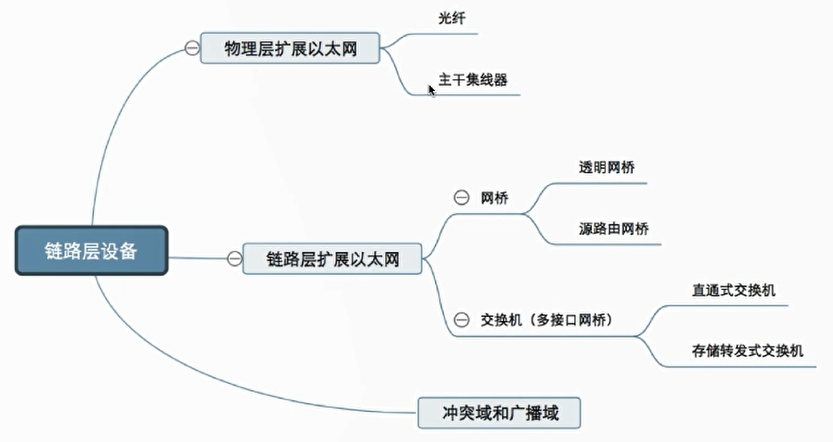

# 计算机网络

## 第一章 计算机网络体系结构

### 1-1-1 概念,组成,功能和分类{2019-07-25}

#### 计算机网络概念

> 计算机网络:是一个将分散的,具有独立功能的`计算机系统`,通过`网络设备`与`线路`连接起来,由功能完善的`软件`实现`资源共享和信息传递`的系统

1. 计算机网络是`互连`的,`自治`的计算机集合
   1. 互连:互联互通/通信线路
   2. 自治:无主从关系

#### 计算机网络功能

1. 数据通信(连通性)
2. 资源共享(硬件/软件/数据)
3. 分布式处理,多台计算机各自承担同一工作任务的不同部分(如Hadoop平台)
4. 提高可靠性
5. 负载均衡

#### 计算机网络的组成

1. 组成方式
   1. 硬件
   2. 软件
   3. 协议
2. 工作方式
   1. 边缘部分-用户直接使用
      1. C/S方式
      2. P2P方式
   2. 核心部分-为边缘部分服务
      1. 路由器等
3. 功能组成
   1. 通信子网-实现数据通信
   2. 资源子网-实现资源共享/数据处理

#### 计算机网络的分类

1. 按分布范围分
   1. 广域网WAN
   2. 城域网MAN
   3. 局域网WAN
   4. 个人局域网PAN
2. 按使用者分
   1. 公用网
   2. 专用网
3. 按交换技术分
   1. 电路交换
   2. 报文交换
   3. 分组交换
4. 按拓扑结构分
   1. 总线型
   2. 星型
   3. 环型
   4. 网状型
5. 按传输技术分
   1. 广播式网络-共享公共通信信道
   2. 点对点网络-使用分组存储转发和路由选择机制

### 1-1-2 标准化工作及相关组织{2019-07-25}

#### 标准化工作

##### 标准的分类

1. 法定标准:由权威机构制定的正式的合法的标准(ISO)
2. 事实标准:某些公司产品占据了主流,时间长了其中的协议和技术就成了标准(TCP/IP)

##### 制定标准

1. RFC(Request For Comments)--因特网标准的形式
2. RFC上升为因特网正式标准的四个阶段
   1. 因特网草案(Internet Draft)
   2. 建议标准(Proposed Standard)
   3. 交由IETF,IAB审核(目前已取消该步骤)
   4. 因特网标准(Internet Standard)

#### 标准化工作的相关组织

1. 国际标准化组织ISO
   1. OSI参考模型,HDLC协议
2. 国际电信联盟ITU
   1. 制定通信规则
3. 国际电气电子工程师协会IEEE
   1. 学术机构
   2. IEEE802系列标准
   3. 5G
4. Internet工程任务组IETF
   1. 负责因特网相关标准的制定

### 1-1-3 性能指标之速率,带宽,吞吐量{2019-07-25}

#### 速率

1. `速率即数据率或数据传输率或比特率`
2. 连接在计算机网络上的主机在数字信道上传送数据位数的速率
3. 单位是b/s,kb/s,Mb/s,Gb/s,Tb/s

> 速率以`k`表示1000,以位为单位;存储容量以`K`表示1024,以字节为单位

#### 带宽

1. `带宽`原本指某个信号具有的频带宽度,即最高频率和最低频率之差,单位为赫兹
2. 计算机网络中,带宽用以表示网络的通信线路传送数据的能力,通常是指单位时间内从网络中的某一点到另一点所能通过的`最高数据率`,单位是比特每秒.实际用的是最高发送速率,并非传输速率

#### 吞吐量

1. 吞吐量表示单位时间内通过某个网络(或信道,接口)的数据量
2. 单位b/s,kb/s,Mb/s
3. 吞吐量受网络的带宽或网络的额定速率的限制

### 1-1-4 性能指标之时延,时延带宽积,往返时间RTT,利用率{2019-07-25}

#### 时延

1. 指数据(报文/分组/比特流)从网络(或链路)的一端传送到另一端所需的时间.也叫`延迟或迟延`.单位是s
2. 包括
   1. 发送时延(传输时延)
   2. 传播时延
   3. 排队时延
   4. 处理时延

#### 时延带宽积

1. 时延带宽积=传播时延×带宽
2. 又称为以比特为单位的链路长度,即某链路现在有多少比特

#### 往返时间RTT

1. 从发送方发送数据开始,到发送方收到接收方的确认(接收方收到数据后立即发送确认)总共经历的时延
2. RTT越大,在收到确认之前,可以发送的数据越多
3. RTT包括
   1. 往返传播时间=传播时延*2
   2. 末端处理时间

#### 利用率

1. 信道利用率=有数据通过时间/(有和无)数据通过时间
2. 网络利用率=信道利用率加权平均值
3. 利用率越高,时延急剧增大

### 1-2-1 分层结构,协议,接口,服务{2019-07-25}

#### 为什么要分层

1. 网络通信过程中需要考虑很多问题,因此分层处理,每层只负责处理本层的任务

#### 怎么分层

1. 分层的基本原则
   1. 各层之间相互`独立`,每层只实现一种相互独立的功能
   2. 每层之间界面`自然清晰`,易于理解,相互交流尽可能少
   3. 结构上可分隔开.每层都采用`最合适的技术`来实现
   4. 保持`下层对上层的独立性`,上层单向使用下层提供的服务
   5. 整个分层结构应该能促进标准化工作

#### 认识分层结构

1. 实体:第n层的活动元素称为`n层实体`.同一层的实体叫`对等实体`
2. 协议:为进行网络中的对等实体数据交换而建立的规则,标准或约定称为网络协议(`水平`)
   1. 语法:规定传输数据的格式
   2. 语义:规定所要完成的功能
   3. 同步:规定各种操作的顺序
3. 接口(访问服务点SAP):上层使用下层服务的入口
4. 服务:下层为相邻上层提供的功能调用(`垂直`)
5. PCI+SDU=PDU

#### 概念总结

### 1-2-2 OSI参考模型I{2019-07-26}

#### 怎么来的

1. 目的:支持`异构网络系统`的互联互通
2. 国际标准化组织(ISO)于1984年提出`开放系统互连(OSI)参考模型`

#### ISO/OSI参考模型

1. 应用层
2. 表示层
3. 会话层
4. 传输层
5. 网络层
6. 数据链路层
7. 物理层

#### OSI参考模型通信过程演示

1. 上四层`端到端`,下三层`点到点`
2. 除物理层外其他各层都`加头部`
3. 数据链路层`不仅加头还加尾`

### 1-2-3 OSI参考模型II{2019-07-26}

#### 应用层

1. 所有能和用户交互产生网络流量的程序
2. 典型应用层服务
   1. 文件传输(FTP)
   2. 电子邮件(SMTP)
   3. 万维网(HTTP)

#### 表示层

1. 用于处理在两个通信系统中交换信息的表示方式(语法和语义)
2. 功能
   1. 数据格式变换
   2. 数据加密解密
   3. 数据压缩和恢复
3. 协议
   1. jpeg
   2. ascii 

#### 会话层

1. 向表示层实体/用户进程提供`建立连接`并在连接上`有序的传输数据`
2. 这是会话,也是`建立同步(SYN)`
3. 功能
   1. 建立,管理,终止会话
   2. 使用校验点可使会话在通信失效时从`检验点/同步点`继续恢复通信,实现数据同步(适用于传输大文件)
4. 协议
   1. ADSP
   2. ASP

#### 传输层

1. 负责主机中`两个进程`的通信,即`端到端`的通信.传输单位是报文段或用户数据报
2. 功能
   1. `可`靠传输/不可靠传输
   2. `差`错控制
   3. `流`量控制(速度匹配问题)
   4. 复`用`分用
      1. 复用:多个应用层进程可同时使用下面传输层的服务
      2. 分用:传输层把收到的信息分别交付给上面应用层中相应的进程
3. 协议
   1. TCP
   2. UDP

#### 网络层

1. 主要任务是把`分组`从源端传到目的端,为分组交换网上的不同主机提供通信服务.网络层传输单位是`数据报`
2. 数据报与分组的关系类似父与子的关系
3. 功能
   1. 路由选择
   2. 流量控制
   3. 差错控制
   4. 拥塞控制
      1. 若所有结点都来不及接收分组,而要丢弃大量分组的话,网络就处于`拥塞状态`
4. 协议
   1. IP
   2. IPX
   3. ICMP
   4. IGMP
   5. ARP
   6. RARP
   7. OSPF

#### 数据链路层

1. 主要任务是把网络层传下来的数据报`组装成帧`.数据链路层的传输单位是`帧`
2. 功能
   1. 成帧(定义帧的开始和结束)
   2. 差错控制(帧错+位错)
   3. 流量控制
   4. 访问(接入)控制:控制对信道的访问
3. 协议
   1. SDLC
   2. HDLC
   3. PPP
   4. STP

#### 物理层

1. 主要任务是在`物理媒体`上实现比特流的`透明传输`.物理层传输单位是`比特`
2. 透明传输:指不管所传数据是什么样的比特组合,都应当能够在链路上传送
3. 功能
   1. 定义接口特性
   2. 定义传输模式(单工,半双工,双工)
   3. 定义传输速率
   4. 比特同步
   5. 比特编码
4. 协议
   1. Rj45
   2. 802.3

### 1-2-4 TCP/IP参考模型和5层模型{2019-07-26}

#### OSI参考模型与TCP/IP参考模型

#### 相同点

1. 都分层
2. 基于独立的协议栈的概念
3. 可以实现异构网络互连

#### 不同点

#### 5层参考模型

#### 5层参考模型的数据封装与解封装

## 第二章 物理层

### 2-1-1 物理层基本概念{2019-07-26}

1. 机械特性
2. 电气特性
3. 功能特性
4. 规程特性

### 2-1-2 数据通信基础知识I{2019-07-26}

#### 典型的数据通信模型

#### 相关术语

#### 三种通信方式

#### 两种数据传输方式

### 2-1-3 数据通信基础知识II-码元波特速率带宽{2019-07-26}

#### 码元

#### 速率,波特,带宽

#### 练习题

### 2-1-4 编码与调制I{2019-07-26}

#### 基带信号与宽带信号

#### 编码与调制

### 2-1-5 编码与调制II{2019-07-27}

#### 数字数据编码为数字信号

1. `非归零编码(NRZ)`
   1. 高1低0
   2. `编码容易实现`,但没有检错功能,且无法判断一个码元的开始和结束,以至于收发双方`难以保持同步`
2. 归零编码(RZ)
   1. 信号电平在一个码元之内都要恢复到零的编码方式
3. 反向不归零编码(NRZI)
   1. 信号电平反转表示0,信号电平不变表示1
4. `曼彻斯特编码`
   1. 将一个码元分成两个相等的间隔,前一个间隔为低后一个为高表示码元1;码元0则相反.也可以采用相反的规定.
   2. 该编码的特点是在每一个码元的中间出现电平跳变,位中间的跳变既作时钟信号(用于同步),又作数据信号,但它所占的频带宽度是原始的基带宽度的两倍.每个码元都被调成两个电平,所以`数据传输速率只有调制速率的一半`
5. `差分曼彻斯特编码`
   1. 同1异0
   2. 常用于局域网传输
   3. 若码元为1,则前半个码元的电平与上一个码元的后半部分的电平相同,若为0,则相反
   4. 在每个码元的中间都有一次电平的跳转,可以实现自同步,`且抗干扰能力强于曼彻斯特编码`
6. 4B/5B编码
   1. 比特流中插入额外的比特以打破一连串的0或1,就是用5个比特来编码4个比特的数据,之后再传给接收方,因此称为4B/5B.
   2. 编码效率为80%

#### 数字数据编码为模拟信号

#### 模拟数据编码为数字信号

#### 模拟数据编码为模拟信号

### 2-1-6 奈氏准则和香农定理{2019-07-27}

#### 失真

#### 失真的一种现象-码间串扰

#### 奈氏准则(奈奎斯特定理)

#### 香农定理

#### 奈氏与香农

### 2-2-1 物理层传输介质{2019-07-27}

#### 传输介质及分类

#### 导向性传输介质

##### 双绞线

##### 同轴电缆

##### 光纤

#### 非导向性传输介质

### 2-3-1 物理层设备{2019-07-27}

#### 中继器

#### 集线器(多口中继器)

## 第三章 数据链路层

### 3-1-1 数据链路层的功能{2019-07-27}

#### 数据链路层基本概念

#### 数据链路层功能概述

### 3-2-1 封装成帧和透明传输{2019-07-28}

#### 封装成帧

#### 透明传输

#### 字符计数法

#### 字符填充法

#### 零比特填充法

#### 违规编码法

### 3-3-1 差错控制(检错编码){2019-07-30}

#### 差错从何而来

#### 数据链路层的差错控制

#### 奇偶校验码

#### CRC循环冗余码

### 3-3-2 差错控制(纠错编码){2019-07-30}

#### 海明码

#### 海明码流程

1. 确定校验码位数r
2. 确定校验码和数据的位置
3. 求出校验码的值
4. 检错并纠错

### 3-4-1 流量控制与可靠传输机制{2019-07-31}

#### 数据链路层的流量控制

#### 流量控制的方法

#### 可靠传输滑动窗口流量控制

### 3-4-2 停止-等待协议{2019-07-31}

#### 停等协议属于哪一层

1. 以前属于链路层,因为链路质量不好,出错概率大
2. 后来属于传输层,提高了链路层的效率

#### 停止等待协议

#### 无差错情况

#### 有差错情况

#### 停等协议性能分析

#### 信道利用率

### 3-4-3 后退N帧协议(GBN){2019-07-31}

#### 停等协议的弊端

#### 后退N帧协议中的滑动窗口

#### GBN发送方必须响应的三件事

#### GBN接收方要做的事

#### 运行中的GBN

#### 滑动窗口长度

#### GBN协议重点

#### GBN性能分析

1. 因连续发送数据帧而提高了信道利用率
2. 在重传时必须把原来已经正确传送的数据帧重传,使传送效率降低

### 3-4-4 选择重传协议(SR){2019-07-31}

#### GBN协议的弊端

#### 选择重传协议中的滑动窗口

#### SR发送方必须响应的三件事

#### SR接收方要做的事

#### 运行中的SR

#### 滑动窗口长度

#### SR协议重点

### 3-5-1 信道划分介质访问控制{2019-07-31}

#### 传输数据使用的两种链路

#### 介质访问控制分类

#### 信道划分介质访问控制

#### 频分多路复用FDM

#### 时分多路复用TDM

#### 改进的时分复用-统计时分复用STDM

#### 波分多路复用WDM

#### 码分多路复用CDM

### 3-5-2 ALOHA协议{2019-07-31}

#### 介质访问控制动态分配信道

#### 纯ALOHA协议

#### 时隙ALOHA协议

#### ALOHA协议重点

### 3-5-3 CSMA协议{2019-08-01}

#### CSMA协议介绍

#### 1-坚持CSMA

#### 非坚持CSMA

#### P-坚持CSMA

#### 三种CSMA比较

### 3-5-4 CSMA/CD协议{2019-08-01}

#### CSMA/CD协议介绍

#### 传播时延对载波监听的影响

#### 碰撞后的重传时机

#### 最小帧长

### 3-5-5 CSMA/CA协议{2019-08-01}

#### CSMA/CA协议介绍

#### CSMA/CA协议工作原理

#### CSMA/CD与CSMA/CA比较

### 3-5-6 轮询访问介质访问控制{2019-08-01}

#### 介质访问控制总结

#### 轮询协议

#### 令牌传输协议

### 3-6-1 局域网基本概念和体系结构{2019-08-01}

#### 局域网基本概念

#### 局域网拓扑结构

#### 局域网传输介质

#### 局域网介质访问控制方法

#### 局域网分类

#### IEEE802标准

#### MAC子层和LLC子层

### 3-6-2 以太网{2019-08-01}

#### 以太网概述

#### 以太网提供无连接不可靠的服务

#### 以太网传输介质与拓扑结构的发展

#### 10BASE-T以太网

#### 适配器与MAC地址

#### 以太网MAC帧

#### 高速以太网

### 3-6-3 IEEE802.11无线局域网{2019-08-02}

> IEEE802.11是无线局域网通用的标准,它是由IEEE所定义的无线网络标准的标准.WiFi是无线局域网的子集

#### 802.11的MAC帧头格式

#### 无线局域网的分类

1. 有固定基础设施无线局域网
2. 无固定基础设施无线局域网的自组织网络

#### 有固定基础设施无线局域网

#### 无固定基础设施无线局域网的自组织网络

### 3-7-1 广域网-PPP协议和HDLC协议{2019-08-02}

#### 广域网概念

#### PPP协议

#### PPP协议应满足的要求

#### PPP协议无需满足的要求

#### PPP协议的三个组成部分

#### PPP协议状态图

#### PPP协议的帧格式

#### HDLC协议

#### HDLC的站

#### HDLC的帧格式

#### PPP协议和HDLC协议

### 3-8-1 数据链路层设备{2019-08-02}

#### 物理层扩展以太网

#### 链路层扩展以太网-网桥

#### 网桥分类-透明网桥

#### 网桥分类-源路由网桥

#### 多接口网桥-以太网交换机

#### 以太网交换机的两种交换方式

#### 冲突域和广播域

## 第四章 网络层

### 4-1-1 网络层功能概述

### 4-3-1 IP数据报格式

### 4-3-2 IP数据报分片

### 4-4-1 IPV4地址

### 4-4-2 网络地址转换

### 4-4-3 子网划分和子网掩码

### 4-4-4 无分类编制CIDR

### 4-4-5 ARP协议

### 4-4-6 DHCP协议

### 4-4-7 ICMP协议

### 4-5-1 IPV6

### 4-2+6-1 路由算法与路由协议概述

### 4-2+6-2 RIP协议与距离向量算法

### 4-2+6-3 OSPF协议与链路状态算法

### 4-2+6-4 BGP协议

### 4-7-1 IP组播

### 4-8-1 移动IP

### 4-9-1 网络层设备

## 第五章 传输层

### 5-1-1 传输层概述

### 5-2-1 UDP协议

### 5-3-1 TCP协议特点和TCP报文段格式

### 5-3-2 TCP连接管理

### 5-3-3 TCP可靠传输

### 5-3-4 TCP流量控制

### 5-3-5 TCP拥塞控制

## 第六章 应用层
