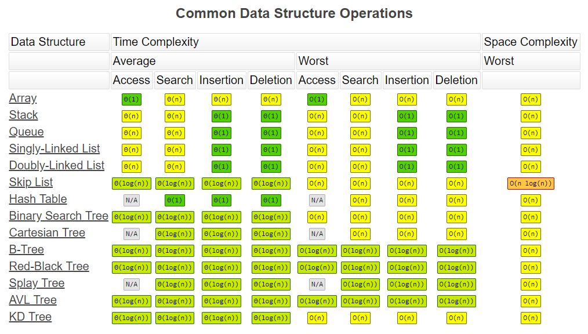
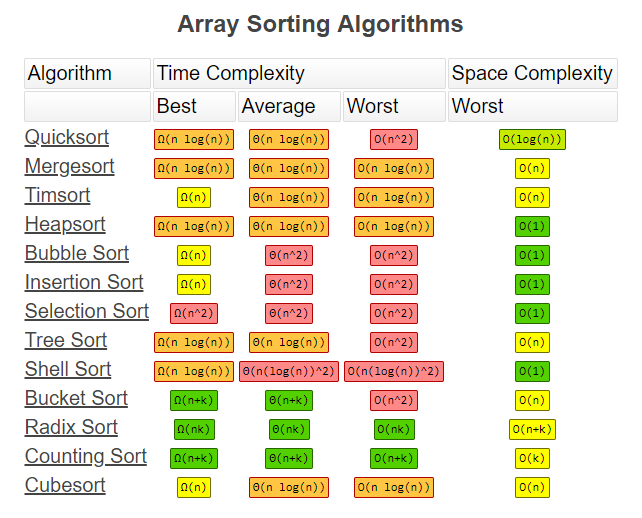

- [算法](#算法)
  - [0总结](#0总结)
    - [代码模板](#代码模板)
      - [递归](#递归)
      - [DFS](#dfs)
      - [BFS](#bfs)
      - [二分查找](#二分查找)
      - [动态规划](#动态规划)
      - [位运算](#位运算)
    - [面试答题四件套](#面试答题四件套)
  - [1数组(Array)&链表(Linked List)](#1数组array链表linked-list)
    - [206反转链表](#206反转链表)
    - [24两两交换链表中的节点](#24两两交换链表中的节点)
    - [141环形链表](#141环形链表)
  - [2堆栈(Stack)&队列(Queue)](#2堆栈stack队列queue)
    - [20有效的括号](#20有效的括号)
    - [232用栈实现队列](#232用栈实现队列)
    - [225用队列实现栈](#225用队列实现栈)
    - [703数据流中的第K大元素](#703数据流中的第k大元素)
    - [239滑动窗口最大值](#239滑动窗口最大值)
  - [3映射(Map)&集合(Set)](#3映射map集合set)
    - [242有效的字母异位词](#242有效的字母异位词)
    - [1两数之和](#1两数之和)
    - [15 三数之和](#15-三数之和)
  - [4树(Tree)&二叉树(Binary Tree)&二叉搜索树(Binary Search Tree)](#4树tree二叉树binary-tree二叉搜索树binary-search-tree)
    - [98验证二叉搜索树](#98验证二叉搜索树)
    - [236二叉树的最近公共祖先](#236二叉树的最近公共祖先)
    - [235二叉搜索树的最近公共祖先](#235二叉搜索树的最近公共祖先)
  - [5二叉树遍历(Binary Tree Travesal)](#5二叉树遍历binary-tree-travesal)
    - [144二叉树的前序遍历](#144二叉树的前序遍历)
    - [94二叉树的中序遍历](#94二叉树的中序遍历)
    - [145二叉树的后序遍历](#145二叉树的后序遍历)
  - [6递归(Recursion)&分治(Divide&Conquer)](#6递归recursion分治divideconquer)
    - [50Pow(x,n)](#50powxn)
    - [169求众数](#169求众数)
  - [7贪心算法(Greedy)](#7贪心算法greedy)
    - [122买卖股票的最佳时机II](#122买卖股票的最佳时机ii)
  - [8广度优先搜索(BFS,Bready-First-Search)](#8广度优先搜索bfsbready-first-search)
    - [102二叉树的层次遍历](#102二叉树的层次遍历)
    - [104二叉树的最大深度](#104二叉树的最大深度)
    - [111二叉树的最小深度](#111二叉树的最小深度)
    - [22括号生成](#22括号生成)
  - [9深度优先搜索(DFS,Depth-First-Search)](#9深度优先搜索dfsdepth-first-search)
  - [10剪枝(Pruning)](#10剪枝pruning)
    - [51@N皇后](#51n皇后)
    - [52@N皇后II](#52n皇后ii)
    - [36有效的数独](#36有效的数独)
    - [37解数独](#37解数独)
  - [11二分查找(Binary Search)](#11二分查找binary-search)
    - [69@x的平方根](#69x的平方根)
  - [12字典树(Trie)](#12字典树trie)
    - [208实现Trie(前缀树)](#208实现trie前缀树)
    - [212单词搜索II](#212单词搜索ii)
  - [13位运算(Bit)](#13位运算bit)
    - [191位1的个数](#191位1的个数)
    - [231@2的幂](#2312的幂)
    - [338比特位计数](#338比特位计数)
    - [52@N皇后II(位运算版本)](#52n皇后ii位运算版本)
  - [14动态规划(Dynamic Programming)](#14动态规划dynamic-programming)
    - [70爬楼梯](#70爬楼梯)
    - [120三角形最小路径和](#120三角形最小路径和)
    - [152乘积最大子序列](#152乘积最大子序列)
    - [买卖股票的最佳时机系列](#买卖股票的最佳时机系列)
      - [121最多一笔交易,最多一支股票](#121最多一笔交易最多一支股票)
      - [122不限交易次数,最多一支股票](#122不限交易次数最多一支股票)
      - [123最多两次交易,最多一支股票](#123最多两次交易最多一支股票)
      - [188最多k次交易,最多一支股票](#188最多k次交易最多一支股票)
      - [309不限交易次数,最多一支股票,含冷冻期](#309不限交易次数最多一支股票含冷冻期)
      - [714不限交易交易,最多一支股票,含手续费](#714不限交易交易最多一支股票含手续费)
    - [300最长上升子序列](#300最长上升子序列)
    - [322零钱兑换](#322零钱兑换)
    - [72编辑距离](#72编辑距离)
  - [15并查集(Union&Find)](#15并查集unionfind)
    - [200岛屿数量](#200岛屿数量)
    - [547朋友圈](#547朋友圈)
  - [16最近最少使用缓存(LRU,least recently used cache)](#16最近最少使用缓存lruleast-recently-used-cache)
    - [146@LRU缓存机制](#146lru缓存机制)
  - [17布隆过滤器(Bloom Filter)](#17布隆过滤器bloom-filter)

# 算法





## 0总结

### 代码模板

#### 递归

```py
def recursion(level,param1,param2,):
    # 递归终止条件
    if level > MAX:
        result
        return
    # 当前层逻辑
    process_data(level,data)
    # 向下递归
    recursion(next_level.param1,param2)
    # 如果需要的话,处理当前层的状态
    reverse_state(level)
```

#### DFS

```py
visited = set()
def DFS(node,visited):
    visited.add(node)
    # 处理当前节点
    process_data(node)
    for next_node in node.next_nodes():
        if next_node not in visited:
            DFS(next_node,visited)
```

```py
stack = list()  # 使用列表模拟栈
stack.append(root)
visited = set()
while stack:
    node = stack.pop()
    visited.add(node)
    # 处理当前节点
    process(node)
    nodes = generate_related_nodes(node)
    stack.append(nodes)
```

#### BFS

```py
queue = collections.deque()
queue.append(root)
visited = set()
while queue:
    node = queue.popleft()
    visited.add(node)
    # 处理当前节点
    nodes = generate_related_nodes(node)
    queue.append(nodes)
```

#### 二分查找

```py
def binarySearch(arr, target):
    left, right = 0, len(arr) - 1
    while left <= right:
        mid = left + (right-left) // 2
        if arr[mid] == target:
            return mid
        elif arr[mid] > target:
            right = mid - 1
        else:
            left = mid + 1
```

#### 动态规划

```py
# 状态定义
dp[i][j]
# 初始状态
dp[0][0] = 0
# 递推公式
for i in range(i):
    for j in range(j):
        dp[i][j] = 
return dp[m][n]
```

#### 位运算

```py
# 判断奇偶
x & 1 == 1 or == 0
# 清除最低位的1
x = x & (x-1)
# 得到最低位的1
b = x & -x
```

### 面试答题四件套

1. Clarification(询问题目细节,边界条件,可能的极端情况)
2. Possible Solution(所有可能的解法都和面试官沟通一遍)
   1. Compare Time & Space Complexity
   2. Optimal Solution
3. Coding
4. Test Cases

## 1数组(Array)&链表(Linked List)

1. 数组:支持随机访问,但是插入和删除复杂
2. 链表:插入和删除方便,但是不支持随机访问

### 206反转链表

```py
# Definition for singly-linked list.
# class ListNode:
#     def __init__(self, x):
#         self.val = x
#         self.next = None

"""
# 解法一
class Solution:
    def reverseList(self, head: ListNode) -> ListNode:
        # 使用两个指针迭代
        pre = None
        cur = head
        
        while cur:
            nextTemp = cur.next
            cur.next = pre
            pre = cur
            cur = nextTemp
        
        return pre

"""

# 解法二
class Solution:
    def reverseList(self, head: ListNode) -> ListNode:
        # 使用两个指针迭代
        pre = None
        cur = head
        
        while cur:
            # 利用python循环赋值特性,去掉中间变量
            pre, cur.next, cur = cur, pre, cur.next
    
        return pre
```

### 24两两交换链表中的节点

```py
# Definition for singly-linked list.
# class ListNode:
#     def __init__(self, x):
#         self.val = x
#         self.next = None

class Solution:
    def swapPairs(self, head: ListNode) -> ListNode:
        pre, pre.next = self, head
        
        while pre.next and pre.next.next:
            # cur = pre.next
            # n = cur.next
            # nn = n.next
            # pre.next = n
            # n.next = cur
            # cur.next = nn
            # pre = cur
            
            cur = pre.next
            n = cur.next
            pre.next, n.next, cur.next = n, cur, n.next
            pre = cur
            
        return self.next
```

### 141环形链表

```py
# Definition for singly-linked list.
# class ListNode(object):
#     def __init__(self, x):
#         self.val = x
#         self.next = None

"解法一"
# class Solution(object):
#     def hasCycle(self, head):
#         """
#         :type head: ListNode
#         :rtype: bool
#         """
#         fast = slow = head
        
#         while slow and fast and fast.next:
#             slow = slow.next
#             fast = fast.next.next
#             if slow is fast:
#                 return True
        
#         return False
    

"解法二"
class Solution(object):
    def hasCycle(self, head):
        """
        :type head: ListNode
        :rtype: bool
        """
        s = set()
        while head:
            if head in s:
                return True
            s.add(head)
            head = head.next
        
        return False
```

## 2堆栈(Stack)&队列(Queue)

1. 栈:先入后出
2. 队列:先入先出
3. 优先队列(PriorityQueue):正常入,按照优先级出
   1. 实现机制
      1. 堆(二叉堆,多项式堆,斐波那契堆),根节点大于(小于)左右节点
      2. 二叉搜索树

### 20有效的括号

```py
class Solution:
    def isValid(self, s: str) -> bool:
        stack = list()
        items = {"}":"{", "]":"[", ")":"("}
        for c in s:
            if c not in items:
                stack.append(c)
            elif not stack:
                return False
            elif items.get(c, None) != stack.pop():
                return False
        return not stack
```

### 232用栈实现队列

```py
class MyQueue:

    def __init__(self):
        """
        Initialize your data structure here.
        """
        self.s1 = list()
        self.s2 = list()
        

    def push(self, x: int) -> None:
        """
        Push element x to the back of queue.
        """
        self.s1.append(x)
        

    def pop(self) -> int:
        """
        Removes the element from in front of queue and returns that element.
        """
        if not self.s2:
            for i in range(len(self.s1)):
                self.s2.append(self.s1.pop())
        return self.s2.pop()
        
        
    def peek(self) -> int:
        """
        Get the front element.
        """
        if not self.s2:
            for i in range(len(self.s1)):
                self.s2.append(self.s1.pop())
        return self.s2[-1]
        

    def empty(self) -> bool:
        """
        Returns whether the queue is empty.
        """
        return not(self.s1 or self.s2)
        


# Your MyQueue object will be instantiated and called as such:
# obj = MyQueue()
# obj.push(x)
# param_2 = obj.pop()
# param_3 = obj.peek()
# param_4 = obj.empty()
```

### 225用队列实现栈

```py
class MyStack:

    def __init__(self):
        """
        Initialize your data structure here.
        """
        self.queue = list()
        

    def push(self, x: int) -> None:
        """
        Push element x onto stack.
        """
        self.queue.append(x)
        

    def pop(self) -> int:
        """
        Removes the element on top of the stack and returns that element.
        """
        return self.queue.pop()
        

    def top(self) -> int:
        """
        Get the top element.
        """
        return self.queue[-1]
        
        
    def empty(self) -> bool:
        """
        Returns whether the stack is empty.
        """
        return not self.queue
        


# Your MyStack object will be instantiated and called as such:
# obj = MyStack()
# obj.push(x)
# param_2 = obj.pop()
# param_3 = obj.top()
# param_4 = obj.empty()
```

### 703数据流中的第K大元素

```py
"解法一"

# from queue import PriorityQueue as pq
# class KthLargest:

#     def __init__(self, k: int, nums: List[int]):
#         self.pq = pq()
#         self.k = k
#         for i in nums:
#             self.pq.put(i)
#             if (self.pq.qsize())>k:
#                 self.pq.get()


#     def add(self, val: int) -> int:
#         self.pq.put(val);
#         if (self.pq.qsize())>self.k:
#             self.pq.get()
#         ret = self.pq.get()
#         self.pq.put(ret)
#         return ret

"解法二"

import heapq
class KthLargest:

    def __init__(self, k: int, nums: List[int]):
        heapq.heapify(nums)
        self.hp = nums
        self.k = k
        while len(self.hp)>k:
            heapq.heappop(self.hp)
        

    def add(self, val: int) -> int:
        if len(self.hp)<self.k:
            heapq.heappush(self.hp,val)
        elif self.hp[0]<val:
            heapq.heapreplace(self.hp,val)
        return self.hp[0]


# Your KthLargest object will be instantiated and called as such:
# obj = KthLargest(k, nums)
# param_1 = obj.add(val)
```

### 239滑动窗口最大值

```py
import heapq
from collections import deque

class Solution:
    def maxSlidingWindow(self, nums: List[int], k: int) -> List[int]:
        if not nums or k == 1:
            return nums
        
        """
        "解法一"
        return [max(nums[i:i+k]) for i in range(len(nums)-k+1)]
        """
        
        """
        "解法二"
        buf = list()
        ma = list()
        for i in range(len(nums)):
            if i<k:
                heapq.heappush(buf,nums[i])
                if i==k-1:
                    ma.append(heapq.nlargest(1,buf)[0])
                else:
                    pass
            else:
                buf.remove(nums[i-k])
                heapq.heappush(buf,nums[i])
                ma.append(heapq.nlargest(1,buf)[0])
        
        return ma
        """
        
        
        "解法三"
        ma = list()
        dq = deque()
        for i in range(len(nums)):
            # 新到的元素比队列尾部元素大则剔除队列尾部元素
            while dq and nums[dq[-1]] <= nums[i]:
                dq.pop()
            # 添加新元素时保存数组下标,避免数组中存在重复元素时无法获取元素下标
            dq.append(i)
            # 当队首元素超出窗口范围时移除队首元素
            if dq[0] == i-k:
                dq.popleft()
            # 从窗口被填满开始,记录队首元素即窗口中最大值
            if i >= k-1:
                ma.append(nums[dq[0]])

        return ma
```

## 3映射(Map)&集合(Set)

1. 哈希函数
2. 哈希碰撞:链表解决
3. 哈希和二叉搜索树实现映射和集合
4. 映射:键值对
5. 集合:键和值相同

### 242有效的字母异位词

```py
class Solution:
    def isAnagram(self, s: str, t: str) -> bool:
        
        # "解法一"
        # return sorted(s) == sorted(t)

       
        # "解法二"
        # dict1 = dict()
        # dict2 = dict()
        # for c in s:
        #     dict1[c] = dict1.get(c,0) + 1
        # for c in t:
        #     dict2[c] = dict2.get(c,0) + 1
        # return dict1 == dict2
        
        "解法三"
        ls = [0]*26
        for c in s:
            ls[ord(c)-ord('a')] += 1
        for c in t:
            ls[ord(c)-ord('a')] -= 1
        
        return [_ for _ in ls if _ != 0] == []
```

### 1两数之和

```py
class Solution:
    def twoSum(self, nums: List[int], target: int) -> List[int]:
        
        # "解法一"
        # for i in range(len(nums)-1):
        #     for j in range(i+1,len(nums)):
        #         if nums[i]+nums[j] == target:
        #             return [i,j]

        "解法二"
        dic = dict()
        for i in range(len(nums)):
            j = dic.get(target - nums[i], None)
            if j is not None:
                return [j,i]
            dic[nums[i]] = i
```

### 15 三数之和

```py
class Solution:
    def threeSum(self, nums: List[int]) -> List[List[int]]:
        if len(nums)<3:
            return []

        res = set()
        nums.sort()
        
        "解法一"
        # for i in range(len(nums)-2):
        #     for j in range(i+1,len(nums)-1):
        #         for k in range(j+1,len(nums)):
        #             if nums[i]+nums[j]+nums[k] == 0:
        #                 res.add((nums[i],nums[j],nums[k]))
        # return res
        
        "解法二"
        # for i, v in enumerate(nums[:-2]):
        #     if i >= 1 and nums[i] == nums[i-1]:
        #         continue
        #     d = dict()
        #     for x in nums[i+1:]:
        #         if x not in d:
        #             d[-v-x] = 1
        #         else:
        #             res.add((v,-v-x,x))
        # return res 
        
        "解法三"
        for i, v in enumerate(nums[:-2]):
            if i >= 1 and nums[i] == nums[i-1]:
                continue
            l = i+1
            r = len(nums)-1
            while l<r:
                su = v + nums[l] + nums[r]
                if su > 0:
                    r -= 1
                elif su < 0:
                    l += 1
                else:
                    res.add((v,nums[l],nums[r]))
                    while l < r and nums[l] == nums[l+1]:
                        l += 1
                    while l < r and nums[r] == nums[r-1]:
                        r -= 1
                    l += 1
                    r -= 1
        return res
```

## 4树(Tree)&二叉树(Binary Tree)&二叉搜索树(Binary Search Tree)

1. 链表结构中添加一个next指针,得到一棵二叉树
2. 二叉搜索树(Binary Search Tree),也称有序二叉树(Ordered Binary Tree)或排序二叉树(Sorted Binary Tree),指一棵`空树`或者满足以下条件的二叉树:
   1. `左子树`上所有结点的值均小于它的根结点的值
   2. `右子树`上所有结点的值均大于它的根结点的值
   3. 递归的(Recursively),左右子树也分别为二叉查找树

### 98验证二叉搜索树

```py
# Definition for a binary tree node.
# class TreeNode:
#     def __init__(self, x):
#         self.val = x
#         self.left = None
#         self.right = None

# "解法一"
# class Solution:
#     def isValidBST(self, root: TreeNode) -> bool:
#         def inorder(root):
#             if root is None:
#                 return []
#             return inorder(root.left) + [root.val] + inorder(root.right)
            
#         order = inorder(root)
#         return order == sorted(set(order))
        

# "解法二"
# class Solution:
#     def isValidBST(self, root: TreeNode) -> bool:
#         self.pre = None
#         def isBST(node):
#             if node is None:
#                 return True
#             if not isBST(node.left):
#                 return False
#             if self.pre and self.pre.val >= node.val:
#                 return False
#             self.pre = node
#             return isBST(node.right)
#         return isBST(root)
        

# "解法三"
# class Solution:
#     def isValidBST(self, root: TreeNode) -> bool:
#         stack = [(root,float("-inf"),float("inf")),]
#         while stack:
#             r,mi,ma = stack.pop()
#             if r is None:
#                 continue
#             if r.val>=ma or r.val<=mi:
#                 return False
#             stack.append((r.left,mi,r.val))
#             stack.append((r.right,r.val,ma))
#         return True
            

"解法四"
class Solution:
    def isValidBST(self, root: TreeNode) -> bool:
        def isBST(r,mi,ma):
            if r is None:
                return True
            if r.val>=ma or r.val<=mi:
                return False
            return isBST(r.left,mi,r.val) and isBST(r.right,r.val,ma)
        return isBST(root,float("-inf"),float("inf"))

```

### 236二叉树的最近公共祖先

```py
# Definition for a binary tree node.
# class TreeNode:
#     def __init__(self, x):
#         self.val = x
#         self.left = None
#         self.right = None

class Solution:
    def lowestCommonAncestor(self, root: 'TreeNode', p: 'TreeNode', q: 'TreeNode') -> 'TreeNode':
        
        "解法一"
        # if root is None or root is p or root is q:
        #     return root
        # left = self.lowestCommonAncestor(root.left,p,q)
        # right = self.lowestCommonAncestor(root.right,p,q)
        # if left:
        #     if right:
        #         return root
        #     return left
        # return right
        
        
        "解法二"
        stack = [root]
        parent_map = {root:None}
        while p not in parent_map or q not in parent_map:
            cur = stack.pop()
            if cur.left:
                parent_map[cur.left] = cur
                stack.append(cur.left)
            if cur.right:
                parent_map[cur.right] = cur
                stack.append(cur.right)
        ancestor = set()
        while p:
            ancestor.add(p)
            p = parent_map[p]
        while q not in ancestor:
            q = parent_map[q]
        return q
```

### 235二叉搜索树的最近公共祖先

```py
# Definition for a binary tree node.
# class TreeNode:
#     def __init__(self, x):
#         self.val = x
#         self.left = None
#         self.right = None

class Solution:
    def lowestCommonAncestor(self, root: 'TreeNode', p: 'TreeNode', q: 'TreeNode') -> 'TreeNode':
        "解法一"
        # if root is None or root is p or root is q:
        #     return root
        # left = self.lowestCommonAncestor(root.left,p,q)
        # right = self.lowestCommonAncestor(root.right,p,q)
        # if left:
        #     if right:
        #         return root
        #     return left
        # return right
        
        "解法二"
        # if root is None:
        #     return root
        # if root.val < p.val and root.val < q.val:
        #     return self.lowestCommonAncestor(root.right,p,q)
        # if root.val > p.val and root.val > q.val:
        #     return self.lowestCommonAncestor(root.left,p,q)
        # return root
        
        
        "解法三"
        # while root:
        #     if root.val < p.val and root.val < q.val:
        #         root = root.right
        #     elif root.val > p.val and root.val > q.val:
        #         root = root.left
        #     else:
        #         return root
        
        "解法四"
        while (p.val-root.val)*(q.val-root.val) > 0:
            root = (root.left,root.right)[p.val>root.val]
        return root
```

## 5二叉树遍历(Binary Tree Travesal)

1. 二叉树的深度优先搜索中(DFS),根据根节点,左右节点的相对顺序分为
   1. 前序(Pre-order):根-左-右
   2. 中序(In-order):左-根-右
   3. 后序(Post-order):左-右-根

### 144二叉树的前序遍历

```py
# Definition for a binary tree node.
# class TreeNode:
#     def __init__(self, x):
#         self.val = x
#         self.left = None
#         self.right = None

class Solution:
    def preorderTraversal(self, root: TreeNode) -> List[int]:
        if not root:
            return []
        
        "解法一"
        # return [root.val] + self.preorderTraversal(root.left) + self.preorderTraversal(root.right)
    
        "解法二"
        # stack = [root]
        # out = list()
        # while stack:
        #     node = stack.pop()
        #     if node is not None:
        #         out.append(node.val)
        #     if node.right is not None:
        #         stack.append(node.right)
        #     if node.left is not None:
        #         stack.append(node.left)
        # return out
    
        "解法三"
        out = list()
        def preorder(root):
            if root:
                out.append(root.val)
                preorder(root.left)
                preorder(root.right)
        preorder(root)
        return out
```

### 94二叉树的中序遍历

```py
# Definition for a binary tree node.
# class TreeNode:
#     def __init__(self, x):
#         self.val = x
#         self.left = None
#         self.right = None

class Solution:
    def inorderTraversal(self, root: TreeNode) -> List[int]:
        if root is None:
            return []
        
        "解法一"
        # return self.inorderTraversal(root.left) + [root.val] + self.inorderTraversal(root.right)
        
        "解法二"
        stack, out, node = [], [], root
        while node or stack:
            while node:
                stack.append(node)
                node = node.left
            node = stack.pop()
            out.append(node.val)
            node = node.right
        return out
            
        "解法三"
        # out = list()
        # def inorder(root):
        #     if root:
        #         inorder(root.left)
        #         out.append(root.val)
        #         inorder(root.right)
        # inorder(root)
        # return out
```

### 145二叉树的后序遍历

```py
# Definition for a binary tree node.
# class TreeNode:
#     def __init__(self, x):
#         self.val = x
#         self.left = None
#         self.right = None

class Solution:
    def postorderTraversal(self, root: TreeNode) -> List[int]:
        
        "解法一"
        # return self.postorderTraversal(root.left) + self.postorderTraversal(root.right) + [root.val] if root else []

        
        "解法二"
        # out = list()
        # def hostorder(root):
        #     if root:
        #         hostorder(root.left)
        #         hostorder(root.right)
        #         out.append(root.val)
        # hostorder(root)
        # return out
        
        "解法三"
        if not root:
            return []
        stack, out = [root], []
        while stack:
            node = stack.pop()
            if node is not None:
                out.append(node.val)
            if node.left is not None:
                stack.append(node.left)
            if node.right is not None:
                stack.append(node.right)
        return out[::-1]
```

## 6递归(Recursion)&分治(Divide&Conquer)

1. 递归:终止条件,递推公式
2. 分治:终止条件,划分,处理,合并

### 50Pow(x,n)

```py
class Solution:
    def myPow(self, x: float, n: int) -> float:
        
        "解法一"
        # return x**n
    
    
        "解法二:超时"
        # if n < 0:
        #     x, n = 1/x, -n
        # res = 1
        # for i in range(n):
        #     res *= x
        # return res
      
    
        "解法三"
        # if n == 0:
        #     return 1
        # if n < 0:
        #     return 1 / self.myPow(x,-n)
        # if n%2:
        #     return x*self.myPow(x,n-1)
        #    # return x*self.myPow(x*x,n//2)
        # return self.myPow(x*x,n//2)
        
        
        "解法四"
        if n < 0:
            x, n = 1/x, -n
        pow = 1
        while n:
            if n&1:
                pow *= x  # 相当于n%2==1时,x*self.myPow(x,n-1)
            x *= x
            n >>= 1
        return pow
```

### 169求众数

```py
class Solution:
    def majorityElement(self, nums: List[int]) -> int:
        
        "解法一"
        # for i in set(nums):
        #     # if nums.count(i) > len(nums)//2:
        #     count = sum(1 for j in nums if j == i)
        #     if count > len(nums)//2:
        #         return i
        
        "解法二"
        # dic = dict()
        # for i in nums:
        #     if i not in dic:
        #         dic[i] = 1
        #     else:
        #         dic[i] += 1
        # for i, v in dic.items():
        #     if v > len(nums)//2:
        #         return i
        # # return max(dic.keys(),key=dic.get)  # 字典根据值取键
        
        # counter = collections.Counter(nums)  # 借助计数器
        # return counter.most_common(1)[0][0]
        
        "解法三"
        # nums.sort()
        # # return nums[len(nums)//2]
        # pre = None
        # cnt = 1
        # for i in nums:
        #     if i == pre:
        #         cnt += 1
        #     else:
        #         pre = i
        #         cnt = 1
        #     if cnt > len(nums)//2:
        #         return i
        
        "解法四"
        # def majority(lo, hi):
        #     if lo == hi:
        #         return nums[lo]
        #     mid = lo + (hi-lo)//2
        #     left = majority(lo,mid)
        #     right = majority(mid+1,hi)
        #     if left == right:
        #         return left
        #     left_cnt = nums[lo:hi+1].count(left)
        #     right_cnt = nums[lo:hi+1].count(right)
        #     return left if left_cnt > right_cnt else right
        # return majority(0,len(nums)-1)
        
        "解法五"
        # while True:
        #     rand = random.choice(nums)
        #     if nums.count(rand) > len(nums)//2:
        #         return rand
        
        "解法六"
        # cnt = 0
        # candidate = None
        # for i in nums:
        #     if cnt == 0:
        #         candidate = i
        #         cnt += 1
        #     else:
        #         cnt += (1 if candidate == i else -1)
        # return candidate
        
        cnt = 0
        candidate = None
        for i in nums:
            if cnt == 0:
                candidate = i
            cnt += (1 if i == candidate else -1)
        return candidate
```

## 7贪心算法(Greedy)

1. 在对问题求解时,总是做出在当前看来是最好的选择
2. 适用场景:问题能够分解成子问题来解决,子问题的最优解能递推到最终问题的最优解.这种子问题最优解称为`最优子结构`
3. 贪心算法和动态规划的不同:贪心算法对每个子问题都做出选择,`不能回退`.而动态规划会保存以前的运算结果,并根据以前的结果对当前进行选择,`有回退功能`

### 122买卖股票的最佳时机II

```py
class Solution:
    def maxProfit(self, prices: List[int]) -> int:
        profit = 0
        for i in range(len(prices)-1):
            cha = prices[i+1]-prices[i]
            if cha > 0:
                profit += cha
        return profit
```

## 8广度优先搜索(BFS,Bready-First-Search)

1. 不需要递归,使用队列实现

```py
def BFS(graph,start,end):
    queue = collections.deque()  # 队列
    queue.append(start)
    visited = set()  # 使用集合保存已访问的元素,树中不需要保存

    while queue:
        node = queue.popleft()  # 弹出队首元素
        process(node)
        visited.add(node)

        nodes = generate_related_nodes(node)  # 当前节点的下一层节点,在图中需判断节点是否被访问过
        queue.append(nodes)
    other_processing_work()
```

### 102二叉树的层次遍历

```py
# Definition for a binary tree node.
# class TreeNode:
#     def __init__(self, x):
#         self.val = x
#         self.left = None
#         self.right = None

class Solution:
    def levelOrder(self, root: TreeNode) -> List[List[int]]:
        
        if not root:
            return []
        
        "解法一"
        # queue = collections.deque()
        # queue.append(root)
        # res = list()
        # # vistted = set()
        # while queue:
        #     le = len(queue)
        #     current_level = list()
        #     for _ in range(le):
        #         node = queue.popleft()
        #         current_level.append(node.val)
        #         if node.left:
        #             queue.append(node.left)
        #         if node.right:
        #             queue.append(node.right)
        #     res.append(current_level)
        # return res
        
        "解法二"
        res = list()
        def _DFS(node,level):
            if not node:
                return
            if len(res) < level + 1:
                res.append([])
            res[level].append(node.val)
            _DFS(node.left,level + 1)
            _DFS(node.right,level + 1)
        _DFS(root,0)
        return res
```

### 104二叉树的最大深度

```py
# Definition for a binary tree node.
# class TreeNode:
#     def __init__(self, x):
#         self.val = x
#         self.left = None
#         self.right = None

class Solution:
    def maxDepth(self, root: TreeNode) -> int:
        if root is None:
            return 0
        "解法一"
        # return 1 + max(self.maxDepth(root.left), self.maxDepth(root.right))
    
        "解法二"
        # queue = collections.deque()
        # queue.append(root)
        # ma = 0
        # while queue:
        #     le = len(queue)
        #     for i in range(le):
        #         node = queue.popleft()
        #         if node.left:queue.append(node.left)
        #         if node.right:queue.append(node.right)
        #     ma += 1
        # return ma
        
        "解法三"
        self.ma = 0
        def DFS(node,level):
            if node is None:
                return
            self.ma = max(self.ma,level+1)
            DFS(node.left,level+1)
            DFS(node.right,level+1)
        DFS(root,0)
        return self.ma
```

### 111二叉树的最小深度

```py
# Definition for a binary tree node.
# class TreeNode:
#     def __init__(self, x):
#         self.val = x
#         self.left = None
#         self.right = None

class Solution:
    def minDepth(self, root: TreeNode) -> int:
        
        "解法一"
        # if root is None:
        #     return 0
        # if root.left is None:
        #     return 1 + self.minDepth(root.right)
        # if root.right is None:
        #     return 1 + self.minDepth(root.left)
        # return 1 + min(self.minDepth(root.right), self.minDepth(root.left))
        
        "解法二"
        # if root is None:
        #     return 0
        # queue = collections.deque()
        # queue.append(root)
        # mi = 0
        # while queue:
        #     le = len(queue)
        #     for _ in range(le):
        #         node = queue.popleft()
        #         if node.left is None and node.right is None:
        #             return mi + 1
        #         if node.left: queue.append(node.left)
        #         if node.right:queue.append(node.right)
        #     mi += 1
        
        "解法三"
        if root is None:
            return 0
        self.mi = float("inf")
        def DFS(node,level):
            if node is None:
                return
            if node.left is None and node.right is None:
                self.mi = min(self.mi, level + 1)
            DFS(node.left,level+1)
            DFS(node.right,level+1)
        DFS(root,0)
        return self.mi
```

### 22括号生成

```py
class Solution:
    def generateParenthesis(self, n: int) -> List[str]:
        
        "解法一"
        # def gen(left, right, st, res):
        #     if left == 0 and right == 0:
        #         res.append(st)
        #         return
        #     if left > 0:
        #         gen(left-1, right, st + "(", res)
        #     if right > left:
        #         gen(left, right - 1, st + ")", res)
        # result = list()
        # gen(n, n, "", result)
        # return result
    
        "解法二"
        if n == 0:
            return [""]
        ans = list()
        for i in range(n):
            for left in self.generateParenthesis(i):
                for right in self.generateParenthesis(n-i-1):
                    ans.append(f"({left}){right}")
        return ans
```

## 9深度优先搜索(DFS,Depth-First-Search)

1. 有递归版本和非递归版本
2. 递归版本代码简单
3. 非递归版本需要借助栈来实现

```py
# 递归版本
visited = set()
def DFS(node, visted):
    process(node)
    visited.add(node)
    for next_node in node.next_nodes():
        if next_node not in visited:
            DFS(next_node, visited)
```

```py
# 非递归版本
def DFS(tree):
    visited, stack = set(), [tree.node]  # 使用列表模拟栈
    while stack:
        node = stack.pop()  # 弹出栈顶元素
        process(node)
        visited.add(node)

        nodes = generate_related_nodes(node)
        stack.append(nodes)
    other_processing_work()
```

## 10剪枝(Pruning)

1. 在搜索中常用的优化策略

### 51@N皇后

```py
class Solution:
    def solveNQueens(self, n: int) -> List[List[str]]:
        def DFS(col, pie, na):
            i = len(col)
            if i >= n:
                result.append(col)
                return
            for j in range(n):
                if j not in col and i+j not in pie and i-j not in na:
                    DFS(col + [j], pie + [i+j], na + [i-j])
        result = list()
        DFS([], [], [])
        return [["."*j + "Q" + "."*(n-j-1) for j in col] for col in result]
```

### 52@N皇后II

```py
class Solution:
    def totalNQueens(self, n: int) -> int:
        def DFS(col, pie, na):
            i = len(col)
            if i >= n:
                self.res += 1
                return
            for j in range(n):
                if j not in col and i+j not in pie and i-j not in na:
                    DFS(col+[j], pie+[i+j], na+[i-j])
        self.res = 0
        DFS([], [], [])
        return self.res
```

### 36有效的数独

```py
class Solution:
    def isValidSudoku(self, board: List[List[str]]) -> bool:
        
        "解法一"
        # for i in range(9):
        #     for j in range(9):
        #         ele = board[i][j]
        #         if ele != ".":
        #             for k in range(9):
        #                 if k != j and board[i][k] == ele:
        #                     return False
        #                 if k != i and board[k][j] == ele:
        #                     return False
        #                 row = 3 * (i // 3) + (k // 3)
        #                 col = 3 * (j // 3) + (k % 3)
        #                 if row != i and col != j and board[row][col] == ele:
        #                     return False
        # return True
        
        "解法二"
        # rows = [{} for i in range(9)]
        # columns = [{} for i in range(9)]
        # boxes = [{} for i in range(9)]
        # for i in range(9):
        #     for j in range(9):
        #         num = board[i][j]
        #         if num != '.':
        #             # num = int(num)
        #             box_index = (i // 3 ) * 3 + j // 3
        #             rows[i][num] = rows[i].get(num, 0) + 1
        #             columns[j][num] = columns[j].get(num, 0) + 1
        #             boxes[box_index][num] = boxes[box_index].get(num, 0) + 1
        #             if rows[i][num] > 1 or columns[j][num] > 1 or boxes[box_index][num] > 1:
        #                 return False         
        # return True
        
        "解法三"
        row = [[x for x in y if x != '.'] for y in board]
        col = [[x for x in y if x != '.'] for y in zip(*board)]
        pal = [[board[i+m][j+n] for m in range(3) for n in range(3) if board[i+m][j+n] != '.'] for i in (0, 3, 6) for j in (0, 3, 6)]
        return all(len(set(x)) == len(x) for x in (*row, *col, *pal))
```

### 37解数独

```py
class Solution:
    def solveSudoku(self, board: List[List[str]]) -> None:
        """
        Do not return anything, modify board in-place instead.
        """
        self.solved = False
        num = list("123456789")
        def isValied(i, j, c):
            for k in range(9):
                if board[i][k] == c:
                    return False
                if board[k][j] == c:
                    return False
                if board[3*(i//3)+k//3][3*(j//3)+k%3] == c:
                    return False
            return True
        def DFS(index,):
            if index >= 81:
                self.solved = True
                return
            i = index//9
            j = index%9
            if board[i][j] == ".":
                for c in num:
                    if isValied(i,j,c):
                        board[i][j] = c
                        DFS(index+1)
                        if self.solved is False:
                            board[i][j] = "."
            else:
                DFS(index+1)
        DFS(0)
```

## 11二分查找(Binary Search)

1. Sorted
2. Bounded
3. Accessible by index

```py
left, right = 0, len(arr) - 1
while left <= right:
    mid = (right + left)//2
    if arr[mid] == target:
        return 
    elif arr[mid] < target:
        left = mid + 1
    else:
        right = mid - 1
```

### 69@x的平方根

```py
class Solution:
    def mySqrt(self, x: int) -> int:
        
        "解法一"
        # return int(math.sqrt(x))
        
        "解法二"
        # if x == 0 or x == 1:
        #     return x
        # left, right = 1, x
        # res = 0
        # while left <= right:
        #     mid = (right + left)//2
        #     square = mid*mid
        #     if square == x:
        #         return mid
        #     elif square > x:
        #         right = mid-1
        #     else:
        #         left = mid + 1
        #         res = mid
        # return res
        
        "解法三"
        if x == 0:
            return 0
        cur = 1
        while True:
            pre = cur
            cur = (cur + x / cur) / 2
            if abs(cur-pre) < 1E-6:
                return int(cur)
```

## 12字典树(Trie)

1. Trie树的基本结构
   1. 又称单词查找树或键树,是一种树形结构,是一种哈希树的变种
   2. 典型应用是用于统计和排序大量的字符串(不限于字符串),经常被搜索引擎用于文本词频统计
   3. 优点:最大限度的减少无谓的字符串比较,查找效率比哈希表高
2. Trie树的核心思想
   1. 空间换取时间.利用字符串的公共前缀来降低查询时间的开销以达到提高效率的目的
3. Trie树的基本性质
   1. 根节点不包含字符,除根节点外每一个节点都只包含一个字符
   2. 从根节点到某一节点,路径上经过的字符拼接起来,为该节点对应的字符串
   3. 每个节点的所有子节点包含的字符都不相同
4. 解决的实际问题
   1. 解决搜索引擎系统设计,搜索建议问题

### 208实现Trie(前缀树)

```py
class Trie:

    def __init__(self):
        """
        Initialize your data structure here.
        """
        self.root = dict()
        self.EOW = "#"        

    def insert(self, word: str) -> None:
        """
        Inserts a word into the trie.
        """
        node = self.root
        for c in word:
            node = node.setdefault(c, dict())
        node[self.EOW] = self.EOW
        

    def search(self, word: str) -> bool:
        """
        Returns if the word is in the trie.
        """
        node = self.root
        for c in word:
            node = node.get(c, None)
            if node is None:
                return False
        return self.EOW in node
        

    def startsWith(self, prefix: str) -> bool:
        """
        Returns if there is any word in the trie that starts with the given prefix.
        """
        node = self.root
        for c in prefix:
            node = node.get(c, None)
            if node is None:
                return False
        return True
        


# Your Trie object will be instantiated and called as such:
# obj = Trie()
# obj.insert(word)
# param_2 = obj.search(word)
# param_3 = obj.startsWith(prefix)
```

### 212单词搜索II

```py
class Solution:
    def findWords(self, board: List[List[str]], words: List[str]) -> List[str]:

        if not words:
            return []
        if not board or not board[0]:
            return []
        self.result = set()
        self.dx = [-1, 1, 0, 0]
        self.dy = [0, 0, -1, 1]
        self.EOW = "#"
        root = collections.defaultdict()
        for word in words:
            node = root
            for c in word:
                node = node.setdefault(c, collections.defaultdict())
            node[self.EOW] = self.EOW

        def DFS(i, j, cur_w, cur_dic):
            cur_w += board[i][j]
            cur_dic = cur_dic[board[i][j]]
            if self.EOW in cur_dic:
                self.result.add(cur_w)
            temp, board[i][j] = board[i][j], "@"
            for k in range(4):
                x, y = i + self.dx[k], j + self.dy[k]
                if 0 <= x < self.m and 0 <= y < self.n and board[x][y] != "@" and board[x][y] in cur_dic:
                    DFS(x, y, cur_w, cur_dic)
            board[i][j] = temp

        self.m = len(board)
        self.n = len(board[0])
        for i in range(self.m):
            for j in range(self.n):
                if board[i][j] in root:
                    DFS(i, j, "", root)
        return self.result
```

## 13位运算(Bit)

1. 位运算介绍
   1. 数据在内存中以二进制存储,位运算直接操作内存中的二进制,处理速度快
2. 位运算常用操作
   1. 与
   2. 或
   3. 异或:同1异0,可用不进位加法理解
      1. `x ^ 0 = x` 
      2. `x ^ 1s = ~x` 
      3. `x ^ (~x) = 1s` 
      4. `x ^ x = 0` 
      5. `a ^ b = c --> a ^ c = b, b ^ c = a`
      6. `a ^ b ^ c = a ^(b ^ c) = (a ^ b) ^ c` 
   4. 取反
   5. 左移
   6. 右移
   7. 实战常用的操作
      1. `X & 1 == 1 or == 0`判断奇偶性(x%2==1)
      2. `x = x&(x-1)`清零最低位的1
      3. `x&(-x)`得到最低位的1
3. 位运算的应用
   1. 将x最右边的n位清零`x&(~0<<n)`
   2. 获取x的第n位的值`(x>>n)&1`
   3. 获取x的第n位的幂值`x&(1<<(n-1))`
   4. 仅将第n位置1`x|(1<<n)`
   5. 仅将第n位置0`x&(~(1<<n))`
   6. 将x最高位至第n位(包含)清零`x&((1<<n)-1)`
   7. 将x第n位至第0位(包含)清零`x&(~((1<<(n+1))-1))`

### 191位1的个数

```py
class Solution(object):
    def hammingWeight(self, n):
        """
        :type n: int
        :rtype: int
        """
        "解法一"
        # res = 0
        # while n:
        #     if n%2==1:
        #         res+=1
        #     n>>=1
        # return res
        
        "解法二"
        res = 0
        while n:
            n = n&(n-1)
            res += 1
        return res
```

### 231@2的幂

```py
class Solution:
    def isPowerOfTwo(self, n: int) -> bool:
        return n>0 and not n&(n-1)
```

### 338比特位计数

```py
class Solution:
    def countBits(self, num: int) -> List[int]:
        ls = [0]*(num+1)
        for i in range(1,num+1):
            # ls.append(0)
            "解法一"
            ls[i] = ls[i>>1]+(i&1)  # 最低有效位
            "解法二"
            # ls[i] = ls[i&(i-1)]+1  # 最低设置位
            "解法三"
            # 最高有效位
            "解法四"
            # 挨个求
        return ls
```

### 52@N皇后II(位运算版本)

```py
class Solution:
    def totalNQueens(self, n: int) -> int:
        "解法一"
        # def DFS(col, pie, na):
        #     i = len(col)
        #     if i >= n:
        #         self.res += 1
        #         return
        #     for j in range(n):
        #         if j not in col and i+j not in pie and i-j not in na:
        #             DFS(col+[j], pie+[i+j], na+[i-j])
        # self.res = 0
        # DFS([], [], [])
        # return self.res
    
        "解法二"
        if n < 0:
            return []
        def DFS_bit(row,col,pie,na):
            if row>=n:
                self.res += 1
                return
            bits = (~(col|pie|na)) & ((1<<n)-1)  # 取有效的n位
            while bits>0:
                p = bits&(-bits)  # 取最低位的1
                DFS_bit(row+1, col|p, (pie|p)<<1, (na|p)>>1)
                bits &=(bits-1)  # 删掉最低位的1
        self.res = 0
        DFS_bit(0,0,0,0)
        return self.res
```

## 14动态规划(Dynamic Programming)

1. 递归+记忆化->`递推`
2. 状态的定义:`opt[i],dp[i],fib[i]`
3. 状态转移方程: `opt[n] = best_of(opt[n-1], opt[n-2])`
4. `最优子结构`
5. 动态规划vs回溯vs贪心
   1. 回溯(递归)-重复计算,没有最优子结构
   2. 贪心-永远局部最优
   3. DP-记录局部最优子结构/多种记录值

### 70爬楼梯

```py
class Solution:
    def climbStairs(self, n: int) -> int:
        
        "解法一"
        # def DFS(n):
        #     if n==0 or n==1:
        #         return 1
        #     return DFS(n-1)+DFS(n-2)
        
        "解法二"
        # dic = dict()
        # dic[0] = 1
        # dic[1] = 1
        # def DFS_mem(n):
        #     if n in dic:
        #         return dic[n]
        #     else:
        #         dic[n] = DFS_mem(n-1)+DFS_mem(n-2)
        #         return dic[n]
        
        "解法三"
        def DP(n):
            x, y = 1, 1
            for _ in range(1,n):
                x, y = y, x+y
            return y
        return DP(n)
```

### 120三角形最小路径和

```py
class Solution:
    def minimumTotal(self, triangle: List[List[int]]) -> int:
        if not triangle:
            return 0
        mini = triangle[-1]
        for i in range(len(triangle)-2,-1,-1):
            for j in range(len(triangle[i])):
                mini[j] = min(mini[j],mini[j+1]) + triangle[i][j]
        return mini[0]
```

### 152乘积最大子序列

```py
class Solution:
    def maxProduct(self, nums: List[int]) -> int:
        if not nums: return 0
        # 定义dp[i][0]为从0到i并且以i结尾时的乘积最大值
        # 定义dp[i][1]为从0到i并且以i结尾时的乘积最小值
        dp =[[0 for j in range(2)] for i in range(len(nums))]
        dp[0][0] = dp[0][1] = nums[0]
        for i in range(1,len(nums)):
            dp[i][0] = max(dp[i-1][0]*nums[i],dp[i-1][1]*nums[i],nums[i])
            dp[i][1] = min(dp[i-1][0]*nums[i],dp[i-1][1]*nums[i],nums[i])
        maxi = list(zip(*dp))[0]
        return max(maxi)
```

### 买卖股票的最佳时机系列

#### 121最多一笔交易,最多一支股票

```py
class Solution:
    def maxProfit(self, prices: List[int]) -> int:

        "解法三"
        if not prices: return 0
        dp = [[0 for i in range(2)] for j in range(len(prices))]
        # 定义dp[i][0]为第i天没有股票时的最大利润
        # 定义dp[i][1]为第i天有一支股票时的最大利润
        # dp[n-1][0]即为最后一天没有股票时的最大利润
        dp[0] = [0, -prices[0]]
        for i in range(1,len(prices)):
            dp[i][0] = max(dp[i-1][0], dp[i-1][1]+prices[i])
            dp[i][1] = max(dp[i-1][1], -prices[i])
        return dp[len(prices)-1][0]
```

#### 122不限交易次数,最多一支股票

```py
class Solution:
    def maxProfit(self, prices: List[int]) -> int:
    
        "解法二"
        if not prices: return 0
        dp = [[0 for i in range(2)] for j in range(len(prices))]
        # 定义dp[i][0]为第i天没有股票时的最大利润
        # 定义dp[i][1]为第i天有一支股票时的最大利润
        # dp[n-1][0]即为最后一天没有股票时的最大利润
        dp[0] = [0, -prices[0]]
        for i in range(1,len(prices)):
            dp[i][0] = max(dp[i-1][0], dp[i-1][1]+prices[i])
            dp[i][1] = max(dp[i-1][1], dp[i-1][0]-prices[i])
        return dp[len(prices)-1][0]
```

#### 123最多两次交易,最多一支股票

```py
class Solution:
    def maxProfit(self, prices: List[int]) -> int:
        if not prices: return 0
        le = len(prices)
        dp = [[[0 for k in range(2)] for j in range(3)] for i in range(le)]
        # 定义dp[i][k][0]为第i天最多k次交易没有股票时的最大利润
        # 定义dp[i][k][1]为第i天最多k次交易有一支股票时的最大利润
        dp[0] = [[0, 0], [0, -prices[0]], [0, -prices[0]]]
        for i in range(1,le):
            for k in range(1,3):
                dp[i][k][0] = max(dp[i-1][k][0], dp[i-1][k][1]+prices[i])
                dp[i][k][1] = max(dp[i-1][k][1], dp[i-1][k-1][0]-prices[i])
        return dp[le-1][2][0]
```

#### 188最多k次交易,最多一支股票

```py
class Solution:
    def maxProfit(self, k: int, prices: List[int]) -> int:
        if not prices: return 0
        if k == 0: return 0
        le = len(prices)
        if k < le//2:
            dp = [[[0 for m in range(2)] for j in range(k+1)] for i in range(le)]
            # 定义dp[i][k][0]为第i天最多k次交易没有股票时的最大利润
            # 定义dp[i][k][1]为第i天最多k次交易有一支股票时的最大利润
            for m in range(1,k+1):
                dp[0][m][1] = -prices[0]
            for i in range(1,le):
                for m in range(1,k+1):
                    dp[i][m][0] = max(dp[i-1][m][0], dp[i-1][m][1]+prices[i])
                    dp[i][m][1] = max(dp[i-1][m][1], dp[i-1][m-1][0]-prices[i])
            return dp[le-1][k][0]
        else:
            dp = [[0 for i in range(2)] for j in range(len(prices))]
            # 定义dp[i][0]为第i天没有股票时的最大利润
            # 定义dp[i][1]为第i天有一支股票时的最大利润
            # dp[n-1][0]即为最后一天没有股票时的最大利润
            dp[0] = [0, -prices[0]]
            for i in range(1,len(prices)):
                dp[i][0] = max(dp[i-1][0], dp[i-1][1]+prices[i])
                dp[i][1] = max(dp[i-1][1], dp[i-1][0]-prices[i])
            return dp[len(prices)-1][0]
```

#### 309不限交易次数,最多一支股票,含冷冻期

```py
class Solution:
    def maxProfit(self, prices: List[int]) -> int:
        if not prices: return 0
        dp = [[0 for i in range(2)] for j in range(len(prices))]
        # 定义dp[i][0]为第i天没有股票时的最大利润
        # 定义dp[i][1]为第i天有一支股票时的最大利润
        # dp[n-1][0]即为最后一天没有股票时的最大利润
        dp[0] = [0, -prices[0]]
        for i in range(1,len(prices)):
            dp[i][0] = max(dp[i-1][0], dp[i-1][1]+prices[i])
            if i>=2:
                dp[i][1] = max(dp[i-1][1], dp[i-2][0]-prices[i])
            else:
                dp[i][1] = max(dp[i-1][1], -prices[i])  
        return dp[len(prices)-1][0]
```

#### 714不限交易交易,最多一支股票,含手续费

```py
class Solution:
    def maxProfit(self, prices: List[int], fee: int) -> int:
        if not prices: return 0
        dp = [[0 for i in range(2)] for j in range(len(prices))]
        # 定义dp[i][0]为第i天没有股票时的最大利润
        # 定义dp[i][1]为第i天有一支股票时的最大利润
        # dp[n-1][0]即为最后一天没有股票时的最大利润
        dp[0] = [0, -prices[0]-fee]
        for i in range(1,len(prices)):
            dp[i][0] = max(dp[i-1][0], dp[i-1][1]+prices[i])
            dp[i][1] = max(dp[i-1][1], dp[i-1][0]-prices[i]-fee)
        return dp[len(prices)-1][0]
```

### 300最长上升子序列

```py
class Solution:
    def lengthOfLIS(self, nums: List[int]) -> int:
        
        "解法一"
        # if not nums: return 0
        # le = len(nums)
        # if le == 1:
        #     return 1
        # res = 0
        # dp = [1 for i in range(le)]
        # for i in range(1,le):
        #     for j in range(i):
        #         if nums[j]<nums[i]:
        #             dp[i] = max(dp[i], dp[j]+1)
        #     res = max(res,dp[i])
        # return res
        
        "解法二"
        import bisect
        if not nums: return 0
        res = list()
        for i in range(len(nums)):
            index = bisect.bisect_left(res,nums[i])
            if index == len(res):
                res.append(nums[i])
            else:
                res[index] = nums[i]
        return len(res)
```

### 322零钱兑换

```py
class Solution:
    def coinChange(self, coins: List[int], amount: int) -> int:
        le = len(coins)
        # 定义dp[i]为凑够金额i时使用硬币的最小值
        dp = [(amount+1) for i in range(amount+1)]
        dp[0] = 0
        for i in range(1,amount+1):
            for j in range(le):
                if coins[j]<=i:
                    dp[i] = min(dp[i], dp[i-coins[j]]+1)
        return -1 if dp[amount]>amount else dp[amount]
```

### 72编辑距离

```py
class Solution:
    def minDistance(self, word1: str, word2: str) -> int:
        m, n = len(word1), len(word2)
        # 定义dp[i][j]为由word1前i个字符转换为word2前j个字符所需要的最少操作数
        dp = [[0 for i in range(n+1)] for j in range(m+1)]
        for i in range(m+1):
            dp[i][0] = i
        for j in range(n+1):
            dp[0][j] = j
        for i in range(1,m+1):
            for j in range(1,n+1):
                if word1[i-1] == word2[j-1]:
                    dp[i][j] = dp[i-1][j-1]
                else:
                    #                替换          添加         删除     
                    dp[i][j] = min(dp[i-1][j-1], dp[i][j-1], dp[i-1][j]) + 1
        return dp[m][n]
```

## 15并查集(Union&Find)

1. 并查集(union&find)是一种树形数据结构,用于处理一些不交集(Disjoint Sets)的合并和查询问题
2. find:确定元素属于哪一个子集,它可以被用来确定两个元素是否属于同一子集
3. union:将两个子集合并成同一个集合
4. 并查集优化
   1. 合并时参考rank,将rank小的集合合并到rank大的集合中,减少合并后的rank数
   2. 查找时进行路径压缩,将子节点全部指向root节点,去掉中间层.
   3. 使用第二种优化后,不需要再考虑第一种优化

### 200岛屿数量

```py
class UnionFind:
    def __init__(self, grid):
        m, n = len(grid), len(grid[0])
        self.count = 0
        self.parent = [-1]*(m*n)
        self.rank = [0]*(m*n)
        for i in range(m):
            for j in range(n):
                if grid[i][j] == "1":
                    self.parent[i*n+j] = i*n+j
                    self.count += 1
    def find(self,i):
        while i != self.parent[i]:
            i = self.parent[i]
        return i
    def union(self,x,y):
        px = self.find(x)
        py = self.find(y)
        if px != py:
            rx = self.rank[px]
            ry = self.rank[py]
            if rx > ry:
                self.parent[py] = px
            elif rx < ry:
                self.parent[px] = py
            else:
                self.parent[px] = py
                self.rank[py] += 1
            self.count -= 1
        
        
class Solution:
    def numIslands(self, grid: List[List[str]]) -> int:
        if not grid or not grid[0]:
            return 0
        
        "解法一"
        # cnt = 0
        # m, n = len(grid), len(grid[0])
        # dx = (-1,1,0,0)
        # dy = (0,0,-1,1)
        # def floodFill_DFS(i,j):
        #     visited = set()
        #     stack = list()
        #     stack.append((i,j,))
        #     while stack:
        #         pi,pj = stack.pop()
        #         grid[pi][pj] = "0"
        #         visited.add((pi,pj,))
        #         for k in range(4):
        #             x, y = pi+dx[k], pj+dy[k]
        #             if 0<=x<m and 0<=y<n and grid[x][y] =="1" and (x,y,) not in visited:
        #                 stack.append((x,y,))
        # for i in range(m):
        #     for j in range(n):
        #         if grid[i][j] == "1":
        #             cnt += 1
        #             floodFill_DFS(i,j)
        # return cnt
        
        "解法二"
        uf = UnionFind(grid)
        m, n = len(grid), len(grid[0])
        dx = (-1,1,0,0)
        dy = (0,0,-1,1)
        for i in range(m):
            for j in range(n):
                if grid[i][j] == "1":
                    for k in range(4):
                        x, y = i+dx[k], j+dy[k]
                        if 0<=x<m and 0<=y<n and grid[x][y] == "1":
                            uf.union(i*n+j,x*n+y)
        return uf.count
```

### 547朋友圈

```py
class UnionFind:
    def __init__(self,n):
        self.parent = [i for i in range(n)]
        self.count = n
    def find(self,i):
        root = i
        while root != self.parent[root]:
            root = self.parent[root]
        while self.parent[i] != root:
            i, self.parent[i] = self.parent[i], root
        return root
    def union(self,x,y):
        px = self.find(x)
        py = self.find(y)
        if px != py:
            self.parent[px] = py
            self.count -= 1
        
        
class Solution:
    def findCircleNum(self, M: List[List[int]]) -> int:
        N = len(M)
        if N == 0:
            return 0
        
        "解法一"
        # uf = UnionFind(N)
        # for i in range(1,N):
        #     for j in range(i):
        #         if M[i][j] == 1:
        #             uf.union(i,j)
        # return uf.count
        
        "解法二"
        parent = {i:set([i]) for i in range(N)}
        cnt = N
        for i in range(1,N):
            for j in range(i):
                if M[i][j] == 1 and parent[i] is not parent[j]:
                    parent[i] |= parent[j]
                    for k in parent[j]:
                        parent[k] = parent[i]
                    cnt -= 1
        return cnt
```

## 16最近最少使用缓存(LRU,least recently used cache)

1. 使用双向链表实现
2. 最近最不常使用(LFU,least frequently used)

### 146@LRU缓存机制

```py
class LRUCache:

    def __init__(self, capacity: int):
        self.lru = collections.OrderedDict()
        self.cap = capacity
        

    def get(self, key: int) -> int:
        if key not in self.lru:
            return -1
        self.lru.move_to_end(key,last=True)
        return self.lru[key]
        

    def put(self, key: int, value: int) -> None:
        if key in self.lru:
            self.lru.move_to_end(key,last=True)
            self.lru[key] = value
        else:
            if self.cap == 0:
                self.lru.popitem(last=False)
            else:
                self.cap -= 1
            self.lru[key] = value
            
        
# Your LRUCache object will be instantiated and called as such:
# obj = LRUCache(capacity)
# param_1 = obj.get(key)
# obj.put(key,value)
```

## 17布隆过滤器(Bloom Filter)

1. 和缓存机制互补
2. 一个很长的二进制向量和一个映射函数
3. 可以检索一个元素是否在一个集合中
4. 优点是空间效率查询时间远远超过一般算法
5. 缺点是删除困难,当判断元素在某集合中时可能会出错,`但是判断元素不在一个集合中时不会出错`
6. 使用
   1. 比特币(Redis VS BloomFliter)
   2. 分布式系统(Map-Reduce)
