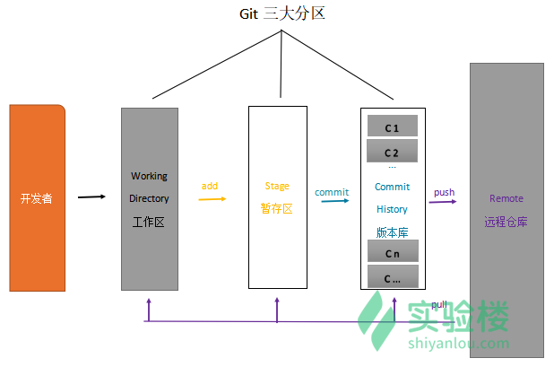

- [Git与Github入门](#git与github入门)
  - [1 克隆远程仓库到本地](#1-克隆远程仓库到本地)
  - [2 Git仓库的三个区域](#2-git仓库的三个区域)
  - [3 查看仓库状态](#3-查看仓库状态)
  - [4 添加修改到暂存区](#4-添加修改到暂存区)
  - [5 查看更改详情](#5-查看更改详情)
  - [6 查看版本区历史提交记录](#6-查看版本区历史提交记录)
  - [7 配置个人信息](#7-配置个人信息)
  - [8 提交暂存区中的修改](#8-提交暂存区中的修改)
  - [9 查看全部分支信息](#9-查看全部分支信息)
  - [10 推送](#10-推送)
  - [11 版本回退](#11-版本回退)
  - [12 处理commit时间线分叉](#12-处理commit时间线分叉)
  - [13 本地仓库commit变化记录](#13-本地仓库commit变化记录)
  - [14 添加SSH关联授权](#14-添加ssh关联授权)
  - [15 为Git命令设置别名](#15-为git命令设置别名)
  - [16 刷新本地分支信息](#16-刷新本地分支信息)
  - [17 创建新的本地分支](#17-创建新的本地分支)
  - [18 将新分支中的提交推送到远程仓库](#18-将新分支中的提交推送到远程仓库)
  - [19 本地分支跟踪远程分支](#19-本地分支跟踪远程分支)
  - [20 删除远程分支](#20-删除远程分支)
  - [21 本地分支的更名与删除](#21-本地分支的更名与删除)
  - [22 多人协作Github部分](#22-多人协作github部分)
    - [仓库拥有者添加合作者](#仓库拥有者添加合作者)
    - [仓库拥有者新建issue](#仓库拥有者新建issue)
  - [23 多人协作Git部分](#23-多人协作git部分)
    - [组员完成任务并推送(备注信息妙用)](#组员完成任务并推送备注信息妙用)
    - [提PR(pull requests)和检查合并PR](#提prpull-requests和检查合并pr)
    - [同步主仓库](#同步主仓库)
    - [merge和rebase区别](#merge和rebase区别)
  - [24 创建标签](#24-创建标签)
    - [轻量级标签](#轻量级标签)
    - [含附注标签](#含附注标签)
  - [25 查看标签](#25-查看标签)
  - [26 删除本地标签](#26-删除本地标签)
  - [27 将本地标签推送到远程仓库](#27-将本地标签推送到远程仓库)
  - [28 删除远程仓库标签](#28-删除远程仓库标签)
  - [29 签出标签对应的提交版本](#29-签出标签对应的提交版本)
  - [30 Github的releases](#30-github的releases)

# Git与Github入门

## 1 克隆远程仓库到本地

1. GitHub新建仓库时,默认主机名`origin` ,默认分支`master` 
2. Git要求本地仓库关联的每个远程主机必须`指定一个主机名(默认为origin)` ,用于本地仓库识别自己关联的主机. `git remote` 系列命令用于管理本地仓库所关联的主机,一个本地仓库可以关联`任意多个主机(即远程仓库)`
3. `git remote -v` 可以查看本地仓库所关联的远程仓库信息
4. 克隆远程仓库到本地时,可以使用`-o` 选项自定义主机名,也可以在地址后面加上一个字段作为本地仓库的主目录名 `git clone <-o 自定义主机名> url <本地的主目录名>` 

## 2 Git仓库的三个区域

## 3 查看仓库状态

1. `git status` 查看仓库状态

## 4 添加修改到暂存区

1. `git add [文件名]` 添加某一文件到暂存区
2. `git add .` 全部添加到暂存区
3. `git reset -- <文件名>` 或 `git rm --cached [文件名]` 撤销某一文件暂存
4. `git reset --` 撤销全部暂存

## 5 查看更改详情

1. `git diff <文件名>` 查看工作区全部被跟踪文件`(只有在版本区中存在的文件才是被跟踪文件)`或某文件的修改详情
2. `git diff --cached <文件名>` 查看暂存区全部或某文件更改详情
3. `git ls-tree -r master <--name-only>` 列出所有已被跟踪的文件

## 6 查看版本区历史提交记录

1. `git log <分支名>` 查看某分支的提交历史,不写分支名查看当前所在分支,默认时间倒序
2. `git log --oneline` 一行显示提交历史
3. `git log -n` n是数字,查看最近n个提交
4. `git log --author [贡献者名字]` 查看指定贡献者的提交记录
5. `git log --graph` 图示法显示提交历史
6. `git log --reverse` 按照时间正序查看提交历史

## 7 配置个人信息

1. `git config --global user.email ["you@email.com"]` 配置邮箱地址
2. `git config --global user.name ["Your Name"]` 配置用户名
3. 配置完成后,在Home目录下自动生成 `.gitconfig` 文件,可手动更改
4. `git config -l` 查看已配置信息

## 8 提交暂存区中的修改

1. `git commit -m ["本次提交备注"]` 生成一个新提交,将暂存区内容全部提交到版本库中,必须使用 `-m` 选项提供本次提交备注
   1. 如果发现本次提交遗漏了某文件或者写错了备注,可以使用 `git commit -amend` 修改最近一次提交,不会生成新的提交,而是尝试追加到上次的提交
2. 提交后,使用`git log` 可以看到提交版本号(唯一),类似于身份证号
3. 不推荐使用`git commit -am ["备注"]` 添加`-a` 选项的作用是将未添加到暂存区的修改,也就是工作区的修改也一并提交,但会`略过未被跟踪的文件`(比如新建的文件)
4. 修改工作区 -> 提交到暂存区 -> 随时使用`git status` 查看仓库状态 -> 将暂存区的修改提交到版本区生成一次新的提交

## 9 查看全部分支信息

1. `git branch -avv` 查看全部分支信息
2. 结果显示多行信息,依次:
   1. 第一行,开头的星号表示当前所在分支,绿色的`master` 是分支名,之所以是绿色,也是因为它是当前所在分支.后面第二项是版本号,第三项中括号里面蓝色的字,表示此分支跟踪的远程分支的名字,这也是克隆远程仓库到本地时的默认设置--创建 master 分支并自动跟踪远程同名分支;冒号后面黑色文字表示本地分支领先或落后其跟踪的远程分支n个提交.最后一项是提交时填写的备注信息
   2. 第二行,是Git `指针信息`,它指向远程仓库的master分支
   3. 第三行,远程分支信息

## 10 推送

1. `git push <远程主机名> <本地分支名> :<远程分支名>` 将本地分支推送到远程主机的远程分支.如 `git push origin master :refs/for/master` 
2. `refs/for` 的意义在于提交代码到服务器之后是需要经过`code review` 之后才能进行merge ,而refs/heads不需要
3. `git push origin master` 如果远程分支被省略,表示将本地分支推送到与之存在追踪关系的远程分支(通常两者同名),如果该远程分支不存在,则会被新建
4. `git push origin :refs/for/master` 如果省略本地分支名,表示`删除指定的远程分支`,这等同于推送一个空的本地分支到远程分支,`等同于git push origin --delete master`
5. `git push origin` 如果当前分支与远程分支存在追踪关系,则本地分支和远程分支都可以省略,将当前分支推送到origin主机的对应分支
6. `git push` 如果当前分支只有一个远程分支,那么主机名都可以省略
   1. 可以使用`git branch -r` 查看远程的分支名
   2. 不带任何参数的git push `默认只推送当前分支`,这叫做simple方式,还有一种matching方式,会推送所有有对应的远程分支的本地分支,Git2.0之前默认使用matching,`现在`改为simple方式
   3. 如果想更改设置,可以使用git config命令
      1. `git config --global push.default matching`
      2. `git config --global push.default simple`
7. `git push --all origin` 不管是否存在对应的远程分支,将本地的所有分支都推送到远程主机
8. `git push --force origin` 如果本地版本库比远程服务器上的低,那么一般会提示你git pull更新,如果一定要提交,可以使用这个命令
9.  `git push origin --tags` 默认不会推送标签,如果一定要推送标签的话可以使用这个命令
    1. `git push origin [tagname]` 可以推送一个本地标签
    2. `git push origin --tags` 可以推送全部未推送过的本地标签
    3. `git tag -d [tagname]` 可以删除一个本地标签
    4. `git push origin :refs/tags/[tagname]` 可以删除一个远程标签

## 11 版本回退

1. 执行`git reset --soft HEAD^` ,撤销最近的一次提交,将修改`还原到暂存区`
   1. `--soft` 表示软退回,`--hard` 表示硬退回
      1. 软退回只修改HEAD指针,不会发生危险
      2. 硬退回可能丢弃修改,更改工作目录,是少有的几个可能`引发危险`的命令之一
   2. `HEAD^` 表示撤销一次提交,`HEAD^^` 表示撤销两次提交,撤销n次可以简写为 `HEAD~n`
2. 使用`git branch -avv` 或`git status` 查看状态
3. 进行修改之后`git add` 并 `git commit` 生成新的提交

<table class="tableblock frame-all grid-all spread">
<thead>
<tr>
<th class="tableblock halign-left valign-top"></th>
<th class="tableblock halign-left valign-top">HEAD</th>
<th class="tableblock halign-left valign-top">Index</th>
<th class="tableblock halign-left valign-top">Workdir</th>
<th class="tableblock halign-left valign-top">WD Safe?</th>
</tr>
</thead>
<tbody>
<tr>
<td class="tableblock halign-left valign-top">
<strong>Commit Level</strong>
</td>
<td class="tableblock halign-left valign-top"></td>
<td class="tableblock halign-left valign-top"></td>
<td class="tableblock halign-left valign-top"></td>
<td class="tableblock halign-left valign-top"></td>
</tr>
<tr>
<td class="tableblock halign-left valign-top">
<code>reset --soft [commit]</code>
</td>
<td class="tableblock halign-left valign-top">
REF
</td>
<td class="tableblock halign-left valign-top">
NO
</td>
<td class="tableblock halign-left valign-top">
NO
</td>
<td class="tableblock halign-left valign-top">
YES
</td>
</tr>
<tr>
<td class="tableblock halign-left valign-top">
<code>reset [commit]</code>
</td>
<td class="tableblock halign-left valign-top">
REF
</td>
<td class="tableblock halign-left valign-top">
YES
</td>
<td class="tableblock halign-left valign-top">
NO
</td>
<td class="tableblock halign-left valign-top">
YES
</td>
</tr>
<tr>
<td class="tableblock halign-left valign-top">
<code>reset --hard [commit]</code>
</td>
<td class="tableblock halign-left valign-top">
REF
</td>
<td class="tableblock halign-left valign-top">
YES
</td>
<td class="tableblock halign-left valign-top">
YES
</td>
<td class="tableblock halign-left valign-top">
<strong>NO</strong>
</td>
</tr>
<tr>
<td class="tableblock halign-left valign-top">
<code>checkout [commit]</code>
</td>
<td class="tableblock halign-left valign-top">
HEAD
</td>
<td class="tableblock halign-left valign-top">
YES
</td>
<td class="tableblock halign-left valign-top">
YES
</td>
<td class="tableblock halign-left valign-top">
YES
</td>
</tr>
<tr>
<td class="tableblock halign-left valign-top">
<strong>File Level</strong>
</td>
<td class="tableblock halign-left valign-top"></td>
<td class="tableblock halign-left valign-top"></td>
<td class="tableblock halign-left valign-top"></td>
<td class="tableblock halign-left valign-top"></td>
</tr>
<tr>
<td class="tableblock halign-left valign-top">
<code>reset (commit) [file]</code>
</td>
<td class="tableblock halign-left valign-top">
NO
</td>
<td class="tableblock halign-left valign-top">
YES
</td>
<td class="tableblock halign-left valign-top">
NO
</td>
<td class="tableblock halign-left valign-top">
YES
</td>
</tr>
<tr>
<td class="tableblock halign-left valign-top">
<code>checkout (commit) [file]</code>
</td>
<td class="tableblock halign-left valign-top">
NO
</td>
<td class="tableblock halign-left valign-top">
YES
</td>
<td class="tableblock halign-left valign-top">
YES
</td>
<td class="tableblock halign-left valign-top">
<strong>NO</strong>
</td>
</tr>
</tbody>
</table>

## 12 处理commit时间线分叉

1. 执行`git status` 和 `git branch -avv` 查看仓库状态和分支状态
2. 本地仓库的master 分支与远程仓库的origin/master 分支在提交版本上有冲突时,又叫`提交时间线分叉`.这种情况下也可以将本地master 分支推送到远程仓库,需要加一个选项 `-f` (--force 的简写)这就是`强制推送`

## 13 本地仓库commit变化记录

1. `git reflog` 记录本地仓库所有分支的每一次版本变化. `reflog记录` 只存在于本地仓库中,只要本地仓库不删除,可以回退到任何地方
2. `git reset --hard [版本号|HEAD@{n}]` 可以回退到任意位置

## 14 添加SSH关联授权

1. `ssh-keygen <-t rsa> <-C "注释内容"> <-f filename>` 在系统中创建公私钥,连续按几次回车确认即可
   1. `-t` 指定密钥类型,默认rsa,可省略
   2. `-C` 设置注释文字,比如邮箱,可省略
   3. `-f` 指定密钥文件存储文件名,可省略
2. 密钥保存在 `~/.ssh` 目录下, 公(id_rsa.pub) 私(id_rsa) 钥各一个文件
3. 将`id_rsa.pub` 中的内容添加到GitHub网页中
4. 克隆仓库时,地址选择`使用SSH` ,即可使用ssh关联
5. 好处
   1. 免密登录
   2. 提高传输速度

## 15 为Git命令设置别名

1. `git config --global alias.[别名] [原命令]` 别名任意,原命令如果`带有选项需使用引号`.设置后别名与原命令等效
2. 可以使用`git config -l` 查看配置文件

## 16 刷新本地分支信息

1. `git fetch` 刷新本地分支信息,将远程仓库的分支信息拉取到本地仓库,`仅仅更新本地的远程分支信息` ,也就是执行`git branch -avv` 后看到的`remotes` 行的分支信息
2. 若需更新本地的master分支为最新,可使用`git pull` 拉取远程仓库的数据到本地
   1. 如果前面执行过`git fetch` 命令,则可以使用`git rebase origin/master` 来实现本地master分支基于远程仓库的master分支或使用`git merge` 合并(都可能产生冲突)

## 17 创建新的本地分支

1. `git branch [分支名]` 创建一个新的分支,但是并未切换分支
2. `git checkout [分支名]` 切换到某分支
3. `git checkout -b [分支名]` 创建新分支并切换到新创建的分支

## 18 将新分支中的提交推送到远程仓库

1. `git push [主机名] [新分支名] :<新分支名>` 将新创建的分支推送到远程仓库,如果远程分支不存在,会自动创建
2. `:` 冒号前后分支名相同,因此可以省略 `:新分支名`

## 19 本地分支跟踪远程分支

1. `git branch -u [主机名/远程分支名] <本地分支名>` 将本地分支与远程分支关联,即本地分支跟踪远程分支.如果操作当前分支,则`本地分支名` 可省略
   1. `-u` 选项是`--set-upstream` 的缩写,两个选项等效
   2. 可以让本地分支跟踪远程非同名分支
2. `git branch --unset-upstream <本地分支名>` 撤销某分支对远程分支的跟踪,如果操作当前分支,可省略`本地分支名`
3. `git push -u [主机名] [新分支名] :<新分支名>` 将新分支推送到远程主机并自动创建远程分支时,自动跟踪远程分支

## 20 删除远程分支

1. `git push <主机名> :[远程分支名]` 删除一个远程分支
2. `git push <主机名> :[远程分支名] :[远程分支名] :[远程分支名]` 删除多个远程分支
3. 命令的原理是推送空分支到远程分支,结果是远程分支被删除
4. 另一个删除远程分支的命令 `git push <主机名> --delete [远程分支名]`

## 21 本地分支的更名与删除

1. `git branch -D [待删除分支名] <[待删除分支名] [待删除分支名]>` 删除本地分支,可同时删除多个,只需罗列出来.但是当前的分支不能被删除
2. `git branch -m <原分支名> [新分支名]` 给本地分支改名,若修改当前分支名,可省略 `原分支名`

## 22 多人协作Github部分

1. 新建仓库时可以选择`忽略文件.ignore` 和 `许可证文件licence`

### 仓库拥有者添加合作者

1. 仓库拥有者可以在GitHub网页中给某仓库添加合作者,在仓库 `Settings` 中的 `Collaborators` 可以使用邮箱或用户名搜索添加组员
2. 组员同意后会跳转到合作仓库页面,可以点击`Fork` 克隆到自己的账户中,不会克隆`issue`

### 仓库拥有者新建issue

1. 组长可以在仓库中添加一些项目任务或待解决问题即 `issue`
   1. 写好任务标题后可以指定一位或多位参与者来完成,同时GitHub 会自动发邮件
   2. 组长仓库的`issue` 不会出现在组员仓库中
   3. 每个`issue` 创建后都会生成一个对应的编号

## 23 多人协作Git部分

1. 组员克隆自己账号下`Fork` 而来的仓库,或者克隆组长的仓库后新建分支,两种方式都可以

### 组员完成任务并推送(备注信息妙用)

1. 在本地解决某个 `issue` 对应的问题后,在commit 时备注中需要附加 `fix|fixes|fixed|closes|close|closed #xxx` ,当备注信息中含有此字样的commit 出现在组长仓库,仓库中编号为 `#xxx的issue` 会自动关闭

### 提PR(pull requests)和检查合并PR

1. 创建一个PR就是从甲分支向乙分支提一个请求,该请求中有一个或多个提交,如果没问题就可以合并这个请求,把请求中所有提交的修改增加到乙分支上
2. 提PR既可以在同一仓库内,也可以跨用户跨仓库
3. 在GitHub网页对应仓库中点击PR并新建PR,选择好 `base repository` 和 `head repository` ,观察是否可以无冲突合并 `Able to merge` ,之后确认提交PR,然后页面自动跳转到组长的仓库PR合并页面
4. 组长(或者有权限的组员)可以合并PR
   1. `Create a merge commit` 这种方式会在组长仓库的master 分支上生成一个新的提交,且保留PR 中的所有提交信息.这是一种常规操作,用得最多
   2. `Squash and merge` 压缩合并,它会把PR 中的全部提交压缩成一个.此方法的优点就是让提交列表特别整洁.一个PR 里有很多提交,每个提交都是很细小的改动,保留这些提交没什么意义,这种情况就使用此方法合并PR
   3. `Rebase and merge` 这种方法不会生成新的提交,例如PR 中有6 个提交,用此方法合并后,组长仓库也会新增6 个提交.注意,这些提交的版本号与组员的提交不同,此外完全一样
5. 从A 向B 提PR 后,在PR 合并或关闭前,A 上`所有新增的提交`都会出现在PR 里

### 同步主仓库

1. 为避免提PR时出现冲突,组员仓库应时刻保持与主仓库(组长仓库)同步
2. `git remote add [主机名] [主仓库地址(https开头)]` 为当前仓库新增一个关联主机
   1. 主机名可任意,不能是`origin` .主仓库的主机名`通常定义为up 或upstream`
   2. 这个主机名其实就是一个变量,它的值就是仓库地址,例如 `git push origin master` 完全等于 `git push git@github.com:someone/repo master`
3. `git fetch up` 拉取主仓库全部分支信息到本地
4. `git pull --rebase up master` 拉取并同步主仓库数据,因为执行了`git fetch` ,所以可以直接使用`git rebase up/master`
5. `git pull --rebase` == `git fetch` + `git rebase`
6. `git pull` == `git fetch` + `git merge`

### merge和rebase区别

1. `merge` 会把公共分支和当前的commit 合并在一起,形成一个新的提交,合并之后仍然能看到两条分支,交汇在新的提交点
2. `rebase` 会把当前分支的commit 放到公共分支的最后面,所以叫变基.变基之后只能看到一条公共分支

## 24 创建标签

> 对某一时间点上的版本打上标签  
> issue 是仓库拥有者在GitHub 上手动创建的,仓库被Fork 时issue 不会跟随  
> Tags 通常在本地使用git 命令创建后推送到GitHub 上,与issue 相同的一点,它也只存在于项目仓库内,Fork 或提 PR 都不会带上它.在多人协作项目中,通常由组长对主仓库设置Tags ,单人项目自己说了算

1. 创建标签是给具体的 `某次提交` 创建的,跟分支无关
2. 标签是在提交的基础上创建的,如果仓库的多个分支中都有这个提交版本,那么这些分支上就有关于这个提交的相同的标签
3. Git 使用的标签有两种类型: 轻量级的(lightweight)和含附注的(annotated)

### 轻量级标签

1. 轻量级标签就像是个不会变化的分支,实际上它就是个指向特定提交对象的引用,是一个保存着对应提交对象的校验和信息的文件
2. `git tag [tagname]` 创建一个轻量级标签

### 含附注标签

1. 含附注标签,实际上是存储在仓库中的一个独立对象,它有自身的校验和信息,包含着标签的名字,电子邮件地址和日期,以及标签说明,标签本身也允许使用 `GNU Privacy Guard (GPG)` 来签署或验证
2. `git tag [-a tagname] [-m "备注信息"] <提交版本号>` 创建一个含附注标签,如果是给当前分支最新提交创建标签的话可以省略 `提交版本号` ,也可以在后期对早先的某次提交加注标签
3. 一般建议使用含附注型的标签以便保留相关信息;当然,如果只是临时性加注标签,或者不需要旁注额外信息,用轻量级标签也没问题

## 25 查看标签

1. `git tag` 列出全部标签
2. `git tag -l 'v1.4.2.*'` 使用特定搜索模式搜索标签
3. `git show [tagname]` 命令查看相应标签的版本信息,并连同显示打标签时的提交对象

## 26 删除本地标签

1. 创建本地标签后,在仓库目录的 `.git/refs/tags` 目录下会生成一个标签文件
2. `git tag -d [tagname]` 删除本地标签,标签文件也会被删除

## 27 将本地标签推送到远程仓库

1. `git push origin [tagname]` 将某一标签推送到远程仓库
2. 推送完成后,在GitHub网页可以点击 `release` 查看releases 和tags
3. `git push origin --tags` 将本地所有未推送标签推送到远程仓库

## 28 删除远程仓库标签

1. `git push origin :refs/tags/[tagname]` 删除远程仓库的标签,命令中的标签名其实就是文件名
2. 删除远程仓库标签并不会删除本地标签

## 29 签出标签对应的提交版本

1. 如果你从GitHub 上克隆了某个程序的仓库,那么可以在仓库主目录下执行`git checkout xxx` 签出程序的某个版本.其实签出版本就是 `指定某个提交版本创建一个新的分支`
2. `git check [tagname]` 切换到之前的某个提交版本之后
3. `git checkout -b [新分支名]` 将此提交版本固定到一个新分支上并切换到此分支

## 30 Github的releases

1. GitHub releases 是2013 年发布的新功能,旨在协助软件开发者分发新版本给用户
2. 当项目组织宣布发布一个软件产品的版本,发布过程就是一个将软件交付给最终用户的工作流.版本是具有修改日志和二进制文件的一类对象,它们提供了Git 工作流之外的完整项目历史,它们也可以从存储库的主页上被访问.发布版release 附带发布说明和下载软件或源代码的链接.按照许多Git 项目的约定,发布版本与Git 的标签tag 绑定.可以使用现有的标签,或者让release 在发布时创建标签
3. 标签是Git 中的概念,而releases 则是Github、码云等源码托管商所提供的更高层的概念.Git 本身没有releases 这个概念,只有tag .两者之间的关系则是,release 基于tag, 为tag 添加更丰富的信息,一般是编译好的文件
